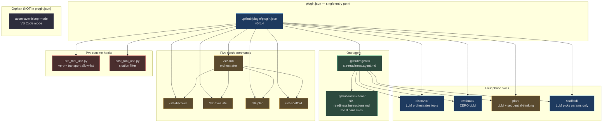
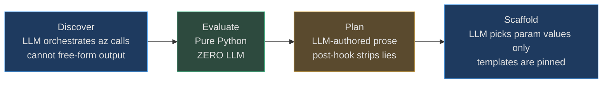
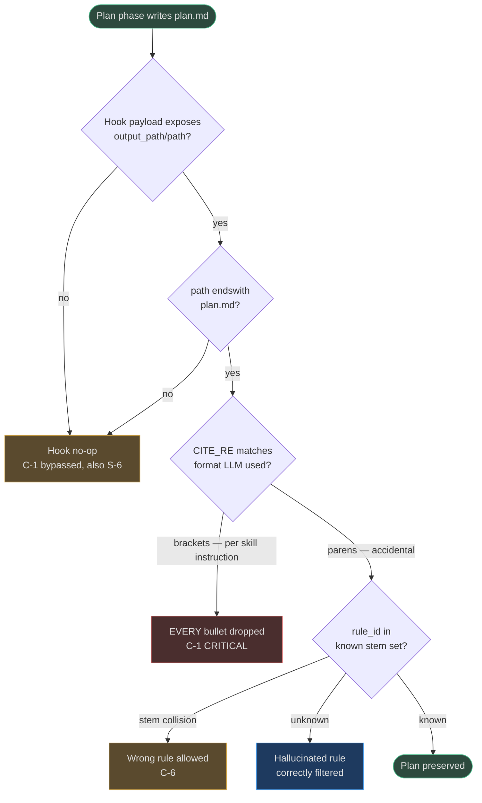
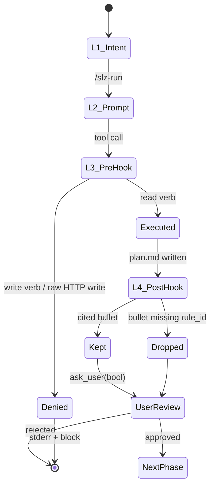

# The agent surface

This page explains **what Copilot-CLI actually loads** when you install `slz-readiness` and **why the surface is shaped that way**. It is the author's mental model, not an API reference — for the mechanical load sequence see [Plugin Mechanics](./plugin-mechanics.md); for the textual pause contract see [Orchestration](./orchestration.md); for the enforcement layer see [Hooks](./hooks.md).

## TL;DR

| Artifact | Count | Role |
|---|---:|---|
| Agents | **1** | Owns the full Discover → Evaluate → Plan → Scaffold state machine |
| Phase skills | **4** | Each implements one phase with a distinct LLM budget |
| Slash commands | **5** | `/slz-discover`, `/slz-evaluate`, `/slz-plan`, `/slz-scaffold`, `/slz-run` (orchestrator) |
| Hooks | **2** | `pre_tool_use` (verb allow-list), `post_tool_use` (citation guard) |
| MCP servers | **2** | `@azure/mcp`, `server-sequential-thinking` (unpinned — see [Security Posture](./security-posture.md) S-9) |
| Orphan skills | **1** | `azure-avm-bicep-mode` exists on disk but is **not wired into `plugin.json`** |

## How the surface fits together



<!-- Sources:
  .github/plugin/plugin.json:1-63
  .github/agents/slz-readiness.agent.md:1-17
  .github/skills/azure-avm-bicep-mode/SKILL.md:1-4
-->

### File inventory

| File | Role | Source |
|---|---|---|
| Plugin manifest | Wires agents / skills / commands / hooks / MCP | [.github/plugin/plugin.json:22-62](https://github.com/msucharda/slz-readiness/blob/main/.github/plugin/plugin.json#L22-L62) |
| Primary agent | Binds instructions + skills + MCP | [.github/agents/slz-readiness.agent.md:1-17](https://github.com/msucharda/slz-readiness/blob/main/.github/agents/slz-readiness.agent.md#L1-L17) |
| Operating rules | The 8 non-negotiable rules; why each exists | [.github/instructions/slz-readiness.instructions.md:1-71](https://github.com/msucharda/slz-readiness/blob/main/.github/instructions/slz-readiness.instructions.md#L1-L71) |
| Orchestrator prompt | `/slz-run` with 4 `ask_user` pause gates | [.github/prompts/slz-run.prompt.md:1-14](https://github.com/msucharda/slz-readiness/blob/main/.github/prompts/slz-run.prompt.md#L1-L14) |
| Discover skill | Read-only enumeration + scope interrogation | [.github/skills/discover/SKILL.md:1-118](https://github.com/msucharda/slz-readiness/blob/main/.github/skills/discover/SKILL.md#L1-L118) |
| Evaluate skill | Zero-LLM Python rule-engine wrapper | [.github/skills/evaluate/SKILL.md:1-34](https://github.com/msucharda/slz-readiness/blob/main/.github/skills/evaluate/SKILL.md#L1-L34) |
| Plan skill | LLM narration, cite-or-be-dropped | [.github/skills/plan/SKILL.md:1-48](https://github.com/msucharda/slz-readiness/blob/main/.github/skills/plan/SKILL.md#L1-L48) |
| Scaffold skill | Fill AVM templates; never free-form | [.github/skills/scaffold/SKILL.md:1-55](https://github.com/msucharda/slz-readiness/blob/main/.github/skills/scaffold/SKILL.md#L1-L55) |
| AVM Bicep mode (**orphan**) | VS Code Copilot-Chat tool-mode; **not in `plugin.json`** | [.github/skills/azure-avm-bicep-mode/SKILL.md:1-47](https://github.com/msucharda/slz-readiness/blob/main/.github/skills/azure-avm-bicep-mode/SKILL.md#L1-L47) |

## Why one agent, not four

A fan-out design (one agent per phase) was explicitly rejected. The contract (read-only, deterministic, cite-or-drop, HITL) must be enforced **between** phases, so the state machine has to live in a single LLM context. [.github/agents/slz-readiness.agent.md:9-13](https://github.com/msucharda/slz-readiness/blob/main/.github/agents/slz-readiness.agent.md#L9-L13) binds all four skills to one agent; pause gates live in the orchestrator prompt, not in inter-agent protocols.

The practical implication for contributors: **the hooks are the only actor that can enforce a rule the LLM forgets**. Prompts are advisory; the pre-hook and post-hook are authoritative. This is called out explicitly at [.github/instructions/slz-readiness.instructions.md:3](https://github.com/msucharda/slz-readiness/blob/main/.github/instructions/slz-readiness.instructions.md#L3): *"Hooks and CI enforce them; this file documents why."*

## The LLM-budget gradient

Each phase has a different tolerance for LLM creativity. This is the single most important design choice in the plugin — the model's blast radius shrinks to the phase's budget:



<!-- Sources:
  .github/instructions/slz-readiness.instructions.md:22-32
  .github/skills/evaluate/SKILL.md:1-10
  .github/skills/plan/SKILL.md:10,18-26
  .github/skills/scaffold/SKILL.md:18-25
-->

| Phase | LLM may… | LLM must not… | Enforced by |
|---|---|---|---|
| Discover | pick which `az list/show` to run, interpret progress | invent findings, run write verbs | [pre_tool_use.py:97-117](https://github.com/msucharda/slz-readiness/blob/main/hooks/pre_tool_use.py#L97-L117) |
| Evaluate | invoke the CLI | add reasoning — **zero LLM tokens in the engine** | [scripts/slz_readiness/evaluate/engine.py](https://github.com/msucharda/slz-readiness/blob/main/scripts/slz_readiness/evaluate/engine.py) is pure Python |
| Plan | prioritise, group, phrase | invent rules, drop gaps | [post_tool_use.py:45-69](https://github.com/msucharda/slz-readiness/blob/main/hooks/post_tool_use.py#L45-L69) |
| Scaffold | pick param values, reason about dependencies | author Bicep by hand | `ALLOWED_TEMPLATES` allow-list in [template_registry.py](https://github.com/msucharda/slz-readiness/blob/main/scripts/slz_readiness/scaffold/template_registry.py) |

## Orchestrated flow with `ask_user` gates

The v0.5.4 release rewrote every pause to **explicitly name the `ask_user` tool**. Before v0.5.4 the prompt said "PAUSE and ask the user" in prose and the agent faithfully typed `**Confirm to proceed?**` into its response — unstructured text, easy to miss.

```mermaid
sequenceDiagram
    autonumber
    actor U as Operator
    participant A as slz-readiness agent
    participant PRE as pre_tool_use
    participant POST as post_tool_use
    participant CLI as Python CLIs
    participant FS as artifacts/&lt;run&gt;/

    U->>A: /slz-run

    Note over A: Phase 1 — Discover
    A->>U: ask_user(enum tenant)
    U-->>A: tenantId
    A->>U: ask_user(enum subscription scope)
    U-->>A: scope
    A->>PRE: az account list / list / show
    PRE-->>A: allow (read verbs)
    A->>CLI: slz-discover --tenant --all-subscriptions
    CLI->>FS: findings.json
    A->>U: ask_user(bool "continue to Evaluate?")

    Note over A: Phase 2 — Evaluate (zero LLM)
    A->>CLI: slz-evaluate
    CLI->>FS: gaps.json, evaluate.summary.md
    A->>U: relay summary verbatim
    A->>U: ask_user(bool "continue to Plan?")

    Note over A: Phase 3 — Plan (LLM + sequential-thinking)
    A->>FS: write candidate plan.md
    POST->>POST: strip bullets w/o valid rule_id
    POST->>FS: plan.dropped.md (if any)
    A->>U: ask_user(bool "continue to Scaffold?")

    Note over A: Phase 4 — Scaffold
    A->>CLI: slz-scaffold
    CLI->>FS: bicep/*, params/*, how-to-deploy.md
    A->>U: ask_user(bool "what-if yourself — acknowledged?")
```

<!-- Sources:
  .github/prompts/slz-run.prompt.md:7-14
  .github/skills/discover/SKILL.md:24-62
  .github/skills/plan/SKILL.md:27-48
  hooks/post_tool_use.py:45-69
-->

> **Generalised lesson: *name the tool, or the tool will not be called.*** More-specific local prose wins over more-general host rules. Plugins must explicitly name `ask_user` on every interaction point, not merely describe the behavior. See the v0.5.4 diff at `95b5ec6` for the minimal-viable fix.

## Known drift & failure modes

The surface was audited in April 2026 (session research reports `agent-design-deep-research.md` and `agent-design-complementary.md`). The findings below are the ones that affect runtime behavior — not cosmetic drift.

| # | Finding | Severity | Status |
|---|---|---:|---|
| **C-1** | `post_tool_use` regex at [post_tool_use.py:22](https://github.com/msucharda/slz-readiness/blob/main/hooks/post_tool_use.py#L22) requires **parentheses** `(rule_id: X)`, but `plan/SKILL.md:20` instructs the LLM to emit **square brackets** `[rule_id: X]`. Every other doc-example in the repo uses brackets. | **CRITICAL** | **Open** — see [Hooks §Known drift](./hooks.md#known-drift-v0-5-4) |
| **C-2** | `_filter_plan` has **zero unit-test coverage**. `test_hooks.py` only tests `_extract_plan_path` (which file to touch), never what the filter actually strips. | HIGH | Open |
| **C-3** | `azure-avm-bicep-mode` skill is on disk but **not** in `plugin.json:25-30` — it's a VS Code Copilot-Chat mode, not a Copilot-CLI skill. Contributors assume all 5 skills are live; only 4 are. | MEDIUM | Open |
| **C-4** | `ask_user` is named 9× in `/slz-run` but **zero times** in the four standalone phase prompts, and `discover/SKILL.md §1` still uses prose to describe scope confirmation. A standalone `/slz-discover` invocation can regress to the pre-v0.5.4 behavior. | MEDIUM | Open |
| **C-5** | Scope confirmation is specified in three un-synchronised places (`agent.md`, `instructions.md §6a`, `discover/SKILL.md §1`) with slightly different step counts. | LOW | Open |
| **C-6** | [post_tool_use.py:34](https://github.com/msucharda/slz-readiness/blob/main/hooks/post_tool_use.py#L34) identifies rules by **file stem** (`p.stem`); the YAML loader at [loaders.py:89-91](https://github.com/msucharda/slz-readiness/blob/main/scripts/slz_readiness/evaluate/loaders.py#L89-L91) identifies them by the **`rule_id:` field**. Two YAMLs with the same stem in different folders will collide silently in the hook. | LOW | Open |

### Failure-mode decision tree



<!-- Sources:
  hooks/post_tool_use.py:22,34,37-58
  .github/skills/plan/SKILL.md:19-20
  scripts/slz_readiness/evaluate/loaders.py:89-91
-->

### Proposed five-minute fix for C-1

<!-- Source: hooks/post_tool_use.py:22 — proposed change -->
```python
# Accept both [rule_id: X] (instructed format) and (rule_id: X) (legacy)
CITE_RE = re.compile(r"[(\[]rule_id:\s*([A-Za-z0-9_.-]+)[)\]]")
```

Land with the missing golden test:

```python
def test_filter_accepts_bracket_and_paren(tmp_path, monkeypatch):
    monkeypatch.setattr(post_hook, "_known_rule_ids", lambda: {"mg.a", "sov.b"})
    p = tmp_path / "plan.md"
    p.write_text(
        "- [rule_id: mg.a] kept by brackets\n"
        "- (rule_id: sov.b) kept by parens\n"
        "- [rule_id: unknown.x] dropped as unknown\n"
        "- no citation at all\n",
        encoding="utf-8",
    )
    post_hook._filter_plan(p, post_hook._known_rule_ids())
    text = p.read_text(encoding="utf-8")
    assert "kept by brackets" in text
    assert "kept by parens" in text
    assert "unknown.x" not in text
    assert "no citation at all" not in text
```

## Layered-defense pattern

Four rings; only two of them are authoritative:



<!-- Sources:
  .github/instructions/slz-readiness.instructions.md:1-71
  .github/prompts/slz-run.prompt.md:7-14
  hooks/pre_tool_use.py:97-117
  hooks/post_tool_use.py:45-69
-->

| Ring | Mechanism | Advisory or authoritative? |
|---|---|---|
| L1 — Intent | Prose rules in `instructions.md` | **Advisory** — relies on model alignment |
| L2 — Prompt | `ask_user` gates in `slz-run.prompt.md` | **Advisory** — but named-tool discipline makes compliance testable |
| L3 — pre-hook | Verb + transport regex gate | **Authoritative** — blocks write verbs at tool-call time |
| L4 — post-hook | Citation regex + known-id set | **Authoritative (when it fires)** — currently broken by C-1 |

## Recommendations, prioritised

1. **[CRITICAL] Fix C-1** — widen `CITE_RE` to accept both `[rule_id:…]` and `(rule_id:…)`, add the golden test from C-2.
2. **[HIGH] Align C-6** — have `_known_rule_ids()` parse the YAML and return the actual `rule_id:` field, matching the loader.
3. **[MEDIUM] Propagate `ask_user` into each standalone phase prompt and into `discover/SKILL.md §1`.** Prevents v0.5.4 regression recurrence inside single-phase invocations.
4. **[MEDIUM] Decide the fate of `azure-avm-bicep-mode`** — delete, banner as VS Code-only, or wire into `plugin.json`.
5. **[LOW] Canonicalise scope confirmation** — one source of truth, others say "see also".
6. **[From prior report]** Pin MCP deps (`@azure/mcp@latest`, no-specifier `server-sequential-thinking`) — see [Security Posture S-9](./security-posture.md).

## Related pages

| Page | Why |
|---|---|
| [Plugin Mechanics](./plugin-mechanics.md) | How Copilot-CLI loads the manifest |
| [Orchestration](./orchestration.md) | The phase hand-off rules in depth |
| [Hooks](./hooks.md) | Implementation of pre/post hooks — now includes a `Known drift` section pointing back here |
| [Plan Phase](./plan.md) | How the plan skill produces `plan.md` — the canonical consumer of the citation guard |
| [Security Posture](./security-posture.md) | Findings S-1…S-12, including MCP pinning (S-9), host payload contract (S-6), and `plan.dropped.md` banner (S-12) |
| [Phased Rollout](./phased-rollout.md) | Scaffold's Audit→Enforce posture (v0.5.x) |
