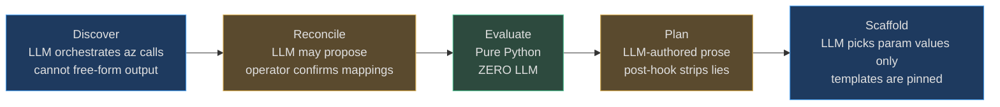
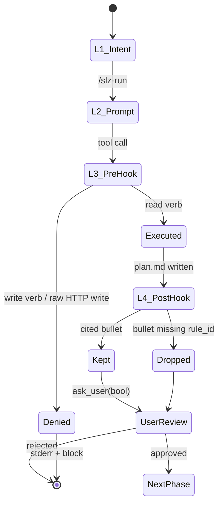

# The agent surface

This page explains **what Copilot-CLI actually loads** when you install `slz-readiness` and **why the surface is shaped that way**. It is the author's mental model, not an API reference — for the mechanical load sequence see [Plugin Mechanics](./plugin-mechanics.md); for the textual pause contract see [Orchestration](./orchestration.md); for the enforcement layer see [Hooks](./hooks.md).

## TL;DR

| Artifact | Count | Role |
|---|---:|---|
| Agents | **1** | Owns the full Discover → Reconcile → Evaluate → Plan → Scaffold state machine |
| Phase skills | **5** | Each implements one phase with a distinct LLM budget |
| Slash commands | **6** | `/slz-discover`, `/slz-reconcile`, `/slz-evaluate`, `/slz-plan`, `/slz-scaffold`, `/slz-run` (orchestrator) |
| Hooks | **2** | `pre_tool_use` (verb allow-list), `post_tool_use` (citation + alias guards) |
| MCP servers | **2** | `@azure/mcp`, `server-sequential-thinking` (unpinned — see [Security Posture](./security-posture.md) S-9) |

## How the surface fits together

```mermaid
graph TB
    subgraph Manifest["plugin.json — single entry point"]
        PJ[".github/plugin/plugin.json<br>v0.14.8"]
    end

    subgraph Agent["One agent"]
        AG[".github/agents/<br>slz-readiness.agent.md"]
        INS[".github/instructions/<br>slz-readiness.instructions.md<br>the 8 hard rules"]
    end

    subgraph Skills["Five phase skills"]
        SD["discover/<br>LLM orchestrates tools"]
        SR["reconcile/<br>operator-gated alias map"]
        SE["evaluate/<br>ZERO LLM"]
        SP["plan/<br>LLM + sequential-thinking"]
        SS["scaffold/<br>templates + operator params"]
    end

    subgraph Cmds["Six slash-commands"]
        PD["/slz-discover"]
        PRC["/slz-reconcile"]
        PE["/slz-evaluate"]
        PP["/slz-plan"]
        PS["/slz-scaffold"]
        PR["/slz-run<br>orchestrator"]
    end

    subgraph Guards["Two runtime hooks"]
        PRE["pre_tool_use.py<br>verb + transport allow-list"]
        POST["post_tool_use.py<br>citation + alias guard"]
    end

    PJ --> AG & SD & SR & SE & SP & SS & PRE & POST & PD & PRC & PE & PP & PS & PR
    AG --> INS & SD & SR & SE & SP & SS
    PR --> PD & PRC & PE & PP & PS

    style PJ fill:#1e3a5f,stroke:#4a9eed,color:#e0e0e0
    style AG fill:#2d4a3e,stroke:#4aba8a,color:#e0e0e0
    style INS fill:#2d4a3e,stroke:#4aba8a,color:#e0e0e0
    style SD fill:#1e3a5f,stroke:#4a9eed,color:#e0e0e0
    style SR fill:#5a4a2e,stroke:#d4a84b,color:#e0e0e0
    style SE fill:#1e3a5f,stroke:#4a9eed,color:#e0e0e0
    style SP fill:#5a4a2e,stroke:#d4a84b,color:#e0e0e0
    style SS fill:#1e3a5f,stroke:#4a9eed,color:#e0e0e0
    style PD fill:#5a4a2e,stroke:#d4a84b,color:#e0e0e0
    style PRC fill:#5a4a2e,stroke:#d4a84b,color:#e0e0e0
    style PE fill:#5a4a2e,stroke:#d4a84b,color:#e0e0e0
    style PP fill:#5a4a2e,stroke:#d4a84b,color:#e0e0e0
    style PS fill:#5a4a2e,stroke:#d4a84b,color:#e0e0e0
    style PR fill:#5a4a2e,stroke:#d4a84b,color:#e0e0e0
    style PRE fill:#4a2e2e,stroke:#d45b5b,color:#e0e0e0
    style POST fill:#4a2e2e,stroke:#d45b5b,color:#e0e0e0
```



<!-- Sources:
  .github/plugin/plugin.json:1-63
  .github/agents/slz-readiness.agent.md:1-17
-->

### File inventory

| File | Role | Source |
|---|---|---|
| Plugin manifest | Wires agents / skills / commands / hooks / MCP | [.github/plugin/plugin.json:22-62](https://github.com/msucharda/slz-readiness/blob/main/.github/plugin/plugin.json#L22-L62) |
| Primary agent | Binds instructions + skills + MCP | [.github/agents/slz-readiness.agent.md:1-17](https://github.com/msucharda/slz-readiness/blob/main/.github/agents/slz-readiness.agent.md#L1-L17) |
| Operating rules | The 8 non-negotiable rules; why each exists | [.github/instructions/slz-readiness.instructions.md:1-71](https://github.com/msucharda/slz-readiness/blob/main/.github/instructions/slz-readiness.instructions.md#L1-L71) |
| Orchestrator prompt | `/slz-run` with structured `ask_user` phase gates | [.github/prompts/slz-run.prompt.md:1-21](https://github.com/msucharda/slz-readiness/blob/main/.github/prompts/slz-run.prompt.md#L1-L21) |
| Discover skill | Read-only enumeration + scope interrogation | [.github/skills/discover/SKILL.md:1-118](https://github.com/msucharda/slz-readiness/blob/main/.github/skills/discover/SKILL.md#L1-L118) |
| Reconcile skill | Greenfield all-null alias or brownfield per-role mapping gates | [.github/skills/reconcile/SKILL.md](https://github.com/msucharda/slz-readiness/blob/main/.github/skills/reconcile/SKILL.md) |
| Evaluate skill | Zero-LLM Python rule-engine wrapper | [.github/skills/evaluate/SKILL.md:1-34](https://github.com/msucharda/slz-readiness/blob/main/.github/skills/evaluate/SKILL.md#L1-L34) |
| Plan skill | LLM narration, cite-or-be-dropped | [.github/skills/plan/SKILL.md:1-48](https://github.com/msucharda/slz-readiness/blob/main/.github/skills/plan/SKILL.md#L1-L48) |
| Scaffold skill | Fill AVM templates; never free-form | [.github/skills/scaffold/SKILL.md:1-55](https://github.com/msucharda/slz-readiness/blob/main/.github/skills/scaffold/SKILL.md#L1-L55) |

## Why one agent, not four

A fan-out design (one agent per phase) was explicitly rejected. The contract (read-only, deterministic, cite-or-drop, HITL) must be enforced **between** phases, so the state machine has to live in a single LLM context. The agent binds the phase skills to one agent; pause gates live in the orchestrator prompt, not in inter-agent protocols.

The practical implication for contributors: **the hooks are the only actor that can enforce a rule the LLM forgets**. Prompts are advisory; the pre-hook and post-hook are authoritative. This is called out explicitly at [.github/instructions/slz-readiness.instructions.md:3](https://github.com/msucharda/slz-readiness/blob/main/.github/instructions/slz-readiness.instructions.md#L3): *"Hooks and CI enforce them; this file documents why."*

## The LLM-budget gradient

Each phase has a different tolerance for LLM creativity. This is the single most important design choice in the plugin — the model's blast radius shrinks to the phase's budget:



<!-- Sources:
  .github/instructions/slz-readiness.instructions.md:22-32
  .github/skills/evaluate/SKILL.md:1-10
  .github/skills/plan/SKILL.md:10,18-26
  .github/skills/scaffold/SKILL.md:18-25
-->

| Phase | LLM may… | LLM must not… | Enforced by |
|---|---|---|---|
| Discover | pick which `az list/show` to run, interpret progress | invent findings, run write verbs | [pre_tool_use.py:97-117](https://github.com/msucharda/slz-readiness/blob/main/hooks/pre_tool_use.py#L97-L117) |
| Reconcile | propose brownfield role→MG candidates from findings | auto-accept mappings or bypass schema validation | [reconcile/cli.py](https://github.com/msucharda/slz-readiness/blob/main/scripts/slz_readiness/reconcile/cli.py) + `ask_user` |
| Evaluate | invoke the CLI | add reasoning — **zero LLM tokens in the engine** | [scripts/slz_readiness/evaluate/engine.py](https://github.com/msucharda/slz-readiness/blob/main/scripts/slz_readiness/evaluate/engine.py) is pure Python |
| Plan | prioritise, group, phrase | invent rules, drop gaps | [post_tool_use.py:45-69](https://github.com/msucharda/slz-readiness/blob/main/hooks/post_tool_use.py#L45-L69) |
| Scaffold | pick param values, reason about dependencies | author Bicep by hand | `ALLOWED_TEMPLATES` allow-list in [template_registry.py](https://github.com/msucharda/slz-readiness/blob/main/scripts/slz_readiness/scaffold/template_registry.py) |

## Orchestrated flow with `ask_user` gates

The orchestrator explicitly names the `ask_user` tool for every scope question and phase gate. Plain-text yes/no questions are considered a regression because they are easy to miss in a scrolling terminal.

```mermaid
sequenceDiagram
    autonumber
    actor U as Operator
    participant A as slz-readiness agent
    participant PRE as pre_tool_use
    participant POST as post_tool_use
    participant CLI as Python CLIs
    participant FS as artifacts/&lt;run&gt;/

    U->>A: /slz-run

    Note over A: Phase 1 — Discover
    A->>U: ask_user(enum tenant)
    U-->>A: tenantId
    A->>U: ask_user(enum subscription scope)
    U-->>A: scope
    A->>PRE: az account list / list / show
    PRE-->>A: allow (read verbs)
    A->>CLI: slz-discover --tenant --all-subscriptions
    CLI->>FS: findings.json
    A->>U: ask_user(bool "continue to Reconcile?")

    Note over A: Phase 2 — Reconcile
    A->>U: ask_user(enum "greenfield or brownfield?")
    A->>CLI: slz-reconcile
    CLI->>FS: mg_alias.json, reconcile.summary.md
    A->>U: ask_user(bool "continue to Evaluate?")

    Note over A: Phase 3 — Evaluate (zero LLM)
    A->>CLI: slz-evaluate
    CLI->>FS: gaps.json, evaluate.summary.md
    A->>U: relay summary verbatim
    A->>U: ask_user(bool "continue to Plan?")

    Note over A: Phase 4 — Plan (LLM + sequential-thinking)
    A->>FS: write candidate plan.md
    POST->>POST: strip bullets w/o valid rule_id
    POST->>FS: plan.dropped.md (if any)
    A->>U: ask_user(bool "continue to Scaffold?")

    Note over A: Phase 5 — Scaffold
    A->>CLI: slz-scaffold
    CLI->>FS: bicep/*, params/*, how-to-deploy.md
    A->>U: ask_user(bool "what-if yourself — acknowledged?")
```

<!-- Sources:
  .github/prompts/slz-run.prompt.md:7-14
  .github/skills/discover/SKILL.md:24-62
  .github/skills/plan/SKILL.md:27-48
  hooks/post_tool_use.py:45-69
-->

> **Generalised lesson: *name the tool, or the tool will not be called.*** More-specific local prose wins over more-general host rules. Plugins must explicitly name `ask_user` on every interaction point, not merely describe the behavior.

## Layered-defense pattern

Four rings; only two of them are authoritative:



<!-- Sources:
  .github/instructions/slz-readiness.instructions.md:1-71
  .github/prompts/slz-run.prompt.md:7-14
  hooks/pre_tool_use.py:97-117
  hooks/post_tool_use.py:45-69
-->

| Ring | Mechanism | Advisory or authoritative? |
|---|---|---|
| L1 — Intent | Prose rules in `instructions.md` | **Advisory** — relies on model alignment |
| L2 — Prompt | `ask_user` gates in `slz-run.prompt.md` | **Advisory** — but named-tool discipline makes compliance testable |
| L3 — pre-hook | Verb + transport regex gate | **Authoritative** — blocks write verbs at tool-call time |
| L4 — post-hook | Citation regex + known-id set; alias schema repair | **Authoritative (when it fires)** — rewrites invalid plan and alias artifacts |

## Related pages

| Page | Why |
|---|---|
| [Plugin Mechanics](./plugin-mechanics.md) | How Copilot-CLI loads the manifest |
| [Orchestration](./orchestration.md) | The phase hand-off rules in depth |
| [Hooks](./hooks.md) | Implementation of pre/post hooks |
| [Plan Phase](./plan.md) | How the plan skill produces `plan.md` — the canonical consumer of the citation guard |
| [Security Posture](./security-posture.md) | Findings S-1…S-12, including MCP pinning (S-9), host payload contract (S-6), and `plan.dropped.md` banner (S-12) |
| [Phased Rollout](./phased-rollout.md) | Scaffold's Audit→Enforce posture (v0.5.x) |
