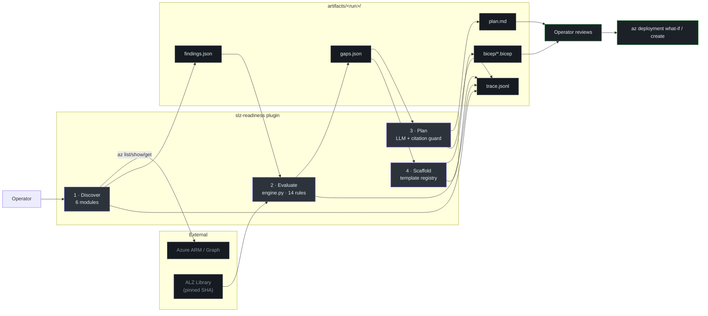
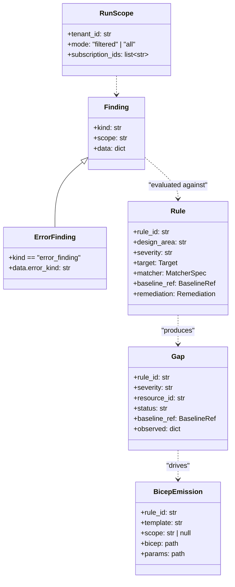
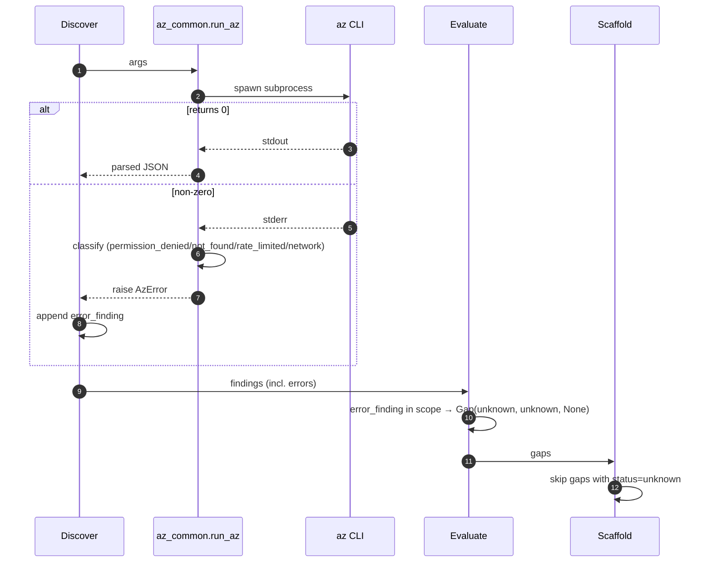
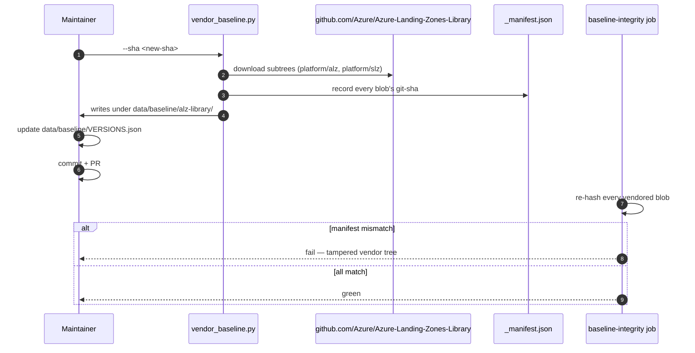

# Architecture Overview

## At a glance

| Attribute | Value |
|---|---|
| Architecture style | 4-phase unidirectional pipeline |
| Data flow | Azure → `findings.json` → `gaps.json` → `plan.md` + `bicep/*.bicep` |
| Safety model | Shell-level verb allowlist + citation guard + template closed-set |
| Determinism | Discover/Evaluate/Scaffold = deterministic; Plan = LLM-narrated + citation-filtered |
| Human-readable numbers | Every phase emits `<phase>.summary.{json,md}`; Scaffold rolls them up into `run.summary.md` — see [Phase Summaries](./phase-summaries.md) |
| Plugin host | GitHub Copilot CLI (APM format) |
| Source-of-truth | Azure Landing Zones Library, pinned by git SHA |

## The pipeline



<!-- Source: docs/architecture.md, .github/agents/slz-readiness.agent.md, scripts/slz_readiness/ -->

## The three invariants

Everything else is implementation detail of these three:

1. **Read-only against Azure.** The shell-level [`hooks/pre_tool_use.py:21`](https://github.com/msucharda/slz-readiness/blob/main/hooks/pre_tool_use.py#L21) `ALLOW_RE` admits `list|show|get|query|search|describe|export|version|account`, and `DENY_RE` blocks `create|delete|set|update|apply|deploy|assign|invoke|new|put|patch`. Gated to `az|azd|bicep` (`AZURE_TOOL_RE`).
2. **Baseline is truth.** Every rule's [`baseline_ref`](https://github.com/msucharda/slz-readiness/blob/main/scripts/slz_readiness/evaluate/models.py) points at a file at a git SHA from [Azure-Landing-Zones-Library](https://github.com/Azure/Azure-Landing-Zones-Library). The baseline is vendored at [`data/baseline/alz-library/`](https://github.com/msucharda/slz-readiness/tree/main/data/baseline/alz-library), every blob's SHA recorded in `_manifest.json`, re-verified by CI ([`baseline_integrity.py`](https://github.com/msucharda/slz-readiness/blob/main/scripts/slz_readiness/evaluate/baseline_integrity.py)).
3. **Deterministic Evaluate.** [`engine.py:51-140`](https://github.com/msucharda/slz-readiness/blob/main/scripts/slz_readiness/evaluate/engine.py#L51-L140) is pure Python. Output is sorted by `(rule_id, resource_id)`. Zero LLM calls. Tested by [`tests/unit/test_evaluate_golden.py`](https://github.com/msucharda/slz-readiness/blob/main/tests/unit/test_evaluate_golden.py).

## Data contracts



<!-- Source: scripts/slz_readiness/evaluate/models.py, loaders.py, scaffold/engine.py -->

## Cross-cutting concerns

### Tracing

[`_trace.py`](https://github.com/msucharda/slz-readiness/blob/main/scripts/slz_readiness/_trace.py) uses a `ContextVar` so a run-id propagates into every subprocess spawn and evaluate pass without explicit threading. NDJSON appending means even partial runs leave useful artifacts.

### Error classification

[`az_common.py`](https://github.com/msucharda/slz-readiness/blob/main/scripts/slz_readiness/discover/az_common.py) classifies every `az` failure into one of four `AzError.kind` values. Discover turns each into an `error_finding`; Evaluate turns each into `status=unknown`; Scaffold refuses to emit for `unknown`.



<!-- Source: scripts/slz_readiness/discover/az_common.py, evaluate/engine.py, scaffold/engine.py -->

### Baseline vendoring



<!-- Source: scripts/slz_readiness/evaluate/vendor_baseline.py, baseline_integrity.py, data/baseline/VERSIONS.json -->

## Why this shape

| Alternative | Rejected because |
|---|---|
| LLM-driven gap analysis | Non-reproducible; cannot be used for compliance evidence |
| Fetch baseline at run time | Offline/air-gapped unusable; supply-chain drift |
| Free-form Bicep generation | AVM compliance impossible to guarantee; what-if behaviour unstable |
| Trust the prompt to stay read-only | One context-saturation bug → writes to production |
| Single monolithic phase | Untestable; each phase is independently golden-testable |

## Extension shape

```mermaid
flowchart LR
    direction TB
    subgraph Closed["Closed-set (modifications require PR + CI)"]
        H["Hooks · pre/post_tool_use.py"]:::c
        M["Matchers · matchers.py MATCHERS dict"]:::c
        T["Templates · ALLOWED_TEMPLATES"]:::c
    end

    subgraph Open["Open (YAML-only 95% of the time)"]
        R["Rules · scripts/evaluate/rules/**/*.yml"]:::o
        RT["Rule→Template · template_registry.py RULE_TO_TEMPLATE"]:::o
    end

    subgraph Dep["Dependent"]
        D["Discoverers · scripts/slz_readiness/discover/*.py"]:::d
    end

    R -.-> M : "kind must exist in MATCHERS"
    RT -.-> T : "value must be in ALLOWED_TEMPLATES"
    D -.-> R : "emits findings rules consume"

    classDef c fill:#1c2128,stroke:#f85149,color:#e6edf3;
    classDef o fill:#1c2128,stroke:#3fb950,color:#e6edf3;
    classDef d fill:#2d333b,stroke:#6d5dfc,color:#e6edf3;
```

## Related reading

- [Plugin Mechanics](/deep-dive/plugin-mechanics) — `apm.yml`, skills, prompts.
- [Hooks](/deep-dive/hooks) — mechanical safety guards.
- [Rule Engine](/deep-dive/evaluate/rule-engine) — deterministic core.
- [Baseline Vendoring](/deep-dive/evaluate/baseline-vendoring) — supply chain.
- [`docs/architecture.md`](https://github.com/msucharda/slz-readiness/blob/main/docs/architecture.md) — first-party architecture note.
- [`docs/anti-hallucination.md`](https://github.com/msucharda/slz-readiness/blob/main/docs/anti-hallucination.md) — safety contract.
