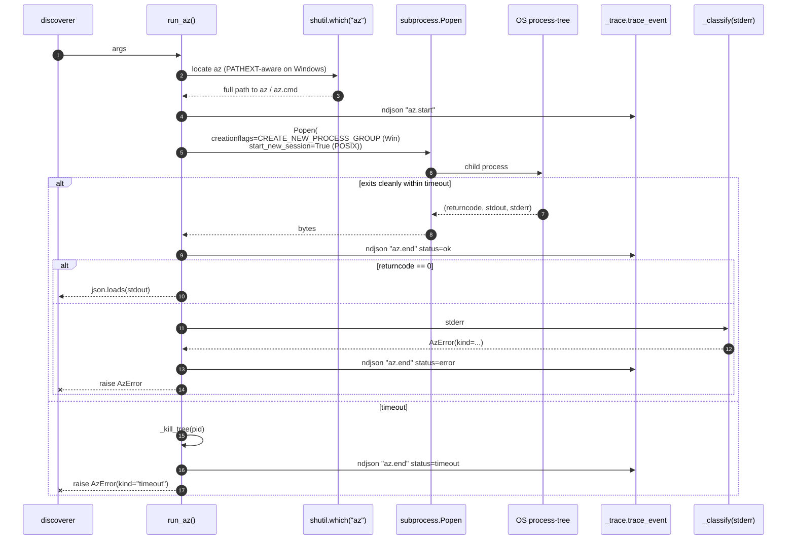
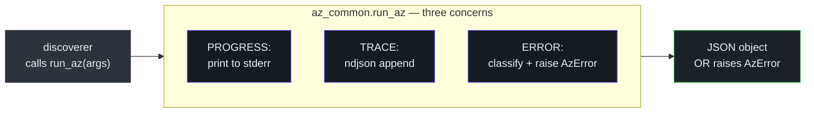

# The `az` Wrapper: subprocess, trace, and error classification

## At a glance

| File | Role |
|---|---|
| [`az_common.py`](https://github.com/msucharda/slz-readiness/blob/main/scripts/slz_readiness/discover/az_common.py) | `run_az()`, `AzError`, cross-platform tree-kill |
| [`_progress.py`](https://github.com/msucharda/slz-readiness/blob/main/scripts/slz_readiness/discover/_progress.py) | TTY-only progress line printer |
| [`_trace.py`](https://github.com/msucharda/slz-readiness/blob/main/scripts/slz_readiness/_trace.py) | `ContextVar`-based NDJSON tracer |

Every Azure CLI call in the discover phase goes through `run_az()`. Never `subprocess.run` directly — otherwise the process-group kill, timeout, classification, and trace events are all bypassed.

## `run_az` contract

```python
def run_az(args: list[str], *, timeout: float | None = None) -> Any:
    """Run `az <args>` and return parsed JSON, or raise AzError."""
```

Defaults:

- `--only-show-errors` is prepended so deprecation warnings don't corrupt JSON.
- `-o json` is appended unless the caller already supplied `-o`.
- Timeout defaults to 60 seconds, overridable via env `SLZ_AZ_TIMEOUT`.

## Under the hood



<!-- Source: scripts/slz_readiness/discover/az_common.py, _trace.py -->

## Why `shutil.which`

On Windows `az` is shipped as `az.cmd`. A bare `subprocess.Popen(["az", ...])` bypasses `PATHEXT` resolution because `shell=False` (correct for safety). `shutil.which("az")` honours `PATHEXT` and returns the full path to `az.cmd`, which `Popen` accepts.

Linux and macOS return `/opt/...` / `/usr/local/bin/az` unchanged.

## Why a new process group

Cancellation. The Azure CLI spawns grandchildren (Python interpreter, auth helpers, sometimes curl). A naive `proc.kill()` orphans the grandchildren, leaving sockets open and the OS tracking zombies.

| OS | Creation | Kill |
|---|---|---|
| Windows | `creationflags=CREATE_NEW_PROCESS_GROUP` | `subprocess.run(["taskkill", "/PID", pid, "/T", "/F"])` |
| POSIX | `start_new_session=True` | `os.killpg(os.getpgid(pid), SIGKILL)` |

`_kill_tree(pid)` in [`az_common.py`](https://github.com/msucharda/slz-readiness/blob/main/scripts/slz_readiness/discover/az_common.py) picks the correct branch.

## Error classification

`AzError.kind` is one of:

| Kind | Stderr marker | Operator action |
|---|---|---|
| `permission_denied` | `AuthorizationFailed`, `403` | Grant Reader at the scope |
| `not_found` | `ResourceNotFound`, `404` | Usually fine — resource doesn't exist |
| `rate_limited` | `429`, `TooManyRequests` | Retry later or shrink scope |
| `network` | `ConnectionError`, DNS-type messages | Check connectivity / proxy |
| `timeout` | n/a (set by wrapper on SIGKILL) | Increase `SLZ_AZ_TIMEOUT` |
| `unknown` | Anything else | Inspect trace.jsonl |

Discoverers treat `not_found` as silent-skip; everything else becomes an `error_finding`.

## Trace NDJSON

`_trace.py` uses a `ContextVar[str]` holding the current run-id. Every `run_az` emits two lines:

```json
{"ts":"2025-01-15T10:22:01.123Z","run":"R","event":"az.start","args":["account","list","--refresh"]}
{"ts":"2025-01-15T10:22:02.456Z","run":"R","event":"az.end","status":"ok","dur_ms":1333}
```

The `ContextVar` choice means every discoverer inherits the run-id without threading it through function signatures — a light-weight dependency injection for trace context.

## Progress line

[`_progress.py`](https://github.com/msucharda/slz-readiness/blob/main/scripts/slz_readiness/discover/_progress.py) writes a one-line summary to stderr when `sys.stderr.isatty()`:

```
[3/6] policy_assignments … 127 findings
```

Behaviour:

- TTY detection — silent in CI.
- `\r` rewrites the same line rather than spamming logs.
- Failure lines are written with `\n` to preserve error visibility.

## Cross-cutting: the three wrapping concerns



Keeping these three concerns in one function means every Azure call is guaranteed to be observable, classified, and cancellable. No discoverer can skip any of them.

## Related reading

- [Discoverers](/deep-dive/discover/discoverers) — how the 6 modules use `run_az`.
- [Architecture](/deep-dive/architecture) — where error findings flow in the pipeline.
