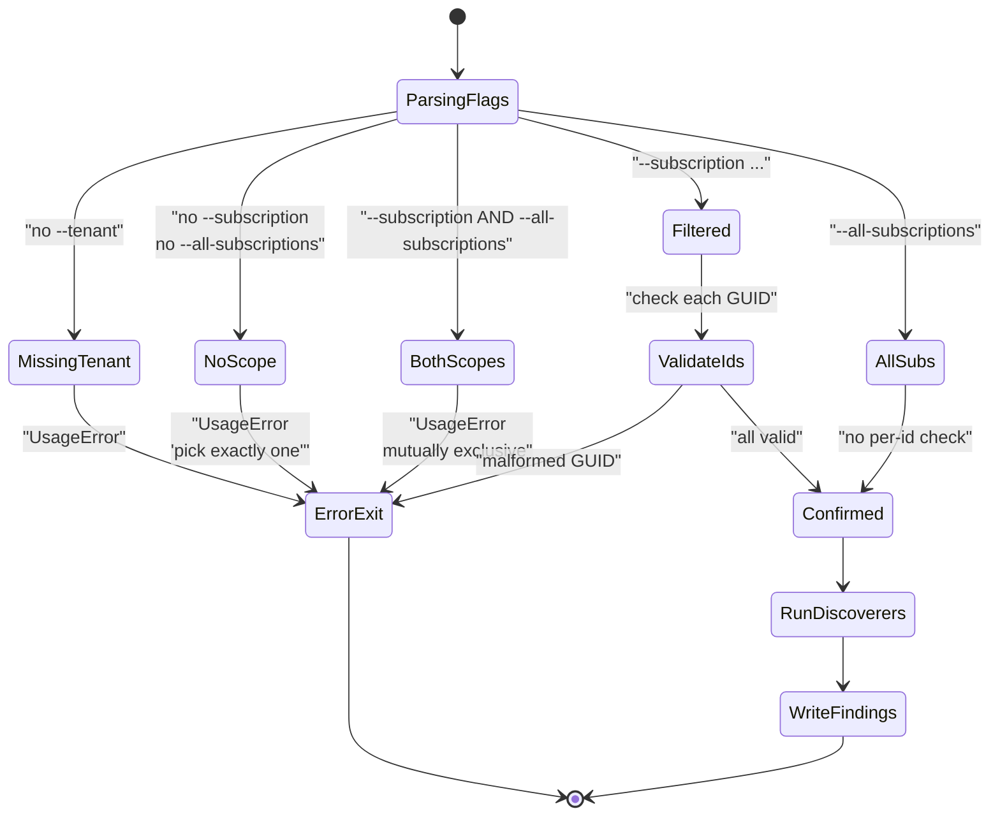
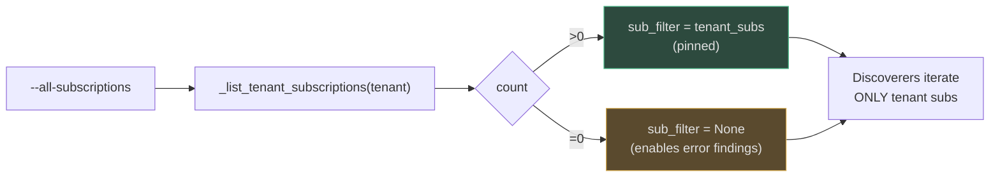
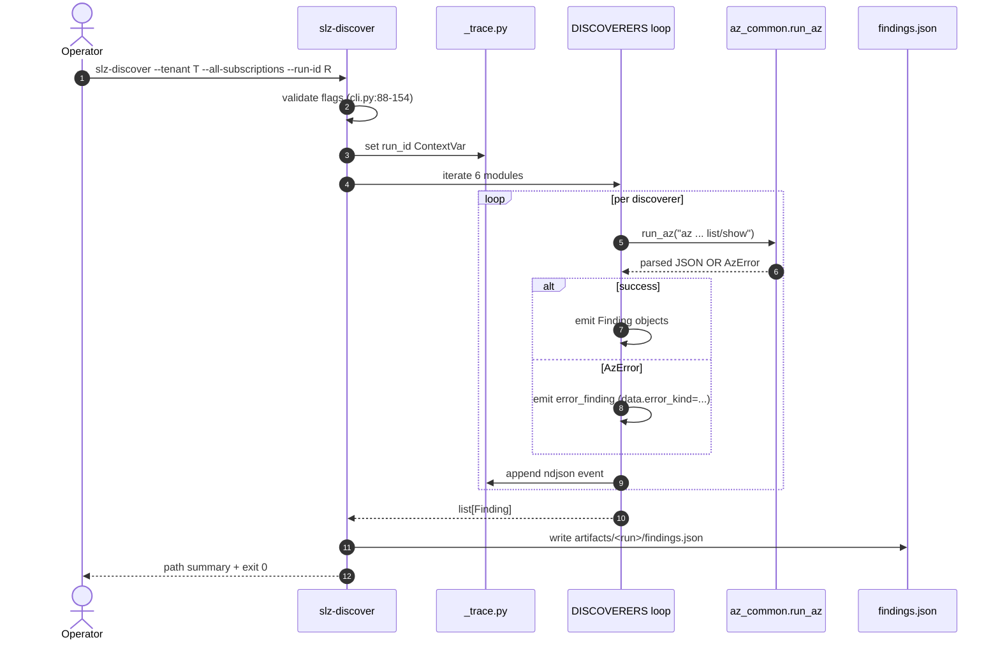
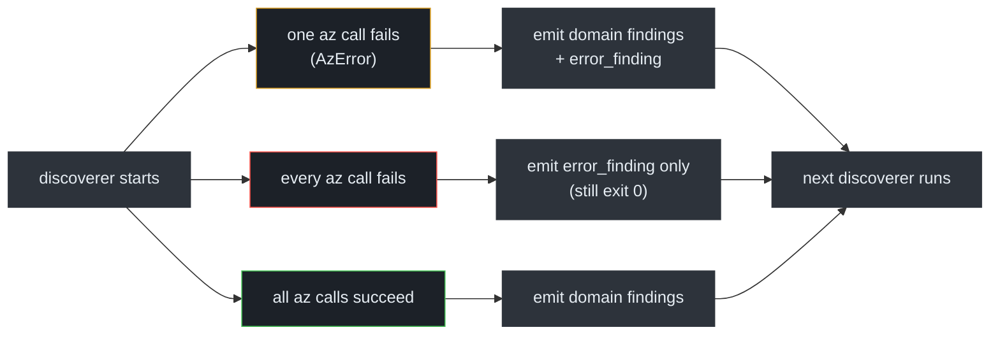

# Discover CLI & Scope Validation

## At a glance

| Attribute | Value |
|---|---|
| Entry point | `slz-discover` (pyproject.toml:31) |
| Module | [`scripts/slz_readiness/discover/cli.py`](https://github.com/msucharda/slz-readiness/blob/main/scripts/slz_readiness/discover/cli.py) |
| Framework | Click |
| Output | `artifacts/<run>/findings.json` |
| Discoverer count | 6 (serial execution) |
| Scope modes | `filtered` (explicit subscriptions) / `all` (tenant-wide) |

## Invocation shapes

All discover runs require `--tenant <guid>`. Scope is then disambiguated with exactly one of:

| Flag | Meaning |
|---|---|
| `--subscription <id>` (repeatable) | Enumerate only the listed subscriptions |
| `--all-subscriptions` | Enumerate every subscription the caller can see |
| (neither) | Error — no default, operator must be explicit |
| (both) | Error — mutually exclusive |

See the validation block at [`cli.py:88-154`](https://github.com/msucharda/slz-readiness/blob/main/scripts/slz_readiness/discover/cli.py#L88-L154).

## The scope state machine

<!-- Source: scripts/slz_readiness/discover/cli.py:88-154, tests/unit/test_discover_scope.py -->

## Why the explicit-scope requirement

A default-to-all-subscriptions posture would be convenient but dangerous — read-only calls at tenant scope can still hit rate limits, surface subscriptions the operator didn't know existed, or leak sensitive tenant topology into an artifact. Making the operator *type* `--all-subscriptions` is the lightest-weight form of informed consent the CLI can enforce.

[`tests/unit/test_discover_scope.py`](https://github.com/msucharda/slz-readiness/blob/main/tests/unit/test_discover_scope.py) covers each branch of this state machine with explicit click `Result` assertions.

## v0.4.1 — cross-tenant fan-out fix

`--all-subscriptions` initially passed `sub_filter=None` to each discoverer, which caused them to fall back to `az account list --all` and iterate every subscription visible to the caller **across every tenant they were a guest in**. The scope banner would report 10 subs while the `sovereignty_controls` progress counter reached 164 iterations (~82 cross-tenant subs × 2 sovereign assignments), violating the tenant-scope guarantee in rule §6a of the instructions.

The fix pins `sub_filter` to the tenant-scoped subscription set computed by `_list_tenant_subscriptions()`. `None` is only passed when the tenant has **zero** subscriptions, so discoverers can still emit tenant-level error findings — see [`discover/cli.py`](https://github.com/msucharda/slz-readiness/blob/main/scripts/slz_readiness/discover/cli.py) and the regression guard at [`tests/unit/test_discover_scope.py::test_sovereignty_controls_ignores_cross_tenant_subs`](https://github.com/msucharda/slz-readiness/blob/main/tests/unit/test_discover_scope.py).

<!-- Sources: scripts/slz_readiness/discover/cli.py (sub_filter pin), tests/unit/test_discover_scope.py::test_cli_all_subscriptions_passes_none_filter, test_cli_all_subscriptions_empty_tenant_passes_none -->

## v0.5.0 — per-module summary

Alongside `findings.json`, Discover now writes `discover.summary.{json,md}` in the same run directory, capturing per-module status, top observations, and caveats (timeouts, permission errors). See [Phase Summaries](../phase-summaries.md) for the contract and [`discover/cli.py:345-444`](https://github.com/msucharda/slz-readiness/blob/main/scripts/slz_readiness/discover/cli.py#L345-L444) for the writer.

## The discoverer list

[`cli.py:24-31`](https://github.com/msucharda/slz-readiness/blob/main/scripts/slz_readiness/discover/cli.py#L24-L31) declares the ordered list of discoverers:

| Order | Module | Emits | Cite |
|---|---|---|---|
| 1 | `subscription_inventory` | `subscription` findings | [`subscription_inventory.py`](https://github.com/msucharda/slz-readiness/blob/main/scripts/slz_readiness/discover/subscription_inventory.py) |
| 2 | `mg_hierarchy` | `management_group` findings | [`mg_hierarchy.py`](https://github.com/msucharda/slz-readiness/blob/main/scripts/slz_readiness/discover/mg_hierarchy.py) |
| 3 | `policy_assignments` | `policy_assignment` findings | [`policy_assignments.py`](https://github.com/msucharda/slz-readiness/blob/main/scripts/slz_readiness/discover/policy_assignments.py) |
| 4 | `identity_rbac` | `role_assignment` findings | [`identity_rbac.py`](https://github.com/msucharda/slz-readiness/blob/main/scripts/slz_readiness/discover/identity_rbac.py) |
| 5 | `logging_monitoring` | `log_analytics_workspace` findings | [`logging_monitoring.py`](https://github.com/msucharda/slz-readiness/blob/main/scripts/slz_readiness/discover/logging_monitoring.py) |
| 6 | `sovereignty_controls` | `sovereignty_baseline` findings | [`sovereignty_controls.py`](https://github.com/msucharda/slz-readiness/blob/main/scripts/slz_readiness/discover/sovereignty_controls.py) |

Order matters only in that subscription inventory runs first to produce the subscription set that subsequent discoverers iterate.

## End-to-end flow

<!-- Source: scripts/slz_readiness/discover/cli.py, _trace.py, az_common.py -->

## Run-id and artifact layout

`--run-id` defaults to a UTC timestamp (`YYYYMMDD-HHMMSSZ`). The CLI creates `artifacts/<run-id>/` and writes:

- `findings.json` — the combined finding list
- `trace.jsonl` — NDJSON of discoverer start/stop, subprocess spawns, errors

Subsequent phases (Evaluate, Plan, Scaffold) reuse the same `<run-id>` directory so all four artifacts are co-located.

## Progress reporting

`--progress` (default on when stderr is a TTY) pipes through [`_progress.py`](https://github.com/msucharda/slz-readiness/blob/main/scripts/slz_readiness/discover/_progress.py) which prints a compact `[3/6] policy_assignments …` line. In CI it's silenced by default to keep logs readable.

## Failure semantics

Discoverer failures are **findings, not exceptions.** Evaluate turns an `error_finding` into a `Gap(status=unknown)`. Scaffold skips unknowns. The operator sees a plan bullet saying "could not observe — permission denied at scope X" instead of a silent missing gap.

## Related reading

- [Discoverers](/deep-dive/discover/discoverers) — the 6 modules in detail.
- [The `az` wrapper](/deep-dive/discover/az-wrapper) — subprocess, trace, classification.
- [Rule Engine](/deep-dive/evaluate/rule-engine) — how error findings become unknown gaps.
