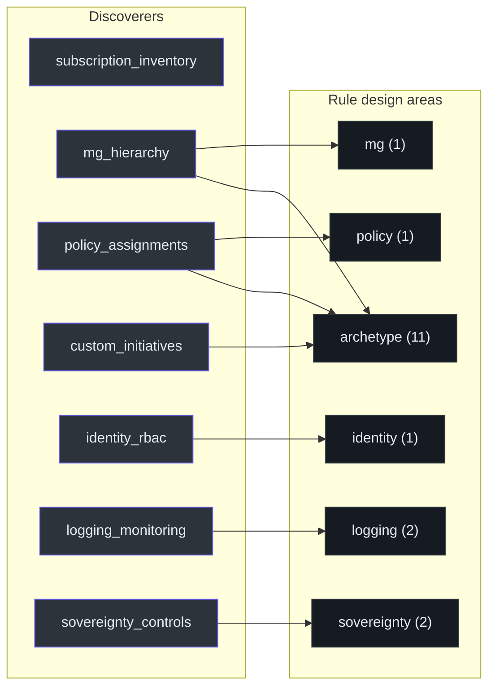

# Discoverers: The Seven Modules

## At a glance

| # | Module | Queries (az ...) | Emits kind |
|---|---|---|---|
| 1 | `mg_hierarchy` | `account management-group list`, `show --expand` | `microsoft.management/managementgroups.*` |
| 2 | `subscription_inventory` | `account list`, `account show` | `microsoft.resources/subscriptions` |
| 3 | `policy_assignments` | `policy assignment list --scope ...` | `microsoft.authorization/policyassignments` |
| 4 | `custom_initiatives` | `policy set-definition show/list` | custom initiative metadata |
| 5 | `identity_rbac` | `role assignment list --scope ...` | `microsoft.authorization/roleassignments` |
| 6 | `logging_monitoring` | `graph query` / workspace enumeration | `microsoft.operationalinsights/workspaces` |
| 7 | `sovereignty_controls` | Composite — policy assignments at specific scopes | sovereignty policy evidence |

All modules live under [`scripts/slz_readiness/discover/`](https://github.com/msucharda/slz-readiness/tree/main/scripts/slz_readiness/discover).

## Shared shape

Every discoverer exposes one function:

```python
def discover(...) -> list[Finding]: ...
```

It reads the tenant/subscription scope, calls `az_common.run_az(...)` one or more times, and returns finding dictionaries with `resource_type`, `resource_id`, `scope`, `observed_state`, and `query_cmd`. Errors become explicit error findings rather than uncaught exceptions.

## Per-module breakdown

### 1. Management-group hierarchy

Walks the tenant's MG tree. Uses `az account management-group list` + `show --expand --recurse` to build the parent/child graph and emits the `managementgroups.summary` record that Reconcile validates aliases against. Cite: [`mg_hierarchy.py`](https://github.com/msucharda/slz-readiness/blob/main/scripts/slz_readiness/discover/mg_hierarchy.py).

Feeds: `mg.slz.hierarchy_shape` rule, all `archetype.*` rules (which match on MG name).

### 2. Subscription inventory

Supplies the tenant-filtered subscription set used by subscription-scoped
checks. Cite: [`subscription_inventory.py`](https://github.com/msucharda/slz-readiness/blob/main/scripts/slz_readiness/discover/subscription_inventory.py).

### 3. Policy assignments

Per MG and per subscription, calls `az policy assignment list --scope <scope>`. The per-scope scoping is deliberate — `--disable-scope-strict-match` would return inherited assignments and confuse the matchers.

Cite: [`policy_assignments.py`](https://github.com/msucharda/slz-readiness/blob/main/scripts/slz_readiness/discover/policy_assignments.py).

Feeds: `policy.*`, `sovereignty.*`, `archetype.*` rules.

### 4. Custom initiatives

Collects custom initiative metadata so Evaluate can identify non-canonical
policy-set wrappers around baseline assignments where supported. Cite:
[`custom_initiatives.py`](https://github.com/msucharda/slz-readiness/blob/main/scripts/slz_readiness/discover/custom_initiatives.py).

### 5. Identity RBAC

Role assignments at tenant-root and per-MG scope. Filters by the built-in role ids the rules care about (Reader, Contributor, Owner, specific RBAC for Identity archetype).

Cite: [`identity_rbac.py`](https://github.com/msucharda/slz-readiness/blob/main/scripts/slz_readiness/discover/identity_rbac.py).

Feeds: `identity.platform_identity_mg_exists`.

### 6. Logging & monitoring

Iterates subscriptions; `az monitor log-analytics workspace list --subscription <id>`. Emits one Finding per workspace with `data.location`, `data.sku`, `data.retention_in_days`.

Cite: [`logging_monitoring.py`](https://github.com/msucharda/slz-readiness/blob/main/scripts/slz_readiness/discover/logging_monitoring.py).

Feeds: `logging.management_mg_exists` and `logging.management_la_workspace_exists`.

### 7. Sovereignty controls

Composite discoverer — does not itself make new `az` calls but **re-shapes** the outputs of `policy_assignments` at specific sovereignty-relevant scopes (tenant root and Confidential MG). Emits `sovereignty_baseline` findings whose `data.assignments[]` carries `policySetDefinitionId` values for matching.

Pinned policySetDefinitionIds for the sovereignty rules:

| Policy | ID |
|---|---|
| SLZ Global policies | `c1cbff38-87c0-4b9f-9f70-035c7a3b5523` |
| SLZ Confidential policies | `03de05a4-c324-4ccd-882f-a814ea8ab9ea` |

Cite: [`sovereignty_controls.py`](https://github.com/msucharda/slz-readiness/blob/main/scripts/slz_readiness/discover/sovereignty_controls.py).

Feeds: `policy.slz.sovereign_root_policies_applied`,
`sovereignty.confidential_corp_policies_applied`, and
`sovereignty.confidential_online_policies_applied`.

## Finding → Rule fan-out



<!-- Source: scripts/slz_readiness/discover/, scripts/evaluate/rules/ -->

## Why serial, not parallel

A parallel pool would be faster, especially for large tenants. Sequential execution is chosen because:

1. **Trace determinism** — NDJSON events are easier to reason about when there's only one writer.
2. **Rate-limiting** — Azure ARM limits are per-subscription + per-tenant; serialising controls the peak RPS without a token-bucket.
3. **Subscription inventory must run first** — other discoverers need its output. You'd need a two-stage parallel pipeline for marginal gain.

Profile data shows a 50-subscription tenant completes in < 3 minutes serially — acceptable for an audit tool.

## Adding a new discoverer

1. Create `scripts/slz_readiness/discover/<area>.py` exposing `def discover(scope) -> list[Finding]`.
2. Register it in the `DISCOVERERS` list at [`cli.py:24-31`](https://github.com/msucharda/slz-readiness/blob/main/scripts/slz_readiness/discover/cli.py#L24-L31).
3. Use `az_common.run_az()` for every shell-out — never raw `subprocess`.
4. Return `error_finding` for non-permission errors; skip silently for expected `not_found`.
5. Extend `tests/unit/test_discover_scope.py` if the new module introduces new CLI flags.

## Related reading

- [CLI & Scope](/deep-dive/discover/cli-and-scope) — invocation and ordering.
- [The `az` wrapper](/deep-dive/discover/az-wrapper) — `run_az` contract.
- [Rule Engine](/deep-dive/evaluate/rule-engine) — how findings become gaps.
