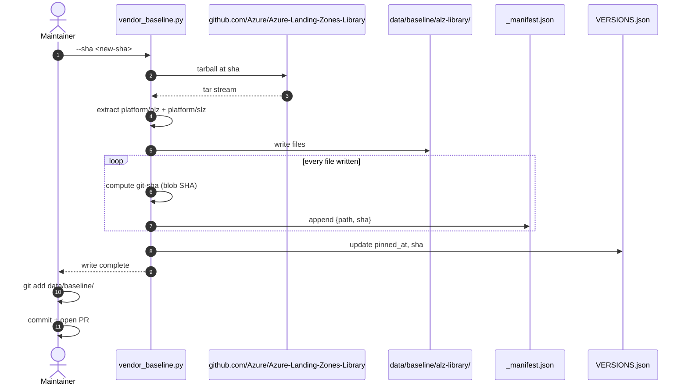
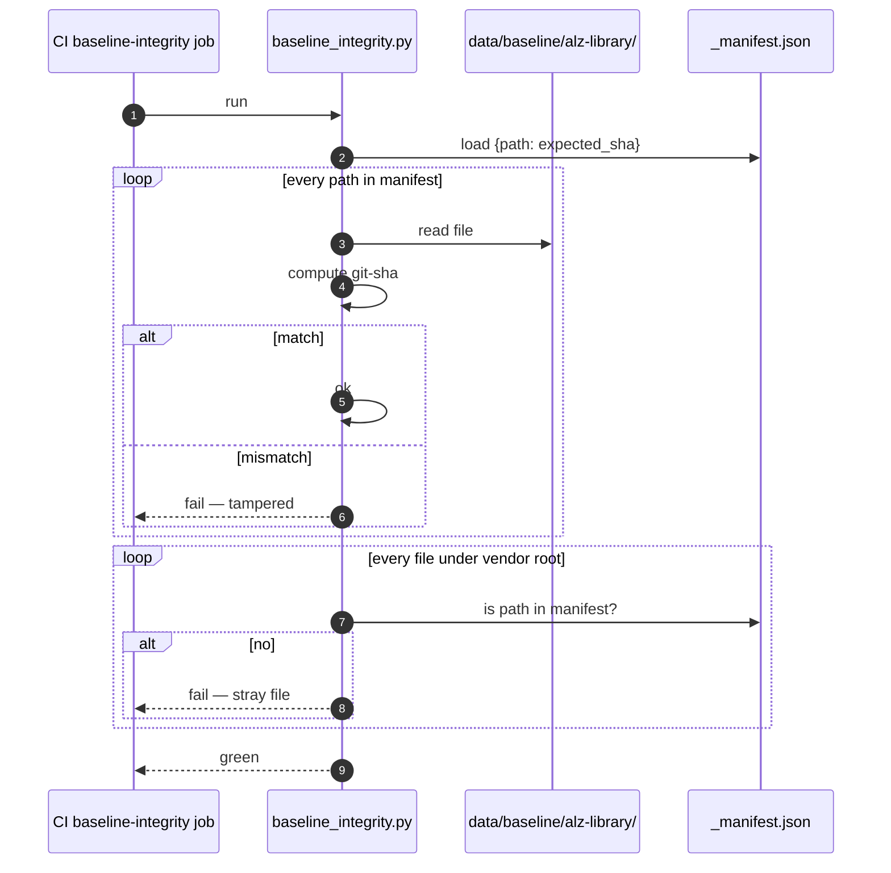
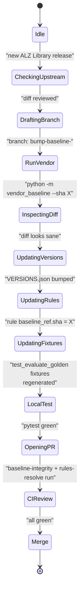

# Baseline Vendoring

## At a glance

| Attribute | Value |
|---|---|
| Source | [`Azure/Azure-Landing-Zones-Library`](https://github.com/Azure/Azure-Landing-Zones-Library) |
| Subtrees vendored | `platform/alz`, `platform/slz` |
| Pinned SHA | `559a4c86fd57eddd9ee5047fb01a455866bd1cf8` |
| Location in repo | [`data/baseline/alz-library/`](https://github.com/msucharda/slz-readiness/tree/main/data/baseline/alz-library) |
| Manifest | [`data/baseline/alz-library/_manifest.json`](https://github.com/msucharda/slz-readiness/blob/main/data/baseline/alz-library/_manifest.json) |
| Version record | [`data/baseline/VERSIONS.json`](https://github.com/msucharda/slz-readiness/blob/main/data/baseline/VERSIONS.json) |
| Vendor script | [`vendor_baseline.py`](https://github.com/msucharda/slz-readiness/blob/main/scripts/slz_readiness/evaluate/vendor_baseline.py) |
| Integrity check | [`baseline_integrity.py`](https://github.com/msucharda/slz-readiness/blob/main/scripts/slz_readiness/evaluate/baseline_integrity.py) |
| CI gate | `baseline-integrity` job in [`ci.yml`](https://github.com/msucharda/slz-readiness/blob/main/.github/workflows/ci.yml) |

## Why vendor

Three design forces pointing in the same direction:

1. **Offline / air-gapped** tenants must be auditable without network access to github.com.
2. **Supply-chain drift** — if baseline content is fetched at run time, an operator running on Tuesday gets different results than one running on Wednesday. Compliance evidence becomes un-reproducible.
3. **Deterministic tests** — golden fixtures only work if the baseline is fixed.

Vendoring at a pinned SHA with manifest-hash verification addresses all three.

## The vendoring flow



<!-- Source: scripts/slz_readiness/evaluate/vendor_baseline.py, data/baseline/ -->

## The integrity check



<!-- Source: scripts/slz_readiness/evaluate/baseline_integrity.py, .github/workflows/ci.yml -->

The check is **bidirectional**:

- Every manifest entry must be on disk with matching sha.
- Every file on disk must be in the manifest.

This catches both accidental edits (sha mismatch) and sneaky additions (stray file).

## `rules-resolve` CI gate

The `rules-resolve` job in [`ci.yml`](https://github.com/msucharda/slz-readiness/blob/main/.github/workflows/ci.yml) does the reverse direction: every rule's `baseline_ref.path` + `baseline_ref.sha` must successfully resolve against the vendored tree.

- Adding a rule pointing at a non-vendored path → fails.
- Bumping a rule's sha without re-vendoring → fails.

Implemented via [`rules_resolve.py`](https://github.com/msucharda/slz-readiness/blob/main/scripts/slz_readiness/evaluate/rules_resolve.py) → [`loaders.resolve_sha()`](https://github.com/msucharda/slz-readiness/blob/main/scripts/slz_readiness/evaluate/loaders.py#L46).

## Upgrade workflow



The two CI gates (`baseline-integrity`, `rules-resolve`) make this hard to mess up silently.

## `VERSIONS.json` shape

```json
{
  "plugin": "0.4.0",
  "alz_library": {
    "repo": "Azure/Azure-Landing-Zones-Library",
    "sha": "559a4c86fd57eddd9ee5047fb01a455866bd1cf8",
    "pinned_at": "2025-01-10T00:00:00Z"
  }
}
```

Displayed by `slz-discover --version` and embedded in `findings.json` metadata for audit traceability.

## Why git-sha, not sha256

Git's blob sha is what GitHub shows in its UI when you navigate to a file — making the `(sha, path)` pair directly verifiable by any reviewer against the upstream repo. `sha256` would require a custom verification tool. Developer ergonomics for a rarely-exercised operation.

## Related reading

- [Rules Catalog](/deep-dive/evaluate/rules-catalog) — every `baseline_ref` uses the vendored tree.
- [Rule Engine](/deep-dive/evaluate/rule-engine) — how `resolve_sha()` is called at runtime.
- [Release Process](/deep-dive/release-process) — how `VERSIONS.json` stays in lock-step with `apm.yml`.
- [Testing](/deep-dive/testing) — the CI jobs that enforce integrity.
