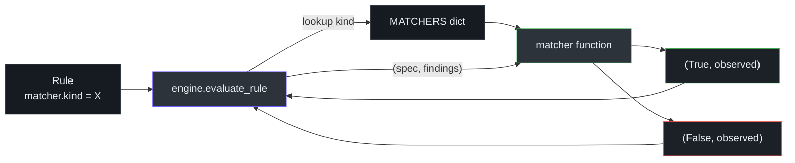
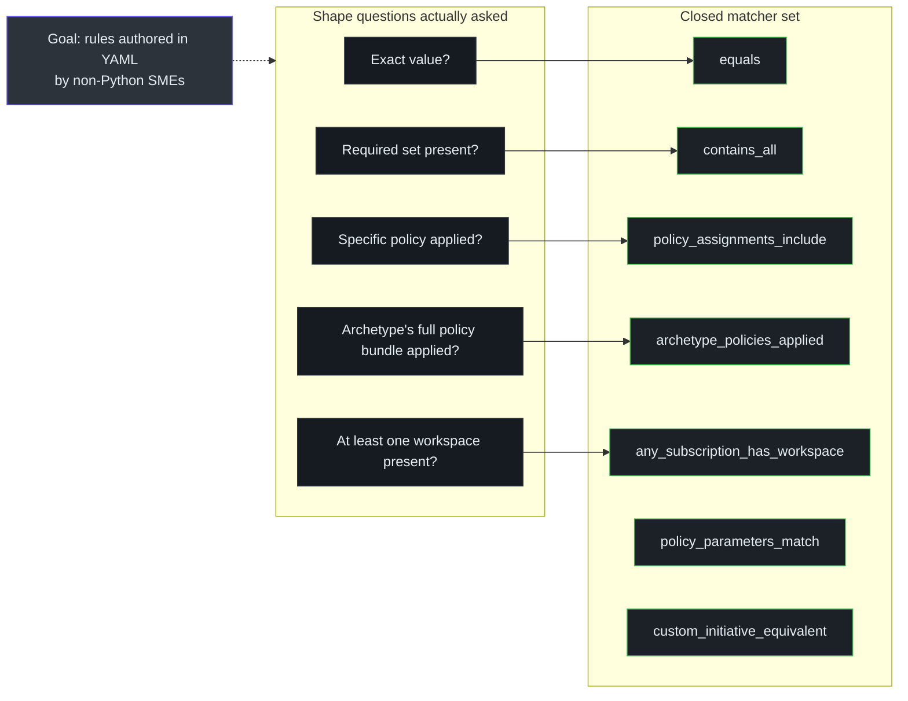

# Matchers

## At a glance

| Matcher kind | Purpose | Example rule |
|---|---|---|
| `equals` | Exact value match on one field | `mg.slz.hierarchy_shape` |
| `contains_all` | Observed set ⊇ required set | Role-assignment lists |
| `policy_assignments_include` | Required policy assignment names are present | legacy / generic policy assignment checks |
| `archetype_policies_applied` | All expected policies for a named archetype are applied, with definition-id fallback | `archetype.*_policies_applied` |
| `any_subscription_has_workspace` | At least one subscription in scope has a Log Analytics workspace | `logging.management_la_workspace_exists` |
| `policy_parameters_match` | Assigned policy parameters match baseline where auto-comparison is safe | `archetype.*_policy_parameters_match` |
| `custom_initiative_equivalent` | Custom initiative contents match the baseline definition-id set | custom initiative drift rules |

Source: [`matchers.py`](https://github.com/msucharda/slz-readiness/blob/main/scripts/slz_readiness/evaluate/matchers.py), registry at [`matchers.py:396`](https://github.com/msucharda/slz-readiness/blob/main/scripts/slz_readiness/evaluate/matchers.py#L396).

## Signature

Every matcher conforms to one type:

```python
Matcher = Callable[[Any, Any, dict[str, Any]], tuple[bool, Any] | tuple[bool, Any, str | None]]
```

- `observed` — the selected finding payload(s) from `findings.json`.
- `expected` — the rule's expected value.
- `spec` — the `matcher:` block from the rule YAML (with a `type` discriminator).
- Return `(ok, observed)`:
  - `ok = True` — rule passes, `observed` is informational.
  - `ok = False` — rule fails, `observed` is the evidence written into the Gap.

## The MATCHERS registry

[`matchers.py:396`](https://github.com/msucharda/slz-readiness/blob/main/scripts/slz_readiness/evaluate/matchers.py#L396):

```python
MATCHERS: dict[str, Matcher] = {
    "equals": _equals,
    "contains_all": _contains_all,
    "policy_assignments_include": _policy_assignments_include,
    "archetype_policies_applied": _archetype_policies_applied,
    "any_subscription_has_workspace": _any_subscription_has_workspace,
    "policy_parameters_match": _policy_parameters_match,
    "custom_initiative_equivalent": _custom_initiative_equivalent,
}
```

Adding a new matcher kind requires:

1. A new `_new_matcher(spec, findings)` function in `matchers.py`.
2. Registration in the `MATCHERS` dict.
3. A parametrized unit test.
4. A rule YAML that uses it with golden fixtures updated.

This is the closed-set safety surface — rules can't smuggle in arbitrary Python.

## Dispatch



## Matcher-by-matcher

### `equals`

```yaml
matcher:
  kind: equals
  field: data.display_name
  value: "SLZ Platform"
```

Passes when a single finding's `field` equals `value`. `observed` reports the mismatched value. Used sparingly — most shape questions are set-based.

### `contains_all`

```yaml
matcher:
  kind: contains_all
  field: data.required_role_definition_ids
  values: ["acdd72a7-...", "b24988ac-..."]
```

Passes when `findings[].field` (treated as a set) is a superset of `values`. Missing elements go into `observed.missing`.

### `policy_assignments_include`

```yaml
matcher:
  type: policy_assignments_include
```

Walks policy-assignment findings in scope and passes when all expected assignment names are present. `observed` lists present and missing assignment names.

### `archetype_policies_applied`

```yaml
matcher:
  type: archetype_policies_applied
  archetype_ref:
    path: platform/alz/archetype_definitions/corp.alz_archetype_definition.json
```

Cross-references:

- selected policy-assignment findings at that MG's scope.
- The baseline policy list for that archetype (loaded from the pinned ALZ Library).

Passes when the in-scope MG carries the expected policy assignment set. `observed` lists required, present, missing, and `matched_by_defid` assignments.

### `any_subscription_has_workspace`

```yaml
matcher:
  kind: any_subscription_has_workspace
  min_retention_days: 30
```

Aggregate-style: passes when **any** `log_analytics_workspace` finding in scope has `data.retention_in_days >= 30`. `observed` lists the workspaces inspected and their retention values.

## Why a small closed set



The closed matcher set covers every question the current rules ask. Adding an unconstrained "custom JSON path + operator" matcher would explode the surface area for hallucination and would force rule authors to learn JSONPath semantics.

## Observed payload conventions

Each matcher returns `observed` with a small, documented shape so the Plan phase can rely on it and Scaffold can populate template parameters from it:

| Matcher | `observed` keys |
|---|---|
| `equals` | `expected`, `actual`, `field` |
| `contains_all` | `required`, `present`, `missing` |
| `policy_assignments_include` | `scope`, `expected_id`, `assignments_seen` |
| `archetype_policies_applied` | `required`, `present`, `missing`, `matched_by_defid` |
| `any_subscription_has_workspace` | `workspace_count`, `workspaces_sample` |
| `policy_parameters_match` | `drifted_assignments` |
| `custom_initiative_equivalent` | `drifted_initiatives` |

The Plan prompt reads these shapes when composing remediation bullets.

## Related reading

- [Rule Engine](/deep-dive/evaluate/rule-engine) — how matchers are dispatched.
- [Rules Catalog](/deep-dive/evaluate/rules-catalog) — which rule uses which matcher.
- [Baseline Vendoring](/deep-dive/evaluate/baseline-vendoring) — where `archetype_policies_applied` gets its expected policy list.
