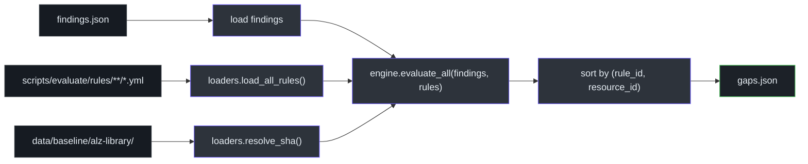
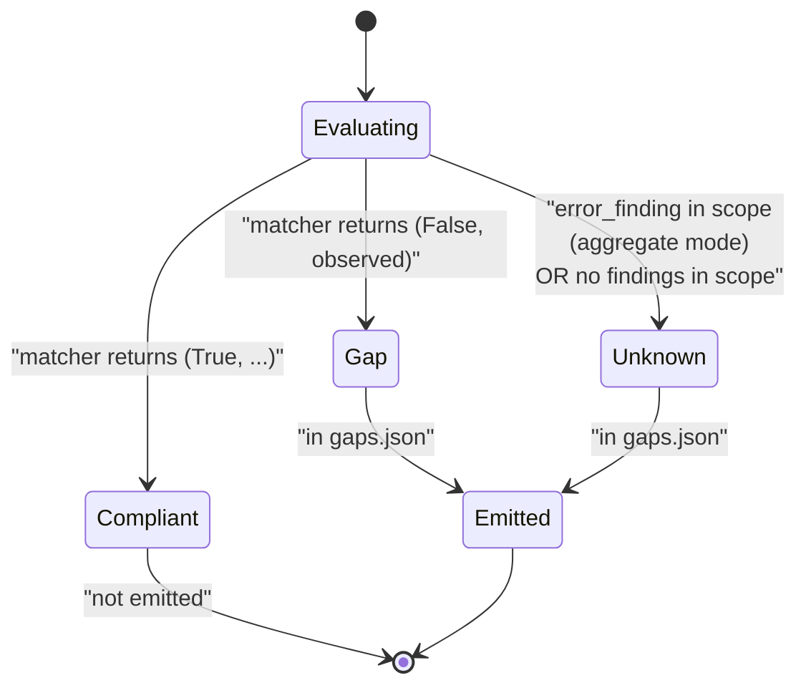
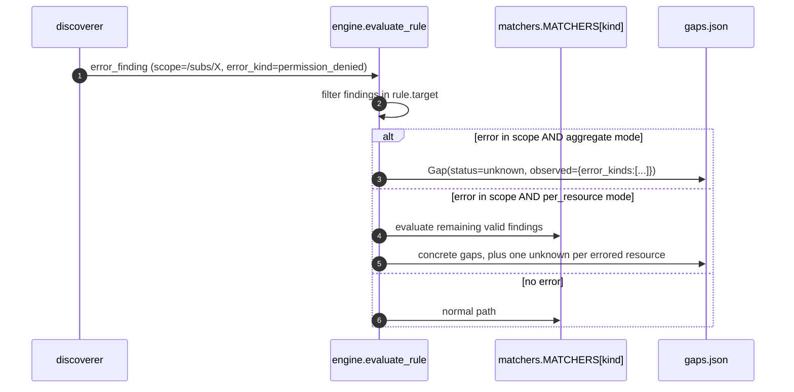

# Rule Engine

## At a glance

| Attribute | Value |
|---|---|
| Entry point | `slz-evaluate` |
| Core | [`scripts/slz_readiness/evaluate/engine.py`](https://github.com/msucharda/slz-readiness/blob/main/scripts/slz_readiness/evaluate/engine.py) |
| Critical window | [`engine.py:51-140`](https://github.com/msucharda/slz-readiness/blob/main/scripts/slz_readiness/evaluate/engine.py#L51-L140) — `evaluate_rule` main branches |
| LLM calls | **Zero.** |
| Determinism | Output sorted by `(rule_id, resource_id)` |
| Test | [`tests/unit/test_evaluate_golden.py`](https://github.com/msucharda/slz-readiness/blob/main/tests/unit/test_evaluate_golden.py) |

## Pipeline shape



<!-- Source: scripts/slz_readiness/evaluate/engine.py, loaders.py -->

## `evaluate_rule` — the core branch

Roughly (paraphrased from [`engine.py:51-140`](https://github.com/msucharda/slz-readiness/blob/main/scripts/slz_readiness/evaluate/engine.py#L51-L140)):

```python
def evaluate_rule(rule: Rule, findings: list[Finding]) -> list[Gap]:
    # 1. scope filter
    in_scope = [f for f in findings if _in_scope(f, rule.target)]

    # 2. error handling
    errors = [f for f in in_scope if f.kind == "error_finding"]
    if errors and rule.target.mode == "aggregate":
        return [Gap(rule_id=rule.rule_id, severity=rule.severity,
                    resource_id="unknown", status="unknown",
                    baseline_ref=rule.baseline_ref,
                    observed={"error_kinds": [e.data["error_kind"] for e in errors]})]

    # 3. matcher dispatch
    matcher = MATCHERS[rule.matcher.kind]

    # 4. aggregate vs per-resource
    if rule.target.mode == "aggregate":
        ok, observed = matcher(rule.matcher, in_scope)
        if ok:
            return []  # compliant
        return [Gap(rule_id=..., resource_id="<scope>", status="gap", observed=observed)]
    else:
        gaps = []
        for f in in_scope:
            ok, observed = matcher(rule.matcher, [f])
            if not ok:
                gaps.append(Gap(rule_id=..., resource_id=f.data["id"], status="gap", observed=observed))
        return gaps
```

## The three Gap statuses



| Status | Meaning | Scaffold behaviour |
|---|---|---|
| (compliant — not emitted) | Rule passed | — |
| `gap` | Rule failed with concrete observation | Emit Bicep |
| `unknown` | Rule could not be evaluated (error, missing data) | Skip — no Bicep |

## Aggregate vs per-resource

Set by `rule.target.mode`:

- **`aggregate`** — the matcher evaluates the whole finding set once. Example: `logging.slz.workspace_exists` asks "does *any* subscription in scope have a workspace?" — one gap or none.
- **`per_resource`** — the matcher evaluates each finding independently. Example: `archetype.alz_corp.policies` iterates every Corp-matching MG and emits one gap per non-compliant MG.

Cite: [`engine.py:51-140`](https://github.com/msucharda/slz-readiness/blob/main/scripts/slz_readiness/evaluate/engine.py#L51-L140).

## Determinism checklist

To stay deterministic the engine must avoid:

- **Set iteration** — use `sorted()`.
- **Dict ordering** — Python 3.7+ preserves insertion order, but we don't rely on it; outputs are re-sorted.
- **`time.time()` in observed payloads** — never. Timestamps live in `trace.jsonl` only.
- **Floating-point anywhere** — rules are set/subset matchers, no thresholds.
- **LLM calls** — hard prohibited; CI grep guards this.

Verified by the golden test: re-run on the same inputs, byte-for-byte equal output.

## The golden test

[`tests/unit/test_evaluate_golden.py`](https://github.com/msucharda/slz-readiness/blob/main/tests/unit/test_evaluate_golden.py) loads a checked-in `findings.json` fixture, runs the engine, and compares against a checked-in `gaps.json`. Any rule change without a fixture update is caught here.

## Error propagation flow



## Unknown → Plan → human

When a gap carries `status=unknown`, the Plan phase emits a bullet like:

> - [rule_id: logging.slz.workspace_exists] Could not evaluate — permission_denied observed. Grant `Reader` at `/providers/Microsoft.Management/managementGroups/slz-platform` and re-run discover.

The Scaffold phase then skips the rule entirely — emitting Bicep from "we don't know" would be a supply-chain footgun.

## Related reading

- [Matchers](/deep-dive/evaluate/matchers) — the 5 matcher kinds.
- [Rules Catalog](/deep-dive/evaluate/rules-catalog) — the 14 rules table.
- [Baseline Vendoring](/deep-dive/evaluate/baseline-vendoring) — supply chain.
- [`docs/anti-hallucination.md`](https://github.com/msucharda/slz-readiness/blob/main/docs/anti-hallucination.md) — why this phase is LLM-free.
