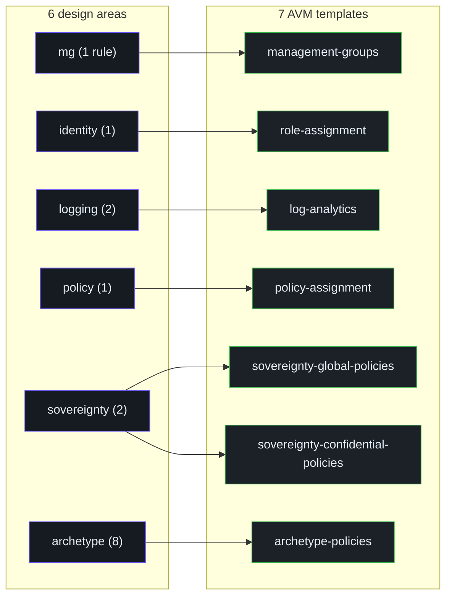
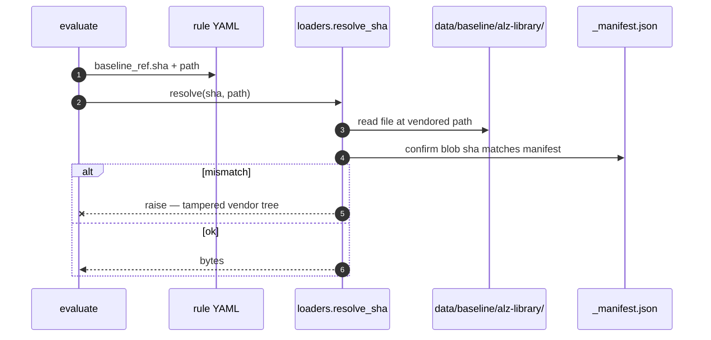

# Rules Catalog

## At a glance

| Attribute | Value |
|---|---|
| Rule count | 14 |
| Design areas | 6 (mg · identity · logging · policy · sovereignty · archetype) |
| Rule format | YAML — one file per rule |
| Location | [`scripts/evaluate/rules/**/*.yml`](https://github.com/msucharda/slz-readiness/tree/main/scripts/evaluate/rules) |
| Loader | [`loaders.load_all_rules()`](https://github.com/msucharda/slz-readiness/blob/main/scripts/slz_readiness/evaluate/loaders.py#L83) |
| Rule model | [`loaders.Rule`](https://github.com/msucharda/slz-readiness/blob/main/scripts/slz_readiness/evaluate/loaders.py#L20) |

## The 14 rules

| Rule ID | Design area | Severity | Matcher | Scaffold template |
|---|---|---|---|---|
| `mg.slz.hierarchy_shape` | mg | high | `equals` | `management-groups` |
| `identity.slz.privileged_roles` | identity | high | `contains_all` | `role-assignment` |
| `logging.slz.workspace_exists` | logging | medium | `any_subscription_has_workspace` | `log-analytics` |
| `logging.slz.diagnostic_settings` | logging | medium | `contains_all` | `log-analytics` |
| `policy.slz.assignments_shape` | policy | medium | `policy_assignments_include` | `policy-assignment` |
| `sovereignty.slz.global_policies` | sovereignty | high | `policy_assignments_include` | `sovereignty-global-policies` |
| `sovereignty.slz.confidential_policies` | sovereignty | high | `policy_assignments_include` | `sovereignty-confidential-policies` |
| `archetype.alz_connectivity.policies` | archetype | medium | `archetype_policies_applied` | `archetype-policies` |
| `archetype.alz_corp.policies` | archetype | medium | `archetype_policies_applied` | `archetype-policies` |
| `archetype.alz_decommissioned.policies` | archetype | low | `archetype_policies_applied` | `archetype-policies` |
| `archetype.alz_identity.policies` | archetype | high | `archetype_policies_applied` | `archetype-policies` |
| `archetype.alz_landing_zones.policies` | archetype | medium | `archetype_policies_applied` | `archetype-policies` |
| `archetype.alz_platform.policies` | archetype | high | `archetype_policies_applied` | `archetype-policies` |
| `archetype.alz_sandbox.policies` | archetype | low | `archetype_policies_applied` | `archetype-policies` |
| `archetype.slz_public.policies` | archetype | medium | `archetype_policies_applied` | `archetype-policies` |

Cite: [`scripts/evaluate/rules/`](https://github.com/msucharda/slz-readiness/tree/main/scripts/evaluate/rules), [`template_registry.py:21`](https://github.com/msucharda/slz-readiness/blob/main/scripts/slz_readiness/scaffold/template_registry.py#L21) (`RULE_TO_TEMPLATE`).

## Rule YAML anatomy

```yaml
rule_id: sovereignty.slz.global_policies
design_area: sovereignty
severity: high

target:
  scope: tenant_root
  mode: aggregate
  finding_kinds: [policy_assignment]

matcher:
  kind: policy_assignments_include
  policy_set_definition_id: c1cbff38-87c0-4b9f-9f70-035c7a3b5523

baseline_ref:
  repo: Azure/Azure-Landing-Zones-Library
  path: platform/slz/policyAssignments/Deploy-SLZ-Global.alz_policy_assignment.json
  sha: 559a4c86fd57eddd9ee5047fb01a455866bd1cf8

remediation:
  summary: Assign the SLZ Global policy set at tenant root.
  template_hint: sovereignty-global-policies
```

The fields map one-to-one to [`loaders.Rule`](https://github.com/msucharda/slz-readiness/blob/main/scripts/slz_readiness/evaluate/loaders.py#L20).

## Design areas



<!-- Source: scripts/evaluate/rules/, scripts/slz_readiness/scaffold/template_registry.py -->

## Severity semantics

| Severity | Meaning | Typical scaffold behaviour |
|---|---|---|
| `high` | Security or sovereignty control — deployment without this is unsafe | Emitted first in plan.md; bolded |
| `medium` | Governance — best practice, not a safety failure | Normal bullet |
| `low` | Hygiene — e.g. decommissioned archetype cleanliness | Grouped under "optional improvements" |

Severity **does not** change whether Scaffold emits Bicep — only the plan narrative ordering.

## Baseline refs

Every rule's `baseline_ref` points at a specific file in the Azure Landing Zones Library at a specific git SHA. Currently all rules pin to SHA `559a4c86fd57eddd9ee5047fb01a455866bd1cf8`.

The integrity path:



## Adding a new rule

The 95% path — no Python changes needed:

1. Create `scripts/evaluate/rules/<design_area>/<rule_id>.yml`.
2. Ensure the matcher `kind` exists in `MATCHERS`.
3. Ensure the scaffold template hint exists in `ALLOWED_TEMPLATES`.
4. Add a row to `RULE_TO_TEMPLATE` in [`template_registry.py:21`](https://github.com/msucharda/slz-readiness/blob/main/scripts/slz_readiness/scaffold/template_registry.py#L21).
5. Add fixtures in `tests/fixtures/` and extend `test_evaluate_golden.py`.
6. Run `slz-rules-resolve` (see Baseline Vendoring) — CI will reject unresolvable `baseline_ref`.

The 5% path — if you need a new matcher or template:

- New matcher → change `matchers.py` + `MATCHERS` dict + unit test.
- New template → add `scripts/scaffold/avm_templates/<name>.bicep` + schema + extend `ALLOWED_TEMPLATES`.

## Related reading

- [Rule Engine](/deep-dive/evaluate/rule-engine) — how rules are dispatched.
- [Matchers](/deep-dive/evaluate/matchers) — matcher kinds in detail.
- [Baseline Vendoring](/deep-dive/evaluate/baseline-vendoring) — the SHA pin.
- [Scaffold: Engine & Registry](/deep-dive/scaffold/engine-and-registry) — rule-to-template mapping.
