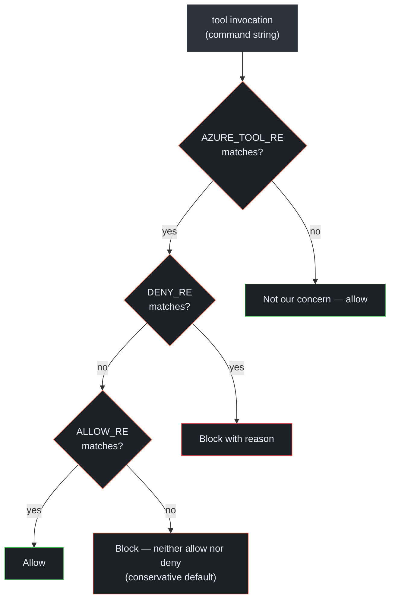
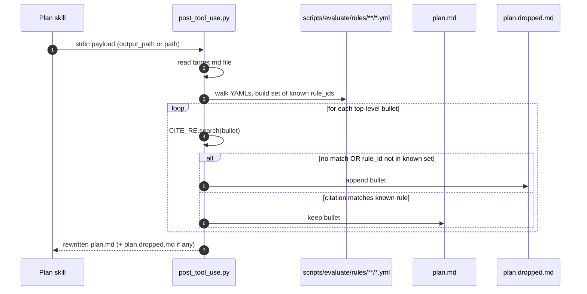

# Hooks: Pre- and Post-Tool-Use

## At a glance

| Hook | File | Runs | Purpose |
|---|---|---|---|
| Pre-tool-use | [`hooks/pre_tool_use.py`](https://github.com/msucharda/slz-readiness/blob/main/hooks/pre_tool_use.py) | Before every tool invocation | Allow-list Azure CLI verbs; deny writes |
| Post-tool-use | [`hooks/post_tool_use.py`](https://github.com/msucharda/slz-readiness/blob/main/hooks/post_tool_use.py) | After plan/reconcile artifact writes | Strip plan bullets without rule citations; repair invalid `mg_alias.json` entries |

Both scripts are standalone Python files with **zero runtime dependencies**. Cross-platform. Copilot CLI shells out to them; they read JSON from stdin and write a verdict to stdout/stderr.

## Pre-tool-use: the verb allowlist

### Regexes (the core of the hook)

From [`hooks/pre_tool_use.py:21-33`](https://github.com/msucharda/slz-readiness/blob/main/hooks/pre_tool_use.py#L21-L33):

```python
AZURE_TOOL_RE = re.compile(r"^\s*(az|azd|bicep)\b", re.IGNORECASE)
ALLOW_RE = re.compile(
    r"(^|\s)(list|show|get|query|search|list-.*|show-.*|export|validate|what-if|"
    r"check|whoami|account|version|summarize|preview|download|"
    r"effective-permissions|graph)(\s|$)"
)
DENY_RE = re.compile(
    r"(^|\s)(create|delete|set|update|apply|deploy|start|stop|restart|add|remove|"
    r"import|upload|grant|revoke|reset|purge|assign|invoke|new|put|patch)(\s|$)"
)
```

### Decision logic



<!-- Source: hooks/pre_tool_use.py:1-85 -->

Important defaults:

- **Non-Azure commands pass through.** `ls`, `cat`, `pytest`, etc. — not the hook's business.
- **Ambiguous Azure commands are blocked.** If neither ALLOW_RE nor DENY_RE matches (e.g. the LLM produced a weirdly phrased verb), the hook fails closed.
- **DENY takes precedence over ALLOW.** An `az policy list-assignment delete` (contrived) would match both; deny wins.
- **Raw Azure HTTP writes are blocked.** The hook also denies `az rest`, `curl`, `Invoke-RestMethod`, and related tools when they target Azure control-plane hosts with write HTTP methods.
- **Generated deploy runbooks are blocked.** Agent attempts to run `deploy-all.{ps1,sh}` or `grant-dine-roles.{ps1,sh}` are denied even when the script defaults to what-if.

### Test coverage

[`tests/test_hooks.py`](https://github.com/msucharda/slz-readiness/blob/main/tests/test_hooks.py) parametrises `decide()` over a representative matrix:

```python
@pytest.mark.parametrize("cmd, expected", [
    ("az account show", "allow"),
    ("az group list", "allow"),
    ("az group delete --name foo", "deny"),
    ("az deployment mg create --template x", "deny"),
    ("ls -la", "allow"),  # not AZURE_TOOL_RE
    ("az policy assignment list --scope /providers/Microsoft.Management/...", "allow"),
    ("az ad sp create-for-rbac", "deny"),
    ("pytest -q", "allow"),
])
```

Any new verb added to either regex must come with a new test case.

## Post-tool-use: citation and alias guards

### Regexes

From [`hooks/post_tool_use.py:36-37`](https://github.com/msucharda/slz-readiness/blob/main/hooks/post_tool_use.py#L36-L37):

```python
BULLET_RE = re.compile(r"^\s*[-*]\s+")
CITE_RE   = re.compile(r"\(rule_id:\s*([A-Za-z0-9_.-]+)\)")   # ⚠ parens only
```

The current guard accepts the parenthesized form `(rule_id: X)`. Square-bracket
examples are stale unless the hook is widened in code.

### Decision logic



<!-- Source: hooks/post_tool_use.py:1-89, scripts/evaluate/rules/ -->

### Why "known rule set" matters

It's not enough that a bullet *looks* cited — the citation must reference a rule that actually exists. This prevents the LLM from inventing plausible-sounding rule ids to satisfy the guard. The hook loads the YAML tree fresh on each invocation (tiny perf cost, large safety win).

### What survives vs what doesn't

| Bullet | Fate |
|---|---|
| `- (rule_id: mg.slz.hierarchy_shape) The tenant MG tree is missing ...` | Keep |
| `- The tenant MG tree is missing …` | Drop (no rule_id) |
| `- (rule_id: invented.rule_name) ...` | Drop (rule id not in known set) |
| `- [rule_id: mg.slz.hierarchy_shape] ...` | Drop (wrong delimiter for current hook) |
| `- (rule: mg.slz.hierarchy_shape) ...` | Drop (wrong marker — must be `rule_id:`) |
| Nested `- - (rule_id: X) ...` (sub-bullet) | Depends on parent — see below |

### Nested bullets

The BULLET_RE matches any `-` prefixed line regardless of indent. Sub-bullets inherit no context, so they must also carry a citation **or be an obvious continuation line** (`  continued text` without a leading dash). The model is coached in the plan skill to keep reasoning flat.

## Alias repair guard

When the target path is `mg_alias.json`, the post hook repairs direct writes
that bypassed the Reconcile CLI. It drops unknown role keys, nulls non-string
values, nulls duplicate MG mappings, and nulls aliases absent from sibling
`findings.json` `present_ids`. Repairs are written to `mg_alias.dropped.md`.

## Edge cases

### Empty plan

If all bullets fail the guard, `plan.md` ends up empty and `plan.dropped.md` has the full output. This is deliberately loud — the operator immediately sees the Plan phase failed to produce valid narration.

### Multiple runs appending

The hook rewrites `plan.md` and appends to `plan.dropped.md`. Running Plan twice in the same artifact directory doubles `plan.dropped.md` — intentional, for audit trail.

### Payload shape

The Copilot CLI runtime passes a JSON payload on stdin. The hook accepts either `output_path` or `path` keys for the target file:

```python
data = json.loads(sys.stdin.read())
target = Path(data.get("output_path") or data.get("path"))
```

## Performance

| Hook | Per-invocation cost | Notes |
|---|---|---|
| `pre_tool_use.py` | < 5 ms | Two regex tests + write verdict |
| `post_tool_use.py` | < 50 ms | Walks rule YAMLs, splits markdown, rewrites plan/alias files |

Neither is a bottleneck.

## Cross-platform

Both scripts use stdlib only:

- `re`, `json`, `sys`, `pathlib`, `collections`.
- No `subprocess`, no path quoting subtleties, no OS-specific paths.
- Tested on Linux / macOS / Windows in CI.

## Extending the hooks safely

If you're adding an allow-list verb:

- Confirm it's genuinely read-only (cross-reference Azure CLI docs).
- Add a parametrized test case in `test_hooks.py`.
- Document the rationale in the PR.

If you're adding a deny verb:

- Normally you don't need to — `DENY_RE` catches broad families. Add only if a new verb needs explicit listing.

If you're changing `post_tool_use.py`:

- This is a security boundary. Any relaxation (e.g. accepting bullets cited by `(see rule X)`) should be rejected — the format is strict on purpose.
- Add golden fixtures covering the new marker shape.

## Related reading

- [Plugin Mechanics](/deep-dive/plugin-mechanics) — how the hooks are registered in `apm.yml`.
- [Plan phase](/deep-dive/plan) — why citations are the contract they are.
- [`tests/test_hooks.py`](https://github.com/msucharda/slz-readiness/blob/main/tests/test_hooks.py) — authoritative parametrised test matrix.
