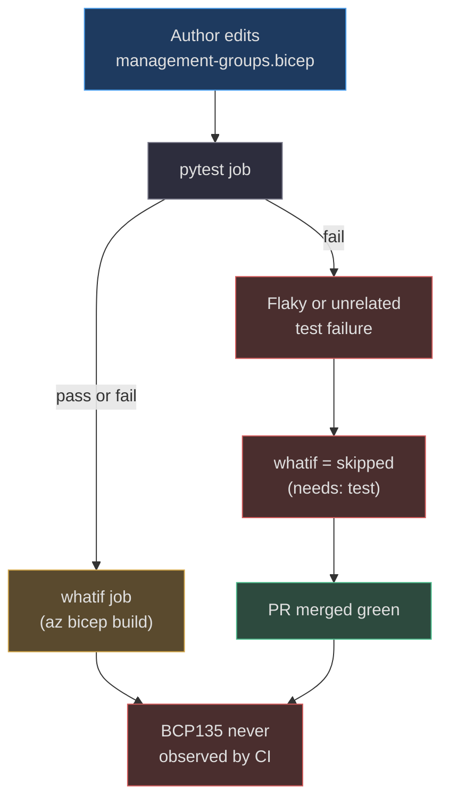
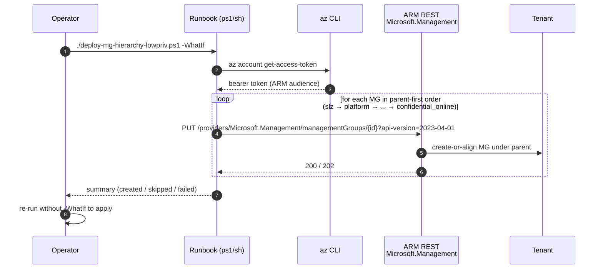
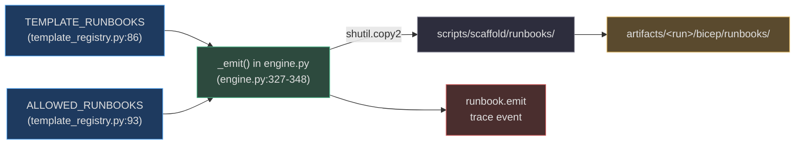
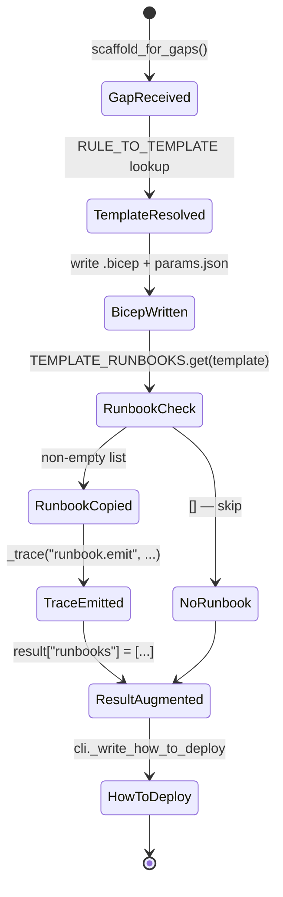
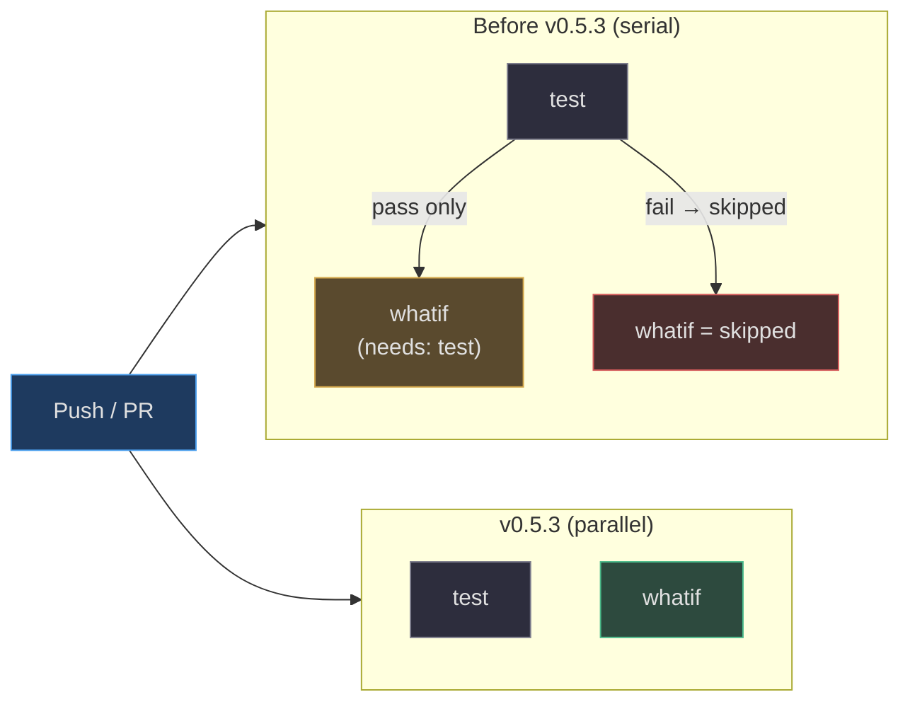

# Low-Privilege Deploy & BCP135 Fix (v0.5.3)

::: tip v0.5.3 — Deployability hardening
Two issues surfaced in back-to-back deploy rehearsals: the shipped `management-groups.bicep` had **never compiled** (BCP135, latent since v0.1.0), and operators without tenant-root RBAC had no supported path to land the MG tree at all. v0.5.3 fixes the compile break and emits a parallel low-privilege runbook for the common MCAPS-class account. It also corrects a `log-analytics` scope drift and decouples the CI `whatif` job so this class of regression cannot hide again.
:::

## At a glance

| Change | Why it matters | Key file |
|---|---|---|
| `scope: tenant()` on every MG resource | Fixes BCP135 — template compiles for the first time since v0.1.0 | [`scripts/scaffold/avm_templates/management-groups.bicep:35-109`](https://github.com/msucharda/slz-readiness/blob/main/scripts/scaffold/avm_templates/management-groups.bicep#L35-L109) |
| `TEMPLATE_RUNBOOKS` + `ALLOWED_RUNBOOKS` registry | Closed-set discipline extends to ops scripts, not just Bicep | [`scripts/slz_readiness/scaffold/template_registry.py:86-95`](https://github.com/msucharda/slz-readiness/blob/main/scripts/slz_readiness/scaffold/template_registry.py#L86-L95) |
| `deploy-mg-hierarchy-lowpriv.{ps1,sh}` runbooks | Direct ARM PUT per MG — unblocks operators without `/`-scope RBAC | [`scripts/scaffold/runbooks/`](https://github.com/msucharda/slz-readiness/tree/main/scripts/scaffold/runbooks) |
| `_emit()` copies runbooks → `out_dir/runbooks/` | Runbooks are first-class emit artifacts with their own trace event | [`scripts/slz_readiness/scaffold/engine.py:327-348`](https://github.com/msucharda/slz-readiness/blob/main/scripts/slz_readiness/scaffold/engine.py#L327-L348) |
| `how-to-deploy.md` gains a low-priv section | Operators see the escape-hatch inline, not buried in code | [`scripts/slz_readiness/scaffold/cli.py:390-436`](https://github.com/msucharda/slz-readiness/blob/main/scripts/slz_readiness/scaffold/cli.py#L390-L436) |
| `log-analytics` scope → `subscription` | Matches the template's `targetScope`; emits `az deployment sub` | [`scripts/slz_readiness/scaffold/template_registry.py:64-76`](https://github.com/msucharda/slz-readiness/blob/main/scripts/slz_readiness/scaffold/template_registry.py#L64-L76) |
| CI `whatif` no longer `needs: [test]` | Bicep compile failures surface regardless of test flakes | [`.github/workflows/ci.yml`](https://github.com/msucharda/slz-readiness/blob/main/.github/workflows/ci.yml) |

---

## Why BCP135 hid for five releases

The bug shipped in every release from `v0.1.0` through `v0.5.2` inclusive. Two compounding reasons:



<!-- Sources: .github/workflows/ci.yml (pre-v0.5.3 whatif job had `needs: [test]`); scripts/scaffold/avm_templates/management-groups.bicep -->

1. **`whatif` gated behind `test`.** Any unrelated pytest flake caused the Bicep compile job to be `skipped`, not failed. The signal that would have caught BCP135 was never emitted.
2. **Local dev skipped `bicep build`.** The compile job required the standalone `bicep` CLI; contributors using `az bicep build` rarely ran it, and [`tests/whatif/test_bicep_build.py`](https://github.com/msucharda/slz-readiness/blob/main/tests/whatif/test_bicep_build.py) silently **skips** when `shutil.which("bicep")` returns `None`.

v0.5.3 fixes both: the workflow now runs `whatif` unconditionally, and the template is correct.

## The BCP135 fix

In Bicep, `Microsoft.Management/managementGroups` is a **tenant-scoped** resource. When declared inside a template with `targetScope = 'managementGroup'`, each resource must carry an explicit `scope: tenant()` — otherwise the compiler emits `BCP135: Scope "tenant" is not valid for this resource type`.

<!-- Source: scripts/scaffold/avm_templates/management-groups.bicep:20-42 -->
```bicep
targetScope = 'managementGroup'

// ...

resource slz 'Microsoft.Management/managementGroups@2023-04-01' = {
  scope: tenant()           // ← required; BCP135 without it
  name: 'slz'
  properties: {
    displayName: slzDisplayName
    details: { parent: { id: '/providers/Microsoft.Management/managementGroups/${parentManagementGroupId}' } }
  }
}
```

All 13 MG resources (`slz`, `platform`, `landingzones`, `sandbox`, `decommissioned`, `management`, `connectivity`, `identity`, `security`, `corp`, `online`, `public`, `confidential_corp`, `confidential_online`) carry the same pattern. The compiled ARM JSON now shows `"scope": "/"` on each resource, exactly matching the AVM reference module `avm/res/management/management-group/main.bicep`.

## The low-privilege deploy path

### Why a second deploy path exists

Azure's `az deployment tenant create` requires `Microsoft.Resources/deployments/*` at **`/`** (tenant root). MCAPS, CSP, and most delegated-admin account models deliberately withhold that assignment. A parallel Copilot CLI session demonstrated — on a real MCAPS tenant — that you can still create the MG tree by issuing direct ARM REST PUTs against `Microsoft.Management/managementGroups/{groupId}`, which only requires `Microsoft.Management/managementGroups/write` on the parent MG (or inherited from the tenant root owner). The runbook codifies that path.

| Deploy mechanism | RBAC required | When to use | Runbook |
|---|---|---|---|
| `az deployment tenant create` | `Microsoft.Resources/deployments/*` at `/` | Greenfield tenant, full owner | — (inline in `how-to-deploy.md`) |
| Per-MG ARM REST PUT loop | `managementGroups/write` on parent | MCAPS / CSP / delegated admin | [`deploy-mg-hierarchy-lowpriv.ps1`](https://github.com/msucharda/slz-readiness/blob/main/scripts/scaffold/runbooks/deploy-mg-hierarchy-lowpriv.ps1) / [`.sh`](https://github.com/msucharda/slz-readiness/blob/main/scripts/scaffold/runbooks/deploy-mg-hierarchy-lowpriv.sh) |

### How the runbook works



<!-- Sources: scripts/scaffold/runbooks/deploy-mg-hierarchy-lowpriv.ps1; scripts/scaffold/runbooks/deploy-mg-hierarchy-lowpriv.sh -->

Ordering matters: ARM rejects a PUT whose `properties.details.parent.id` points at an MG that doesn't exist yet. The runbooks hard-code the 14-MG array in parent-first order so dependencies resolve top-down. The `-WhatIf` / `--whatif` switch performs a `HEAD` equivalent and prints the plan without mutating anything.

### Closed-set discipline extends to runbooks

Runbooks follow the same allowlist pattern as Bicep templates — scaffold refuses to emit any file not registered.



<!-- Sources: scripts/slz_readiness/scaffold/template_registry.py:86-95; scripts/slz_readiness/scaffold/engine.py:327-348 -->

A runbook referenced by `TEMPLATE_RUNBOOKS` but missing from disk raises at emit-time, and `ALLOWED_RUNBOOKS` is derived from the same dict so the two cannot drift. This is the rule-5 analogue for ops scripts — see [Engine & Registry](./scaffold/engine-and-registry.md) for the Bicep-template equivalent.

## Runbook emission lifecycle



<!-- Sources: scripts/slz_readiness/scaffold/engine.py:327-348; scripts/slz_readiness/scaffold/cli.py:149-153 -->

Only templates with entries in `TEMPLATE_RUNBOOKS` trigger the runbook branch; for all other templates (policy-assignment, archetype-policies, etc.) the flow short-circuits through `NoRunbook` and the result is unchanged.

## The `log-analytics` scope correction

Before v0.5.3, `TEMPLATE_SCOPES["log-analytics"]` was `resourceGroup` while the template itself declared `targetScope = 'subscription'`. ARM rejects that mismatch at deploy time (`az deployment group create` against a subscription-scoped template → `InvalidTemplate`). The fix is a one-line flip in the registry plus a new branch in `_deploy_commands` that emits `az deployment sub {verb} --location`:

<!-- Source: scripts/slz_readiness/scaffold/cli.py:93-96 -->
```python
elif scope == "subscription":
    bash_head = 'az deployment sub {verb} --location "$LOCATION"'
    pwsh_head = "az deployment sub {verb} --location $location"
```

The new test [`test_log_analytics_template_scope_matches_registry`](https://github.com/msucharda/slz-readiness/blob/main/tests/unit/test_scaffold.py) parses the template's `targetScope` line and asserts it matches the registry entry, preventing future drift.

## CI: decoupling `whatif`



<!-- Sources: .github/workflows/ci.yml -->

`whatif` now runs in parallel with `test`. Bicep compile failures surface independently, so a future BCP-class regression cannot hide behind an unrelated test flake.

## Regression coverage

Four new tests in [`tests/unit/test_scaffold.py`](https://github.com/msucharda/slz-readiness/blob/main/tests/unit/test_scaffold.py) lock this release in place:

| Test | Guards against |
|---|---|
| `test_log_analytics_template_scope_matches_registry` | Registry drift vs. template `targetScope` |
| `test_management_groups_emit_produces_runbooks` | Runbook copy + trace wiring regressing |
| `test_how_to_deploy_includes_lowpriv_section_when_mg_emitted` | CLI forgetting to surface the escape-hatch |
| `test_all_rule_to_template_emits_compile` | Any template silently failing to parse |
| `test_deploy_commands_are_scope_aware` *(updated)* | `log-analytics` emitting `az deployment group` |

Full suite: `108 passed, 7 skipped` on Python 3.14 locally; three-OS matrix (Linux / macOS / Windows) in CI.

## Operator impact

If you lack tenant-scope deploy rights (MCAPS, CSP, delegated admin), the generated `how-to-deploy.md` now tells you exactly what to run:

```pwsh
# WhatIf first — prints the plan, mutates nothing
./runbooks/deploy-mg-hierarchy-lowpriv.ps1 -ParentManagementGroupId <tenant-id> -WhatIf

# Apply
./runbooks/deploy-mg-hierarchy-lowpriv.ps1 -ParentManagementGroupId <tenant-id>
```

After the runbook succeeds, the remaining templates (`log-analytics`, `archetype-policies`, `sovereignty-*`) deploy via the standard `az deployment sub|mg create` commands already documented — no special path needed once the MG tree exists.

## Deferred / out of scope

| Item | Status | Why deferred |
|---|---|---|
| `pyproject.toml` `package-data` for `scripts/scaffold/` | Known gap | Affects wheel installs only; editable installs work. Track separately. |
| `needs_rg` branch in `_deploy_commands` | Dead code, harmless | No template currently maps to `resourceGroup`; remove when a future template claims it. |
| Sovereignty / archetype low-priv runbooks | Not needed | Those templates deploy at MG scope, which MCAPS-class accounts *do* typically have. |

## Related Pages

| Page | Why read it |
|---|---|
| [Phased Rollout & Scope-Aware Deployment](./phased-rollout.md) | How `TEMPLATE_SCOPES` drives `az deployment <scope>` command emission |
| [Scaffold: Engine & Registry](./scaffold/engine-and-registry.md) | Closed-set template discipline that `TEMPLATE_RUNBOOKS` mirrors |
| [AVM Templates](./scaffold/avm-templates.md) | The seven pinned templates, their scopes, and their AVM lineage |
| [Release Process](./release-process.md) | How four version strings bump in lockstep for v0.5.3 |
| [Testing Strategy](./testing.md) | Where the four new regression tests fit in the broader matrix |
