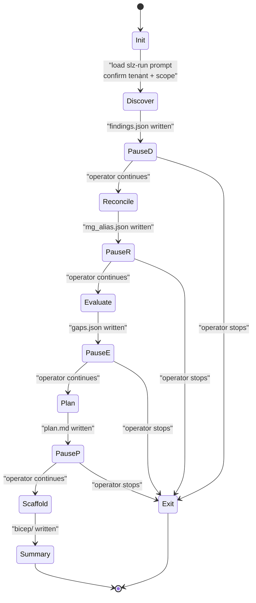
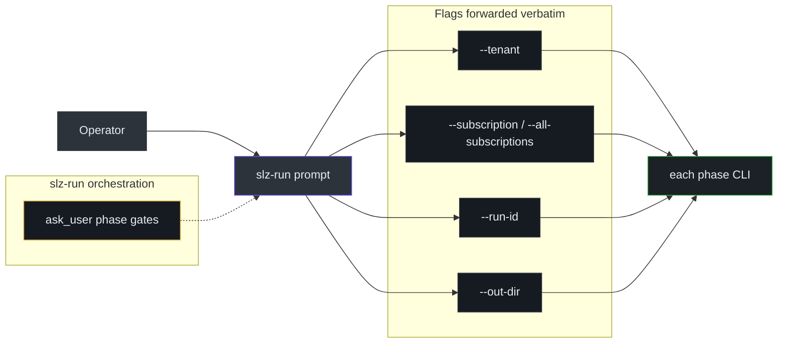

# Orchestration

## At a glance

| Attribute | Value |
|---|---|
| Entry point | `/slz-run` slash command |
| Prompt | [`.github/prompts/slz-run.prompt.md`](https://github.com/msucharda/slz-readiness/blob/main/.github/prompts/slz-run.prompt.md) |
| Nature | **Prompt, not skill.** Runs under the agent's default skill context. |
| Phases | Discover → Reconcile → Evaluate → Plan → Scaffold |
| HITL pauses | Between each phase with `ask_user` structured gates |

> There is **no** `.github/skills/run/SKILL.md`. Each individual phase has a skill; the orchestration lives in a prompt. Documentation or tooling that references a "run skill" is incorrect — the file does not exist.

## The orchestration loop



Each pause is a structured `ask_user` form, not a plain-text yes/no question. The prompt explicitly forbids collapsing phases or asking via chat text.

## Why pauses are default

- **Discover** can surface surprises (hidden subscriptions, permission gaps). Worth a look before spending time on Evaluate.
- **Reconcile** decides whether the run is greenfield or brownfield and, for brownfield, maps canonical SLZ roles to actual tenant MGs.
- **Evaluate** produces the first actionable artifact (`gaps.json`). Operators often stop here for compliance reporting.
- **Plan** is the narrative layer — last chance to confirm "the machine's interpretation matches our understanding" before Scaffold.
- **Scaffold** produces Bicep. Scaffold failure (skipped rules, unknown gaps) is visible here before a `what-if` is run.

## Flag propagation



The orchestrator does not invent tenant or subscription scope. It confirms scope, invokes each phase with the shared run directory, and keeps artifacts under one `artifacts/<run-id>/` directory.

## Failure propagation

A phase that exits non-zero stops the chain — subsequent phases are not invoked. The artifacts from successful earlier phases remain on disk. Re-running `/slz-run` with the same `--run-id` resumes at the first phase whose output is missing or stale.

Caveat: the orchestrator checks for *file existence*, not *content freshness*. If you edit `findings.json` by hand, re-run will not re-detect and not re-discover. Use a fresh `--run-id` to force a clean pass.

## Cross-cutting: tracing

Every phase writes to the same `artifacts/<run-id>/trace.jsonl`. Reading that file chronologically is the best single-view debugging tool:

```json
{"ts":"...","run":"R","event":"discover.start"}
{"ts":"...","run":"R","event":"az.start","args":["account","list"]}
{"ts":"...","run":"R","event":"az.end","status":"ok","dur_ms":423}
{"ts":"...","run":"R","event":"discover.end","findings":217}
{"ts":"...","run":"R","event":"evaluate.start"}
{"ts":"...","run":"R","event":"evaluate.end","gaps":11}
{"ts":"...","run":"R","event":"plan.start"}
{"ts":"...","run":"R","event":"plan.dropped","bullet":"..."}
{"ts":"...","run":"R","event":"plan.end"}
{"ts":"...","run":"R","event":"scaffold.start"}
{"ts":"...","run":"R","event":"scaffold.skipped","rule_id":"archetype.alz_decommissioned_policies_applied","reason":"emit_skipped"}
{"ts":"...","run":"R","event":"scaffold.end","emitted":8}
```

## What `/slz-run` does NOT do

- It doesn't deploy. `az deployment … create` is explicitly blocked — see [Hooks](/deep-dive/hooks).
- It doesn't clean up old artifact directories. Operators manage retention.
- It doesn't parallelise phases. Each runs to completion before the next starts.
- It doesn't retry on failure. An operator inspects the trace, fixes the issue, and re-runs.

## Related reading

- [Plugin Mechanics](/deep-dive/plugin-mechanics) — how the prompt is registered.
- [Discover CLI & Scope](/deep-dive/discover/cli-and-scope) — the first phase in detail.
- [Plan](/deep-dive/plan) — the narrative phase.
- [Scaffold: Engine & Registry](/deep-dive/scaffold/engine-and-registry) — the last phase.
