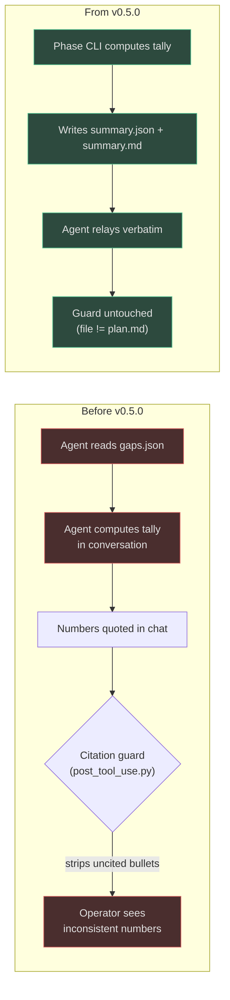
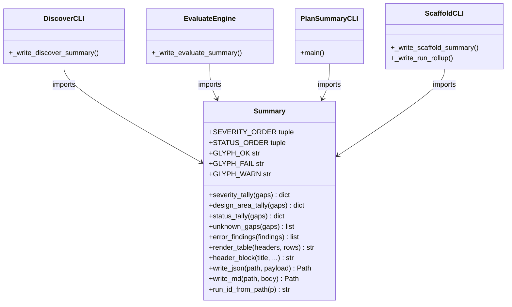
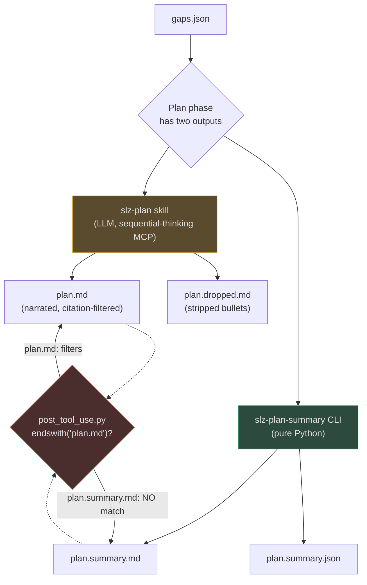

# Phase Summaries

## At a glance

| Attribute | Value | Source |
|---|---|---|
| Introduced in | `v0.5.0` | [apm.yml](https://github.com/msucharda/slz-readiness/blob/main/apm.yml) |
| Shared module | `scripts/slz_readiness/_summary.py` | [`_summary.py`](https://github.com/msucharda/slz-readiness/blob/main/scripts/slz_readiness/_summary.py) |
| Emitters | Discover, Evaluate, Plan, Scaffold | all 4 phase CLIs |
| Output pairs | `<phase>.summary.json` (machine) + `<phase>.summary.md` (human) | one per phase |
| Roll-up | `run.summary.md` (concatenation) | written by Scaffold |
| Determinism | Zero LLM, zero network, stable sort keys | [`_summary.py:38-80`](https://github.com/msucharda/slz-readiness/blob/main/scripts/slz_readiness/_summary.py#L38-L80) |
| Encoding | ASCII-only — three-OS CI matrix safe | [`_summary.py:11-19`](https://github.com/msucharda/slz-readiness/blob/main/scripts/slz_readiness/_summary.py#L11-L19) |

Phase summaries are the project's answer to a narrow but persistent problem: the agent was re-deriving run numbers in chat, sometimes getting them wrong, and the post-tool-use citation guard would then strip the reasoning that produced them. Summaries move the numbers into committed artifacts on disk, computed deterministically, so the agent can **relay them verbatim** instead of recomputing them.

## Why this exists

The four original artifacts (`findings.json`, `gaps.json`, `plan.md`, `bicep/*.bicep`) are either machine-readable or LLM-narrated. Neither is ideal for a human quickly asking _"what did this run actually find?"_ — `findings.json` is too raw, `plan.md` is citation-filtered prose.

Phase summaries close that gap without violating any of the repo's invariants:



<!-- Sources: scripts/slz_readiness/_summary.py:1-35, hooks/post_tool_use.py, .github/skills/plan/SKILL.md -->

The critical subtlety: the plan summary is filename‑engineered to dodge the citation guard. The post‑tool‑use hook matches `endswith("plan.md")`, so `plan.summary.md` is intentionally out of scope — locked in by [`tests/test_hooks.py:95-97`](https://github.com/msucharda/slz-readiness/blob/main/tests/test_hooks.py#L95-L97).

## The four phase summaries at a glance

| Phase | Writer | JSON shape | Markdown content | Source |
|---|---|---|---|---|
| **Discover** | `slz-discover` CLI | per-module status, error tallies, scope banner | module table, top observations, caveats (timeouts, perms) | [`discover/cli.py:345-444`](https://github.com/msucharda/slz-readiness/blob/main/scripts/slz_readiness/discover/cli.py#L345-L444) |
| **Evaluate** | `slz-evaluate` via `engine.py` | tally of `rules_evaluated/passed/failed/unknown`, severity + area + status rollups, compliance ratio | totals by severity/area/status, top-N largest gaps, unknown-gap block | [`evaluate/engine.py:51-237`](https://github.com/msucharda/slz-readiness/blob/main/scripts/slz_readiness/evaluate/engine.py#L51-L237) |
| **Plan** | `slz-plan-summary` (separate console script) | foundation-rule readiness map, design-area grouping, severity tally, unknown gaps | readiness snapshot, foundation table, order of operations, discovery blind spots | [`plan/summary_cli.py:1-236`](https://github.com/msucharda/slz-readiness/blob/main/scripts/slz_readiness/plan/summary_cli.py) |
| **Scaffold** | `slz-scaffold` CLI | emitted templates, warnings, un-scaffolded gaps, per-template `what-if` + `create` commands | what was emitted, what was skipped, dependency-ordered deploy commands | [`scaffold/cli.py:380-427`](https://github.com/msucharda/slz-readiness/blob/main/scripts/slz_readiness/scaffold/cli.py#L380-L427) |

Each JSON file sorts its keys (`sort_keys=True`) and each markdown file is ASCII-only — [`_summary.py:155-171`](https://github.com/msucharda/slz-readiness/blob/main/scripts/slz_readiness/_summary.py#L155-L171).

## Emission sequence in a full run

```mermaid
sequenceDiagram
    autonumber
    actor Op as Operator
    participant D as slz-discover
    participant E as slz-evaluate
    participant PS as slz-plan-summary
    participant P as slz-plan (LLM)
    participant S as slz-scaffold
    participant FS as artifacts/&lt;run&gt;/

    Op->>D: --tenant --all-subscriptions
    D->>FS: findings.json
    D->>FS: discover.summary.{json,md}
    Op->>E: --findings findings.json
    E->>FS: gaps.json
    E->>FS: evaluate.summary.{json,md}
    Op->>PS: --gaps gaps.json
    PS->>FS: plan.summary.{json,md}
    Note over PS,FS: Deterministic - no LLM
    Op->>P: (skill, LLM-narrated)
    P->>FS: plan.md, plan.dropped.md
    Op->>S: --gaps gaps.json
    S->>FS: bicep/*.bicep + params/
    S->>FS: scaffold.summary.{json,md}
    S->>FS: run.summary.md (roll-up of all 4)
```

<!-- Sources: scripts/slz_readiness/discover/cli.py:255-270, scripts/slz_readiness/evaluate/engine.py:198-220, scripts/slz_readiness/plan/summary_cli.py, scripts/slz_readiness/scaffold/cli.py:430-466 -->

`run.summary.md` is written **last**, by Scaffold, because Scaffold is the only phase guaranteed to have seen all prior artifacts. If earlier phases were skipped, the roll-up silently omits their sections — [`scaffold/cli.py:442-444`](https://github.com/msucharda/slz-readiness/blob/main/scripts/slz_readiness/scaffold/cli.py#L442-L444).

## The shared primitive: `_summary.py`

Four separate phase CLIs write summaries, but the tally logic, table renderer, and header block are centralised so all four files look identical in structure. This isn't just DRY — it's **determinism insurance**: a single place to enforce ASCII, canonical severity order, and stable sort keys.



<!-- Sources: scripts/slz_readiness/_summary.py:38-181, scripts/slz_readiness/discover/cli.py:12, scripts/slz_readiness/evaluate/engine.py:14, scripts/slz_readiness/plan/summary_cli.py:19, scripts/slz_readiness/scaffold/cli.py (import _summary) -->

### Canonical order constants

Every tally renders in the same order across every phase — non-negotiable:

| Constant | Value | Purpose | Source |
|---|---|---|---|
| `SEVERITY_ORDER` | `("critical","high","medium","low","info","unknown")` | severity tables never re-order | [`_summary.py:22`](https://github.com/msucharda/slz-readiness/blob/main/scripts/slz_readiness/_summary.py#L22) |
| `STATUS_ORDER` | `("missing","misconfigured","unknown")` | status tables never re-order | [`_summary.py:31`](https://github.com/msucharda/slz-readiness/blob/main/scripts/slz_readiness/_summary.py#L31) |
| `GLYPH_OK / FAIL / WARN` | `[OK] / [FAIL] / [WARN]` | ASCII glyphs (no Unicode) | [`_summary.py:17-19`](https://github.com/msucharda/slz-readiness/blob/main/scripts/slz_readiness/_summary.py#L17-L19) |

Unexpected severities or statuses are appended sorted at the tail — they never displace the canonical keys — see `severity_tally` at [`_summary.py:38-46`](https://github.com/msucharda/slz-readiness/blob/main/scripts/slz_readiness/_summary.py#L38-L46).

## The `slz-plan-summary` CLI — why it's separate

Unlike the other three phases, Plan has **two** emitters: the LLM-narrated `slz-plan` skill writes `plan.md`, and the deterministic `slz-plan-summary` console script writes `plan.summary.{json,md}`. They live in the same `plan/` subpackage but share no code path.



<!-- Sources: scripts/slz_readiness/plan/__init__.py:1-7, scripts/slz_readiness/plan/summary_cli.py:1-24, hooks/post_tool_use.py, tests/test_hooks.py:95-120 -->

The module docstring makes the contract explicit — [`plan/summary_cli.py:1-12`](https://github.com/msucharda/slz-readiness/blob/main/scripts/slz_readiness/plan/summary_cli.py#L1-L12):

> _The output filenames are chosen so the post-tool-use hook's `endswith("plan.md")` check does NOT match `plan.summary.md` — verified by `tests/test_hooks.py::test_plan_summary_not_filtered`._

### Foundation readiness block

`plan.summary.md` opens with a fixed, ordered readiness table of five foundational rules — it answers _"did the SLZ skeleton land at all?"_ before any detail:

| rule_id | Label | Source |
|---|---|---|
| `mg.slz.hierarchy_shape` | SLZ management-group hierarchy | [`summary_cli.py:28`](https://github.com/msucharda/slz-readiness/blob/main/scripts/slz_readiness/plan/summary_cli.py#L28) |
| `identity.platform_identity_mg_exists` | Platform identity MG | [`summary_cli.py:29`](https://github.com/msucharda/slz-readiness/blob/main/scripts/slz_readiness/plan/summary_cli.py#L29) |
| `logging.management_mg_exists` | Management MG (central logging) | [`summary_cli.py:30`](https://github.com/msucharda/slz-readiness/blob/main/scripts/slz_readiness/plan/summary_cli.py#L30) |
| `logging.management_la_workspace_exists` | Central Log Analytics workspace | [`summary_cli.py:31`](https://github.com/msucharda/slz-readiness/blob/main/scripts/slz_readiness/plan/summary_cli.py#L31) |
| `policy.slz.sovereign_root_policies_applied` | Sovereign root policies | [`summary_cli.py:32`](https://github.com/msucharda/slz-readiness/blob/main/scripts/slz_readiness/plan/summary_cli.py#L32) |

Each rule is rendered as `[OK] ok`, `[FAIL] missing`, or `[WARN] unknown` based on whether a gap exists for it — derived in `_foundation_status` at [`summary_cli.py:53-68`](https://github.com/msucharda/slz-readiness/blob/main/scripts/slz_readiness/plan/summary_cli.py#L53-L68).

### Design-area ordering

The "order of operations" section groups gaps by `design_area` in a fixed priority (`mg → identity → logging → sovereignty → policy → archetype`), with any unlisted areas appended alphabetically — [`summary_cli.py:34-41`](https://github.com/msucharda/slz-readiness/blob/main/scripts/slz_readiness/plan/summary_cli.py#L34-L41) and `_ordered_areas` at [`summary_cli.py:71-75`](https://github.com/msucharda/slz-readiness/blob/main/scripts/slz_readiness/plan/summary_cli.py#L71-L75). This is presentation logic, deliberately kept out of rule YAML.

## The `run.summary.md` roll-up

After Scaffold completes, `_write_run_rollup` concatenates any phase summaries present into `run.summary.md`. The function is idempotent and tolerant of missing phases — [`scaffold/cli.py:430-466`](https://github.com/msucharda/slz-readiness/blob/main/scripts/slz_readiness/scaffold/cli.py#L430-L466):

```
# SLZ Run summary

_run=20260417T171608Z | phases=Discover,Evaluate,Plan,Scaffold | ts=...Z_

---
<!-- source: discover.summary.md -->
# SLZ Discover summary ...

---
<!-- source: evaluate.summary.md -->
# SLZ Evaluate summary ...

---
<!-- source: plan.summary.md -->
# SLZ Plan summary ...

---
<!-- source: scaffold.summary.md -->
# SLZ Scaffold summary ...
```

Each per-phase markdown file stays on disk for machine consumption — the roll-up is a **copy**, not a move. A `run.summary` event is logged to `trace.jsonl` with the phase list — [`scaffold/cli.py:466`](https://github.com/msucharda/slz-readiness/blob/main/scripts/slz_readiness/scaffold/cli.py#L466).

## Determinism invariants

```mermaid
stateDiagram-v2
    [*] --> Compute
    Compute --> Sorted : "sort by (rule_id, resource_id)"
    Sorted --> ASCII : "strip Unicode; use [OK]/[FAIL]/[WARN]"
    ASCII --> FixedOrder : "apply SEVERITY_ORDER + STATUS_ORDER"
    FixedOrder --> JSON : "sort_keys=True + trailing newline"
    FixedOrder --> MD : "render_table with padded widths"
    JSON --> [*]
    MD --> [*]
```



<!-- Sources: scripts/slz_readiness/_summary.py:38-171, tests/unit/test_summary_helpers.py, tests/unit/test_phase_summaries.py -->

Every summary passes through the same deterministic pipeline:

1. **Sort by `(rule_id, resource_id)`** before rendering — e.g. `unknown_gaps` at [`_summary.py:65-69`](https://github.com/msucharda/slz-readiness/blob/main/scripts/slz_readiness/_summary.py#L65-L69) and `error_findings` at [`_summary.py:72-80`](https://github.com/msucharda/slz-readiness/blob/main/scripts/slz_readiness/_summary.py#L72-L80).
2. **ASCII only** — `[OK]`/`[FAIL]`/`[WARN]` replace Unicode glyphs. The module docstring is explicit about the three-OS CI matrix motivation — [`_summary.py:11-19`](https://github.com/msucharda/slz-readiness/blob/main/scripts/slz_readiness/_summary.py#L11-L19).
3. **Fixed order constants** — severity and status tables never re-order by count.
4. **JSON stability** — `json.dumps(..., indent=2, sort_keys=True)` + trailing newline at [`_summary.py:155-161`](https://github.com/msucharda/slz-readiness/blob/main/scripts/slz_readiness/_summary.py#L155-L161).
5. **Table widths computed before emit** so the same input produces byte-identical output across runs.

Only the `ts=` field in the header block varies between runs — everything else is content-addressable. Tests pin the `ts` argument for golden comparisons — see `header_block(ts=...)` at [`_summary.py:122-148`](https://github.com/msucharda/slz-readiness/blob/main/scripts/slz_readiness/_summary.py#L122-L148).

## Test coverage

| Test file | What it pins | Source |
|---|---|---|
| `tests/unit/test_summary_helpers.py` | tally order, ASCII glyphs, JSON key sort, table rendering | [test_summary_helpers.py](https://github.com/msucharda/slz-readiness/blob/main/tests/unit/test_summary_helpers.py) |
| `tests/unit/test_phase_summaries.py` | end-to-end emit for each of the four phases | [test_phase_summaries.py](https://github.com/msucharda/slz-readiness/blob/main/tests/unit/test_phase_summaries.py) |
| `tests/test_hooks.py::test_plan_summary_not_filtered` | `plan.summary.md` bypasses the citation guard | [test_hooks.py:95-120](https://github.com/msucharda/slz-readiness/blob/main/tests/test_hooks.py#L95-L120) |

The hook test is the load-bearing one: if someone renames `plan.summary.md` back toward `plan.md`, or loosens the guard's suffix match, determinism protection around numbers silently evaporates. The test encodes that contract.

## Integration with the agent skills

All four `SKILL.md` files were updated in the same commit (`cb3e7c0`) to instruct the agent to **relay** `*.summary.md` verbatim rather than re-derive numbers in the conversation — see the SKILL.md diffs under `.github/skills/{discover,evaluate,plan,scaffold}/SKILL.md`. This is why the human-readable summaries exist at all: they are the agent's script.

## Evaluate's optional `tally_out` parameter

Evaluate's summary required surgery to keep the engine pure. Rather than compute a second pass over gaps, the evaluator accepts an optional in-place counter dict:

<!-- Source: scripts/slz_readiness/evaluate/engine.py:51-72 -->
```python
def _tally_bump(tally_out: dict[str, Any] | None, *, passed: bool, status: str) -> None:
    """Bump counters in ``tally_out`` without allocating when ``None``."""
    if tally_out is None:
        return
    tally_out["rules_evaluated"] = tally_out.get("rules_evaluated", 0) + 1
    if status == "unknown":
        tally_out["rules_unknown"] = tally_out.get("rules_unknown", 0) + 1
    elif passed:
        tally_out["rules_passed"] = tally_out.get("rules_passed", 0) + 1
    else:
        tally_out["rules_failed"] = tally_out.get("rules_failed", 0) + 1
```

`evaluate()` stays pure when called without `tally_out` — callers outside the CLI (unit tests, future consumers) see no behavioural change. See [`engine.py:51-156`](https://github.com/msucharda/slz-readiness/blob/main/scripts/slz_readiness/evaluate/engine.py#L51-L156).

## Related pages

| Page | Why it's relevant |
|---|---|
| [Artifacts & Outputs](../getting-started/artifacts.md) | Lists all summary files alongside the primary artifacts |
| [Architecture Overview](./architecture.md) | Positions summaries in the four-phase pipeline |
| [Hooks](./hooks.md) | Explains the `post_tool_use.py` citation guard that `plan.summary.md` deliberately bypasses |
| [Discover CLI & Scope](./discover/cli-and-scope.md) | Source of `discover.summary.{json,md}` — also covers scope validation |
| [Rule Engine](./evaluate/rule-engine.md) | Source of `evaluate.summary.{json,md}` — engine tally contract |
| [Orchestration](./orchestration.md) | When each summary fires during `/slz-run` |
