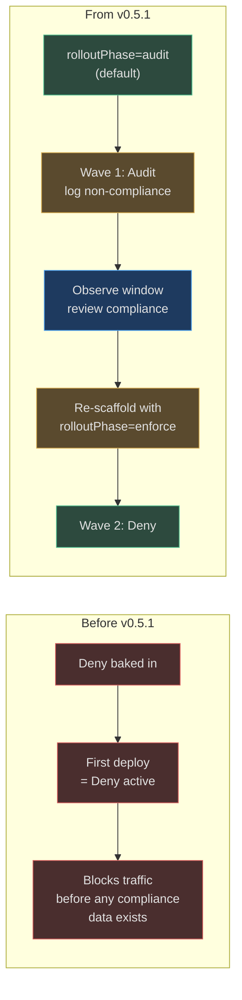
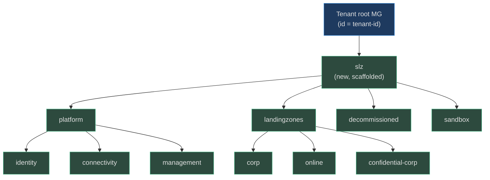
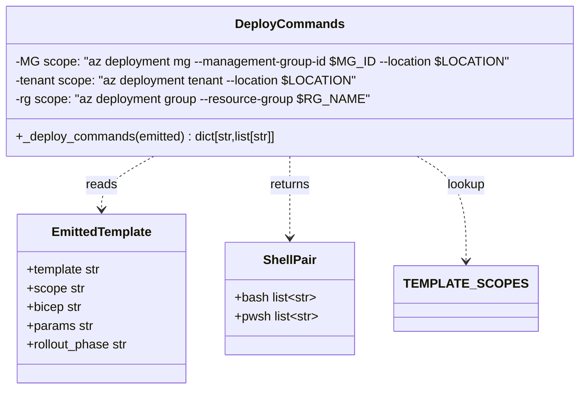
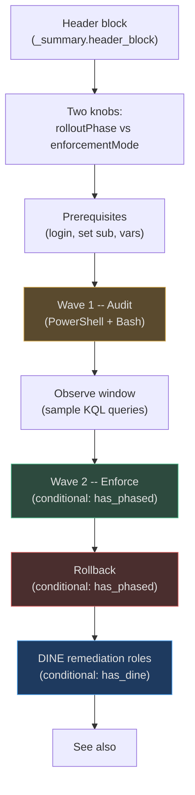
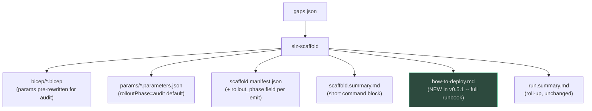

# Phased Rollout & Scope-Aware Deployment

## At a glance

| Attribute | Value | Source |
|---|---|---|
| Introduced in | `v0.5.1` | [apm.yml](https://github.com/msucharda/slz-readiness/blob/main/apm.yml) |
| Headline fix | `management-groups.bicep` `targetScope` `tenant` → `managementGroup` | [`management-groups.bicep:20`](https://github.com/msucharda/slz-readiness/blob/main/scripts/scaffold/avm_templates/management-groups.bicep#L20) |
| New registry | `TEMPLATE_SCOPES` map (template → ARM scope) | [`template_registry.py:58-72`](https://github.com/msucharda/slz-readiness/blob/main/scripts/slz_readiness/scaffold/template_registry.py#L58-L72) |
| New artifact | `how-to-deploy.md` written by scaffold | [`scaffold/cli.py:_write_how_to_deploy`](https://github.com/msucharda/slz-readiness/blob/main/scripts/slz_readiness/scaffold/cli.py) |
| Rollout mechanism | `rolloutPhase=audit\|enforce` on all Deny-class templates | [`engine.py:_PHASED_TEMPLATES`](https://github.com/msucharda/slz-readiness/blob/main/scripts/slz_readiness/scaffold/engine.py) |
| Identity propagation | `identityRequired` threaded from baseline `identity.type` | [`engine.py:_resolve_archetype_assignments`](https://github.com/msucharda/slz-readiness/blob/main/scripts/slz_readiness/scaffold/engine.py) |
| Shells emitted | Bash **and** PowerShell for every deployment command | [`scaffold/cli.py:_deploy_commands`](https://github.com/msucharda/slz-readiness/blob/main/scripts/slz_readiness/scaffold/cli.py) |

v0.5.1 closes three long-standing gaps between what the scaffold **emits** and what an operator **needs to deploy** safely:

1. The MG template declared `targetScope = 'tenant'` but was meant to be deployed against the tenant-root management group — ARM rejected it at `what-if` time with a scope mismatch.
2. The emitted `az deployment` commands were one-size-fits-all `az deployment mg` without `--location`, so half of them failed instantly against ARM's "location is required for mg/tenant deployments" validator.
3. Policies shipped with `effect: Deny` baked in — no phased rollout path, no way to observe compliance before enforcing.

## Why this matters

Rule §5 of the operating instructions requires: _"Policies ship Audit-first. Scaffold defaults `rolloutPhase=audit` and rewrites baseline `Deny` effects to `Audit` at emit-time."_ Before v0.5.1 that rule existed on paper; v0.5.1 is the first release where the engine actually enforces it.



<!-- Sources: scripts/slz_readiness/scaffold/engine.py (v0.3.0 changes docstring + _PHASED_TEMPLATES + _downshift_deny_to_audit), scripts/scaffold/avm_templates/sovereignty-global-policies.bicep:17-30 -->

## The MG template scope fix

The scaffold emitted this command:

```
az deployment mg what-if --management-group-id <mg-id> --template-file management-groups.bicep
```

…against a `.bicep` file whose header said `targetScope = 'tenant'`. ARM rejected it. The v0.5.1 fix is structural rather than cosmetic: the template genuinely models a **child MG tree under the tenant-root MG**, not a tenant-root resource itself.



<!-- Sources: scripts/scaffold/avm_templates/management-groups.bicep:1-27 -->

The new header at [`management-groups.bicep:1-19`](https://github.com/msucharda/slz-readiness/blob/main/scripts/scaffold/avm_templates/management-groups.bicep#L1-L19) documents **why AVM is not used** here (the registry ships `avm/res/management/management-group` for a single MG, but has no pattern module for a hierarchy tree) — a deliberate, time-bounded deviation from the closed-set principle, with an explicit "revisit when `avm/ptn/mg/hierarchy` exists" note.

## TEMPLATE_SCOPES — single source of truth for deployment scope

Fixing the MG template exposed a broader issue: every template's `targetScope` line and every `az deployment <scope>` command need to stay in lockstep. v0.5.1 introduces a dedicated map so neither side can drift silently.

| Template | ARM scope | `az deployment` verb | Location flag? | Source |
|---|---|---|---|---|
| `management-groups` | `managementGroup` | `az deployment mg` | yes (`--location`) | [`template_registry.py:65`](https://github.com/msucharda/slz-readiness/blob/main/scripts/slz_readiness/scaffold/template_registry.py#L65) |
| `policy-assignment` | `managementGroup` | `az deployment mg` | yes | [`template_registry.py:66`](https://github.com/msucharda/slz-readiness/blob/main/scripts/slz_readiness/scaffold/template_registry.py#L66) |
| `sovereignty-global-policies` | `managementGroup` | `az deployment mg` | yes | [`template_registry.py:67`](https://github.com/msucharda/slz-readiness/blob/main/scripts/slz_readiness/scaffold/template_registry.py#L67) |
| `sovereignty-confidential-policies` | `managementGroup` | `az deployment mg` | yes | [`template_registry.py:68`](https://github.com/msucharda/slz-readiness/blob/main/scripts/slz_readiness/scaffold/template_registry.py#L68) |
| `archetype-policies` | `managementGroup` | `az deployment mg` | yes | [`template_registry.py:69`](https://github.com/msucharda/slz-readiness/blob/main/scripts/slz_readiness/scaffold/template_registry.py#L69) |
| `role-assignment` | `managementGroup` | `az deployment mg` | yes | [`template_registry.py:70`](https://github.com/msucharda/slz-readiness/blob/main/scripts/slz_readiness/scaffold/template_registry.py#L70) |
| `log-analytics` | `resourceGroup` | `az deployment group` | no (`--resource-group`) | [`template_registry.py:71`](https://github.com/msucharda/slz-readiness/blob/main/scripts/slz_readiness/scaffold/template_registry.py#L71) |

The map comment is explicit about the contract — [`template_registry.py:58-64`](https://github.com/msucharda/slz-readiness/blob/main/scripts/slz_readiness/scaffold/template_registry.py#L58-L64):

> _ARM deployment scope for each template. Must stay in lockstep with the `targetScope` line of each `.bicep` under `scripts/scaffold/avm_templates/` — ARM rejects any mismatch between the template's targetScope and the `az deployment <scope>` command the scaffold emits._

### Why `--location` is mandatory

`az deployment mg` and `az deployment tenant` both require `--location`. It doesn't locate the deployed resources (policy assignments have no physical location) — it locates the **deployment metadata record** in ARM, which Azure needs for async tracking and subsequent status queries. `az deployment group` doesn't need it because it inherits the resource group's location. The scaffold now emits the right flag for each scope automatically.

## The `_deploy_commands` rewrite



<!-- Sources: scripts/slz_readiness/scaffold/cli.py:_deploy_commands signature + body, scripts/slz_readiness/scaffold/template_registry.py:58-72 -->

Two structural changes from v0.5.0:

| Change | Before (v0.5.0) | After (v0.5.1) | Source |
|---|---|---|---|
| Return type | `list[str]` (single Bash block) | `dict[str, list[str]]` with `bash` + `pwsh` keys | [`scaffold/cli.py:_deploy_commands`](https://github.com/msucharda/slz-readiness/blob/main/scripts/slz_readiness/scaffold/cli.py) |
| Command shape | `az deployment mg ... <mg-id>` hardcoded | Scope selected via `TEMPLATE_SCOPES.get(template, ...)` | same |
| Variables | `<mg-id>` placeholder | `$MG_ID` / `$LOCATION` / `$RG_NAME` (Bash) + `$mgId` / `$location` / `$rgName` (PowerShell) | same |
| Location flag | absent | emitted for `managementGroup` and `tenant` scopes | same |
| Phase hint | absent | `# <template> (rolloutPhase=audit) -- what-if first, then create` | same |
| RG block | always skipped | emitted **only** when `needs_rg` (any `resourceGroup`-scoped template present) | same |

## The `how-to-deploy.md` artifact

Previously the deployment commands lived as a fenced code block inside `scaffold.summary.md`. v0.5.1 promotes them into a dedicated `how-to-deploy.md` with a full operational runbook. The file is written by `_write_how_to_deploy` in `scaffold/cli.py`, only when templates were actually emitted.

### File structure



<!-- Sources: scripts/slz_readiness/scaffold/cli.py:_write_how_to_deploy (sections appended in order) -->

Sections are **content-gated** by what was scaffolded:

| Section | Gated on | Why |
|---|---|---|
| Wave 2 — Enforce | `has_phased = any(e.rollout_phase for e in emitted)` | Only meaningful when at least one template accepts `rolloutPhase` |
| Rollback | `has_phased` | Tied to the phased-rollout story |
| DINE remediation roles | `has_dine = any(e.template == "archetype-policies")` | Only archetype bundles carry DINE policies |
| Resource-group vars | `needs_rg` | Avoid prompting for `$RG_NAME` when nothing uses it |

### The two knobs table — the runbook's most important paragraph

| Knob | Values | What it does |
|---|---|---|
| `rolloutPhase` | `audit` / `enforce` | Controls each policy's **effect**. `audit` logs non-compliance without blocking (Wave 1). `enforce` flips `Deny` on (Wave 2). Phased-rollout knob. |
| `enforcementMode` | `Default` / `DoNotEnforce` | Azure Policy's own binary on/off switch. `DoNotEnforce` suppresses compliance recording — emergency kill-switch only. |

Conflating these two was a common operator mistake before v0.5.1. The runbook now calls them out side-by-side — see [`scaffold/cli.py` inside `_write_how_to_deploy`](https://github.com/msucharda/slz-readiness/blob/main/scripts/slz_readiness/scaffold/cli.py).

## The phased-rollout engine path

The `Deny → Audit` rewrite lives in the scaffold engine, not the template. The template exposes a `rolloutPhase` param; the engine rewrites baseline parameter values before emission so the param is honoured whether the template reads it (sovereignty templates) or ignores it (archetype-policies, which bakes per-assignment effects).

```mermaid
sequenceDiagram
    autonumber
    participant CLI as slz-scaffold
    participant Eng as scaffold_for_gaps
    participant DS as _downshift_deny_to_audit
    participant Tmpl as &lt;template&gt;.bicep
    participant Out as artifacts/&lt;run&gt;/

    CLI->>Eng: gaps + user_params
    Eng->>Eng: For each phased template
    Eng->>Eng: rollout_phase = user.rolloutPhase or "audit"
    alt archetype-policies
        Eng->>Eng: _resolve_archetype_assignments(..., rollout_phase)
        loop each baseline assignment
            Eng->>DS: downshift(parameters)
            DS-->>Eng: new params + rewrite_count
            Eng->>Eng: identityRequired = (identity.type != "None")
        end
        Eng->>Eng: warnings += "rewrote N Deny effects"
        Eng->>Eng: warnings += "M assignments need identity"
    else sovereignty-global / -confidential
        Eng->>Eng: params.setdefault("rolloutPhase", "audit")
        Note over Tmpl: template computes<br>effectValue = rolloutPhase == 'enforce' ? 'Deny' : 'Audit'
    end
    Eng->>Out: write bicep + params.json
    Eng->>CLI: emitted + warnings (one advisory per template)
```

<!-- Sources: scripts/slz_readiness/scaffold/engine.py:scaffold_for_gaps + _downshift_deny_to_audit + _resolve_archetype_assignments, scripts/scaffold/avm_templates/sovereignty-global-policies.bicep:28, scripts/scaffold/avm_templates/sovereignty-confidential-policies.bicep:20 -->

### The downshift rewrite — whitelist-by-both-sides

`_downshift_deny_to_audit` is narrow by design — see the docstring in `scaffold/engine.py`. It rewrites a parameter entry **only when both** conditions are true:

| Condition | Regex / test | Source |
|---|---|---|
| Key name contains `effect` (case-insensitive) | `_EFFECT_PARAM_RE = re.compile(r"[Ee]ffect")` | [`engine.py`](https://github.com/msucharda/slz-readiness/blob/main/scripts/slz_readiness/scaffold/engine.py) |
| Value is exactly `"Deny"`, `"deny"`, or `"DENY"` | `_DENY_EFFECT_VALUES = {"Deny","deny","DENY"}` | same |

Both-sides matching means `denyVnetPeering = {"value": "Deny"}` (name has no `effect`) is **preserved**, and `listOfResourceTypesNotAllowed = {"value": ["SomeDeny"]}` (value is a list, not a string) is **preserved**. Rewritten entries count toward `audit_rewrite_count`, surfaced as an operator-visible warning string so the behaviour is never silent.

### Template-side vs engine-side rewrite

| Template | Rewrite location | Mechanism |
|---|---|---|
| `sovereignty-global-policies` | **Template** (Bicep `var`) | `var effectValue = rolloutPhase == 'enforce' ? 'Deny' : 'Audit'` |
| `sovereignty-confidential-policies` | **Template** (Bicep `var`) | same |
| `archetype-policies` | **Engine** (`_downshift_deny_to_audit`) | Walks each baseline assignment's `parameters` dict pre-emission |

The split exists because the sovereignty templates assign **one** policy set each with a single `effect` param — cheap to express in Bicep. Archetype templates assign many policies with different, per-assignment effect parameter names — the engine is the only place with visibility into the baseline JSON to rewrite them generically.

## Identity propagation for DINE / Modify / Append

Before v0.5.1, `policy-assignment.bicep` and `archetype-policies.bicep` created assignments with `identity.type = None`, so DINE remediation policies silently lost their managed identity and could never remediate. v0.5.1 threads `identityRequired` end-to-end.

```mermaid
flowchart LR
    Base["baseline assignment JSON<br>identity.type"] --> Prop["engine:<br>identityRequired = type != 'None'"]
    Prop --> Schema["schema: identityRequired boolean"]
    Schema --> Tmpl["bicep: identity = identityRequired<br>? SystemAssigned : None"]
    Tmpl --> Deployed["deployed assignment<br>with principalId"]
    Deployed --> PostStep["how-to-deploy.md:<br>DINE remediation roles section"]
    PostStep --> Role["az role assignment create<br>--assignee-object-id $principalId"]

    style Base fill:#2d2d3d,stroke:#7a7a8a,color:#e0e0e0
    style Prop fill:#1e3a5f,stroke:#4a9eed,color:#e0e0e0
    style PostStep fill:#5a4a2e,stroke:#d4a84b,color:#e0e0e0
    style Role fill:#2d4a3e,stroke:#4aba8a,color:#e0e0e0
```



<!-- Sources: scripts/slz_readiness/scaffold/engine.py:_resolve_archetype_assignments (identity_type read + identityRequired emit), scripts/scaffold/avm_templates/policy-assignment.bicep:30-41, scripts/scaffold/avm_templates/archetype-policies.bicep:24-31, scripts/scaffold/param_schemas/archetype-policies.schema.json -->

The Bicep emits a system-assigned identity conditionally — [`policy-assignment.bicep:35-40`](https://github.com/msucharda/slz-readiness/blob/main/scripts/scaffold/avm_templates/policy-assignment.bicep):

<!-- Source: scripts/scaffold/avm_templates/policy-assignment.bicep:35-40 -->
```bicep
resource assignment 'Microsoft.Authorization/policyAssignments@2024-04-01' = {
  name: assignmentName
  location: identityRequired ? identityLocation : null
  identity: identityRequired ? { type: 'SystemAssigned' } : { type: 'None' }
  ...
}
```

A post-deploy step is required because the assignment's `principalId` doesn't exist until ARM provisions the identity. The engine surfaces this as an operator warning when any archetype assignment needs identity (`identity_count` > 0 in `_resolve_archetype_assignments`), and `how-to-deploy.md` carries the two-step `az policy assignment show` → `az role assignment create` recipe in both shells.

## Schema updates

| Schema | New property | Default | Source |
|---|---|---|---|
| `archetype-policies.schema.json` | `identityRequired` (per-assignment) | `false` | [`archetype-policies.schema.json:20`](https://github.com/msucharda/slz-readiness/blob/main/scripts/scaffold/param_schemas/archetype-policies.schema.json#L20) |
| `archetype-policies.schema.json` | `roleDefinitionIds` (per-assignment) | `[]` | [`archetype-policies.schema.json:21`](https://github.com/msucharda/slz-readiness/blob/main/scripts/scaffold/param_schemas/archetype-policies.schema.json#L21) |
| `archetype-policies.schema.json` | `rolloutPhase` | `"audit"` | same file |
| `archetype-policies.schema.json` | `identityLocation` | (no default) | same file |
| `sovereignty-global-policies.schema.json` | `rolloutPhase` | `"audit"` | [`sovereignty-global-policies.schema.json`](https://github.com/msucharda/slz-readiness/blob/main/scripts/scaffold/param_schemas/sovereignty-global-policies.schema.json) |
| `sovereignty-confidential-policies.schema.json` | `rolloutPhase` | `"audit"` | [`sovereignty-confidential-policies.schema.json`](https://github.com/msucharda/slz-readiness/blob/main/scripts/scaffold/param_schemas/sovereignty-confidential-policies.schema.json) |
| `policy-assignment.schema.json` | `identityRequired`, `identityLocation` | `false`, (none) | [`policy-assignment.schema.json`](https://github.com/msucharda/slz-readiness/blob/main/scripts/scaffold/param_schemas/policy-assignment.schema.json) |

All schemas retain `additionalProperties: false` — new fields are explicitly declared or validation fails.

## Operator-visible warnings

v0.5.1 adds several advisory strings to the `warnings` list in `scaffold.manifest.json`. They are not failures — the run succeeds — but they surface non-obvious consequences. One advisory is emitted **per phased template** regardless of rewrite count, so operators always see the current phase for each Deny-class emission.

| Condition | Warning | Severity |
|---|---|---|
| `rolloutPhase=audit` and N effects rewritten | `[archetype-policies] rolloutPhase=audit — rewrote N baseline Deny effect(s) to Audit` | informational |
| archetype identity count > 0 | `[archetype-policies] M assignment(s) require a system-assigned identity for remediation` | operator action required |
| any phased template with `rolloutPhase=audit` | `rolloutPhase=audit — assignments will log non-compliance without blocking. Re-run scaffold with rolloutPhase=enforce after the observe window` | informational |
| any phased template with `rolloutPhase=enforce` | `rolloutPhase=enforce — assignments will Deny non-compliant writes on first deploy. Confirm an Audit wave already ran` | warning |
| `sovereignty-global-policies` missing `listOfAllowedLocations` | `the Global policy set will flag every location as non-compliant` (softened from v0.5.0's "deny") | warning |

Source: see all strings in [`scripts/slz_readiness/scaffold/engine.py`](https://github.com/msucharda/slz-readiness/blob/main/scripts/slz_readiness/scaffold/engine.py) (`warnings.append(...)` sites in `scaffold_for_gaps` and `_resolve_archetype_assignments`).

## Test coverage

| Test | Pins | Source |
|---|---|---|
| `test_downshift_rewrites_deny_effect_to_audit` | Whitelist-by-both-sides: only `*effect*`-named keys with exact `"Deny"` values are rewritten | [`test_scaffold.py`](https://github.com/msucharda/slz-readiness/blob/main/tests/unit/test_scaffold.py) |
| `test_scaffold_emits_audit_rewrite_warning` | Audit rewrite is surfaced in `warnings` with count | same |
| `test_scaffold_enforce_phase_passes_through` | `rolloutPhase=enforce` leaves baseline `Deny` intact | same |
| `test_scaffold_identity_required_propagates` | `identity.type != None` → `identityRequired=true` in emitted params | same |
| `test_scaffold_mg_template_scope` | Asserts emitted command starts with `az deployment mg ... --location` | same |

## Interaction with existing artifacts

`scaffold.summary.md` now includes a shortened command block (both shells) and a pointer to `how-to-deploy.md` for the full recipe — see [Phase Summaries](./phase-summaries.md) for the determinism contract. `run.summary.md` is unchanged in structure but picks up the new scaffold summary content transparently.



<!-- Sources: scripts/slz_readiness/scaffold/cli.py:main (writes all six artifacts), scripts/slz_readiness/scaffold/engine.py:_emit (adds rollout_phase to manifest) -->

## Related pages

| Page | Why it's relevant |
|---|---|
| [Engine & Registry](./scaffold/engine-and-registry.md) | Home of `RULE_TO_TEMPLATE`, now joined by `TEMPLATE_SCOPES` |
| [AVM Templates](./scaffold/avm-templates.md) | Per-template reference — `rolloutPhase` param lives here |
| [Phase Summaries](./phase-summaries.md) | `scaffold.summary.md` is the short form; `how-to-deploy.md` is the long form |
| [Artifacts & Outputs](../getting-started/artifacts.md) | Lists `how-to-deploy.md` alongside the other run artifacts |
| [Architecture Overview](./architecture.md) | HITL boundary — scaffold never runs `az deployment create` |
| [Orchestration](./orchestration.md) | When `how-to-deploy.md` fires in `/slz-run` |
