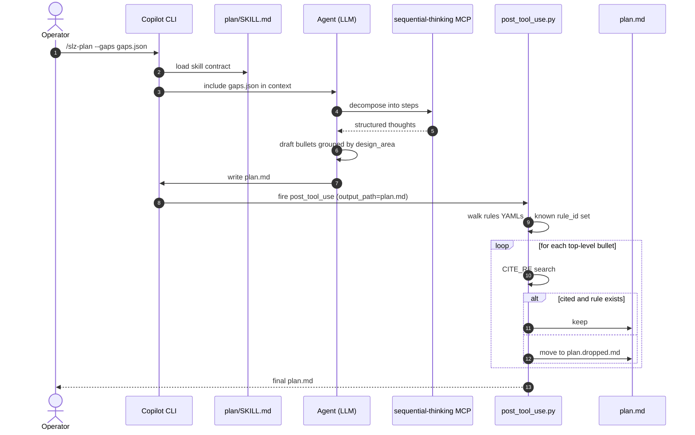

# Plan Phase

## At a glance

| Attribute | Value |
|---|---|
| Entry point | `/slz-plan` slash command |
| Prompt | [`.github/skills/plan/SKILL.md`](https://github.com/msucharda/slz-readiness/blob/main/.github/skills/plan/SKILL.md) |
| MCP server used | `sequential-thinking` |
| Safety guard | [`hooks/post_tool_use.py`](https://github.com/msucharda/slz-readiness/blob/main/hooks/post_tool_use.py) |
| Input | `gaps.json` |
| Output | `plan.md` (+ `plan.dropped.md` if any bullets failed the guard) |

This is the **only** phase where the LLM does meaningful reasoning. It's bracketed by a strict structural contract.

## The contract

1. **Input is `gaps.json`.** Nothing else. No re-querying Azure, no re-loading rules, no web.
2. **Output is Markdown bullets.** One top-level bullet per gap.
3. **Every top-level bullet must carry a `rule_id:` citation** that resolves to a real rule in `scripts/evaluate/rules/`.
4. **Reasoning is grouped by design_area.**
5. **Severity order: high → medium → low** within each group.
6. **Unknown gaps** get their own section explaining the observation shortfall.

Everything after #3 is LLM judgement. #1-#3 are enforced mechanically.

## Flow



<!-- Source: .github/skills/plan/SKILL.md, hooks/post_tool_use.py -->

## Why sequential-thinking

Gaps carry substantive domain nuance — e.g. a sovereignty policy gap at tenant root has different remediation order than one at the Confidential MG. `sequential-thinking` lets the model decompose "what's the safest order to apply these?" into explicit, inspectable steps. It's gated to Plan + Scaffold only via `apm.yml`, so Discover and Evaluate can't accidentally pull it in.

## Bullet shape

The Plan skill's prompt coaches the model into a consistent shape:

```markdown
## sovereignty (2 gaps)

- [rule_id: sovereignty.slz.global_policies] **high** — SLZ Global policy set
  (`c1cbff38-87c0-4b9f-9f70-035c7a3b5523`) is not assigned at tenant root.
  The scaffold phase will emit a policy assignment at tenant root using the
  `sovereignty-global-policies` AVM template. Review and apply with
  `az deployment tenant what-if --template-file ...` before `create`.

- [rule_id: sovereignty.slz.confidential_policies] **high** — ...
```

Key features:

- Rule id in square brackets at the start (machine-parsable).
- Severity prefix in bold.
- Observed data (what was found vs expected) comes first.
- Named template reference — operators can cross-check against `ALLOWED_TEMPLATES`.
- HITL cue at the end — "review and apply … before create" is a convention.

## What the guard drops

Examples of bullets the guard kills (real LLM-failure modes observed):

```markdown
- The tenant needs to apply the global sovereignty policy
- (sovereignty.slz.global_policies) Assign the policy set at tenant root
- [rule_id: sovereignty.policies] Apply it
- [rule_id: archetype.nonexistent.policies] Archetype X missing policies
```

| Line | Fail reason |
|---|---|
| 1 | No `rule_id:` citation |
| 2 | Wrong marker — parentheses, not `rule_id:` |
| 3 | `rule_id:` present but `sovereignty.policies` isn't a known rule |
| 4 | Cited rule doesn't exist in `scripts/evaluate/rules/` |

See [Hooks](/deep-dive/hooks) for the regex details.

## `plan.dropped.md`

Dropped bullets aren't discarded — they're appended to `plan.dropped.md` so the operator can:

- Diagnose what the LLM tried to say.
- File an issue if a bullet looks legitimate but the rule genuinely doesn't exist.
- Recover usable remediation text that's merely mis-formatted.

CI does not read `plan.dropped.md`; it's purely for humans.

## The shape mismatch problem

If the LLM drops every bullet into `plan.dropped.md`, `plan.md` ends up with just the heading skeleton. This is a loud failure — the operator sees an empty plan immediately and re-runs.

The Plan skill is designed so a re-run with the same `gaps.json` + the dropped file as prior-turn context usually self-corrects.

## No Azure calls

The Plan phase is subject to the verb allowlist too, but since it doesn't invoke `az` at all, the pre-tool-use hook is a no-op for this phase. The guard here is purely structural (the post-hook), not access-control (the pre-hook).

## Related reading

- [Hooks](/deep-dive/hooks) — the citation guard regexes.
- [Rules Catalog](/deep-dive/evaluate/rules-catalog) — the source-of-truth rule set.
- [Orchestration](/deep-dive/orchestration) — how Plan sits between Evaluate and Scaffold.
