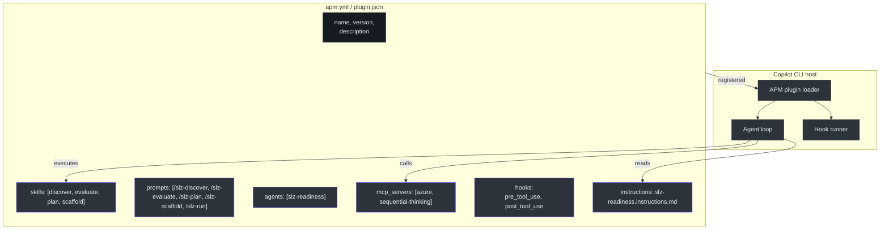
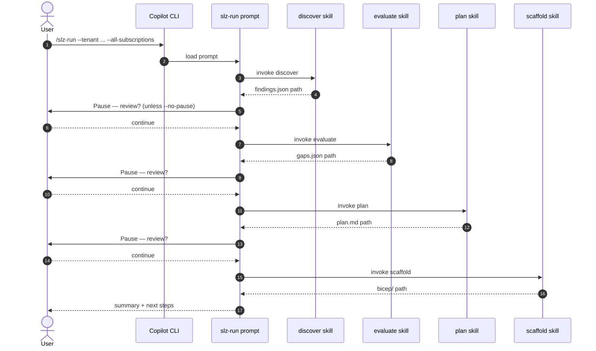

# Plugin Mechanics

## At a glance

| File | Role | Who reads it |
|---|---|---|
| [`apm.yml`](https://github.com/msucharda/slz-readiness/blob/main/apm.yml) | Dev/source plugin manifest | Copilot CLI (local dev) |
| [`.github/plugin/plugin.json`](https://github.com/msucharda/slz-readiness/blob/main/.github/plugin/plugin.json) | Packaged plugin manifest | Copilot CLI (published) |
| [`.github/agents/slz-readiness.agent.md`](https://github.com/msucharda/slz-readiness/blob/main/.github/agents/slz-readiness.agent.md) | Agent definition | Copilot CLI |
| [`.github/instructions/slz-readiness.instructions.md`](https://github.com/msucharda/slz-readiness/blob/main/.github/instructions/slz-readiness.instructions.md) | Non-negotiable rules | Agent system prompt |
| [`.github/skills/*/SKILL.md`](https://github.com/msucharda/slz-readiness/tree/main/.github/skills) | Per-phase skill contracts | Agent per-task |
| [`.github/prompts/*.prompt.md`](https://github.com/msucharda/slz-readiness/tree/main/.github/prompts) | Slash-command entry points | Copilot CLI |
| [`hooks/*.py`](https://github.com/msucharda/slz-readiness/tree/main/hooks) | Tool-use guards | Copilot CLI runtime |

## The anatomy of the plugin

<!-- Source: apm.yml, .github/plugin/plugin.json -->

## `apm.yml` vs `plugin.json`

APM (Agentic Plugin Manifest) is the **authoring** format used during development. `plugin.json` is the **published** format consumed by Copilot CLI users after `/plugin install`. They carry the same information and must stay in sync — [`scripts/release.py`](https://github.com/msucharda/slz-readiness/blob/main/scripts/release.py) bumps both in lockstep, and [`release.yml`](https://github.com/msucharda/slz-readiness/blob/main/.github/workflows/release.yml) cross-validates against the tag.

Version is bumped in **four** places simultaneously:

| File | Field |
|---|---|
| `apm.yml` | `version: 0.4.0` (line 2) |
| `.github/plugin/plugin.json` | `"version": "0.4.0"` |
| `scripts/slz_readiness/__init__.py` | `__version__ = "0.4.0"` (line 7) |
| `data/baseline/VERSIONS.json` | `pinned_at` timestamp + plugin version |

Any PR that hand-edits just one of these will fail `release.yml`.

## Agent definition

[`.github/agents/slz-readiness.agent.md`](https://github.com/msucharda/slz-readiness/blob/main/.github/agents/slz-readiness.agent.md) declares the agent's identity and the 4-phase contract. The agent's system prompt is composed from:

1. The agent definition file (identity, persona, 4-phase overview)
2. The instructions file (8 non-negotiable rules)
3. Per-invocation skill context (one of Discover / Evaluate / Plan / Scaffold SKILL.md)

The separation is intentional: persona + rules are static across all phases; skill contracts are per-invocation.

## Skills

Each of the four phases has a skill under [`.github/skills/<phase>/SKILL.md`](https://github.com/msucharda/slz-readiness/tree/main/.github/skills):

- **`discover/SKILL.md`** — read-only discovery contract. Describes the 6 discoverer modules, the scope-confirmation requirement, the `findings.json` schema.
- **`evaluate/SKILL.md`** — deterministic evaluation contract. Describes zero-LLM guarantee, sort order, the 5 matcher types.
- **`plan/SKILL.md`** — LLM narration contract. Describes the citation guard, design-area grouping, the post-hook.
- **`scaffold/SKILL.md`** — template-only emission contract. Describes `ALLOWED_TEMPLATES`, per-scope dedup, JSON-Schema validation.

Skills do **not** contain executable code — they're Markdown that the agent reads to scope its behaviour for each phase.

## Prompts

[`.github/prompts/*.prompt.md`](https://github.com/msucharda/slz-readiness/tree/main/.github/prompts) are the slash-command entry points. Each is a short Markdown file that tells the agent:

1. Which skill to invoke
2. What CLI command to shell out (the real work is in `scripts/slz_readiness/` Python)
3. How to report output back to the user

### The orchestrator prompt

[`.github/prompts/slz-run.prompt.md`](https://github.com/msucharda/slz-readiness/blob/main/.github/prompts/slz-run.prompt.md) is **not a skill** — it's a prompt that sequences the four skills with pauses between phases. Important: there is no `.github/skills/run/SKILL.md`. If you see a reference to one, it's a documentation bug.

<!-- Source: .github/prompts/slz-run.prompt.md -->

## MCP servers

Declared in `apm.yml` under `mcp_servers`:

| Server | Package | Gate | Purpose |
|---|---|---|---|
| `azure` | `@azure/mcp` | Always on | Identity / tenant context |
| `sequential-thinking` | `@modelcontextprotocol/server-sequential-thinking` | `plan`, `scaffold` only | Structured reasoning during narration |

Gating to specific phases means Discover and Evaluate cannot even pull in sequential-thinking — a defence-in-depth choice to keep the deterministic phases free of LLM-adjacent dependencies.

## Hooks

Two Python scripts in [`hooks/`](https://github.com/msucharda/slz-readiness/tree/main/hooks):

- **`pre_tool_use.py`** — verb allowlist enforcement (see [Hooks](/deep-dive/hooks)).
- **`post_tool_use.py`** — citation guard for `plan.md` (see [Hooks](/deep-dive/hooks)).

Both are plain Python, cross-platform, no dependencies. The Copilot CLI runtime shells out to them on every tool invocation and every tool output write respectively.

## Instructions file

[`.github/instructions/slz-readiness.instructions.md`](https://github.com/msucharda/slz-readiness/blob/main/.github/instructions/slz-readiness.instructions.md) documents the 8 non-negotiable rules (read-only, baseline-as-truth, determinism, citations, templates, HITL, scope confirmation, trace). These are included in the agent's system prompt at every turn.

Critically, the rules here are reinforced **mechanically** elsewhere:

| Rule | Documented here | Mechanical enforcement |
|---|---|---|
| Read-only | § 1 | `hooks/pre_tool_use.py` |
| Determinism | § 3 | `engine.py` sort + zero LLM + golden tests |
| Citations | § 4 | `hooks/post_tool_use.py` |
| Templates | § 5 | `ALLOWED_TEMPLATES` in `template_registry.py` |
| HITL | § 6 | `az deployment` in `DENY_RE` |
| Scope | § 6a | Click flag validation in `discover/cli.py` |
| Trace | § 8 | `_trace.py` NDJSON appender |

The documentation is a contract with reviewers; the code is a contract with the runtime.

## Related reading

- [Hooks](/deep-dive/hooks) — the two hook scripts in detail.
- [Orchestration](/deep-dive/orchestration) — the `/slz-run` prompt.
- [Release Process](/deep-dive/release-process) — how the four version strings stay in sync.
