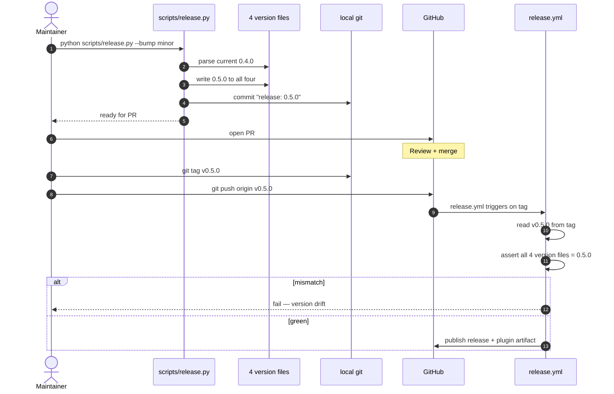

# Release Process

## At a glance

| Attribute | Value |
|---|---|
| Release script | [`scripts/release.py`](https://github.com/msucharda/slz-readiness/blob/main/scripts/release.py) |
| CI workflow | [`.github/workflows/release.yml`](https://github.com/msucharda/slz-readiness/blob/main/.github/workflows/release.yml) |
| Current version | `0.4.0` |
| Version files | 4 — all kept in lock-step |
| Cadence | Tag-driven; no fixed schedule |

## The four version strings

| File | Field | Role |
|---|---|---|
| [`apm.yml`](https://github.com/msucharda/slz-readiness/blob/main/apm.yml) | `version:` (line 2) | Dev/source plugin manifest |
| [`.github/plugin/plugin.json`](https://github.com/msucharda/slz-readiness/blob/main/.github/plugin/plugin.json) | `"version"` | Packaged/published manifest |
| [`scripts/slz_readiness/__init__.py`](https://github.com/msucharda/slz-readiness/blob/main/scripts/slz_readiness/__init__.py) | `__version__` (line 7) | Python runtime |
| [`data/baseline/VERSIONS.json`](https://github.com/msucharda/slz-readiness/blob/main/data/baseline/VERSIONS.json) | `plugin` | Audit/baseline correlation |

All four must agree. Any PR that edits one without the others fails CI.

## The release flow



<!-- Source: scripts/release.py, .github/workflows/release.yml -->

## Why lockstep

The four strings serve different audiences but must correlate:

- `apm.yml` / `plugin.json` — Copilot CLI users see this via `/plugin list`.
- `__version__` — `slz-discover --version` shows this; embedded in `findings.json`.
- `VERSIONS.json` — audit trail: "this run was plugin 0.5.0 against ALZ SHA X".

A correctness bug in any of these makes audit evidence ambiguous. The lockstep rule means a consumer reading any one field can trust the others.

## `release.py` behaviour

Invocations:

- `python scripts/release.py --set 0.5.0` — explicit target.
- `python scripts/release.py --bump patch|minor|major` — semver increment.

What it does:

1. Reads the current version from `apm.yml` (source of truth).
2. Computes the new version.
3. Rewrites all 4 files with deterministic formatting.
4. Updates `VERSIONS.json.pinned_at` to the current UTC timestamp.
5. Does **not** commit — leaves staged changes for reviewer inspection.
6. Does **not** tag — tagging is manual after PR merge.

The "don't auto-commit" choice is deliberate: reviewers inspect the diff before any merge, catching accidental bumps.

## CI cross-check

`release.yml` on tag push does essentially:

```bash
TAG="${GITHUB_REF#refs/tags/v}"   # 0.5.0

# all four must equal $TAG
grep "version: $TAG" apm.yml
jq -e --arg v "$TAG" '.version == $v' .github/plugin/plugin.json
grep "__version__ = \"$TAG\"" scripts/slz_readiness/__init__.py
jq -e --arg v "$TAG" '.plugin == $v' data/baseline/VERSIONS.json
```

Any failure aborts the release. Since all four are updated by `release.py` in one commit, this is really catching "maintainer edited one by hand" rather than "release.py is broken".

## Baseline bump ≠ version bump

A baseline SHA bump (new ALZ Library release) is independent of a plugin version bump:

| Scenario | Bump plugin version? |
|---|---|
| Baseline SHA update only (no rule changes) | Patch (e.g. 0.4.0 → 0.4.1) |
| New rule added | Minor (0.4.0 → 0.5.0) |
| Matcher or template API break | Major (0.4.0 → 1.0.0) |
| Copy-edit docs only | No release |

## Emergency process

If a critical bug is found after tag:

1. Revert the tag locally (`git tag -d vX.Y.Z; git push --delete origin vX.Y.Z`).
2. Fix on a branch.
3. Re-run `release.py --set X.Y.Z+1` (never re-use a tag — consumers may have cached).
4. Tag and push the new version.

## Related reading

- [Plugin Mechanics](/deep-dive/plugin-mechanics) — `apm.yml` vs `plugin.json`.
- [Baseline Vendoring](/deep-dive/evaluate/baseline-vendoring) — when baseline updates trigger a plugin bump.
- [Testing](/deep-dive/testing) — the CI jobs that gate every release.
