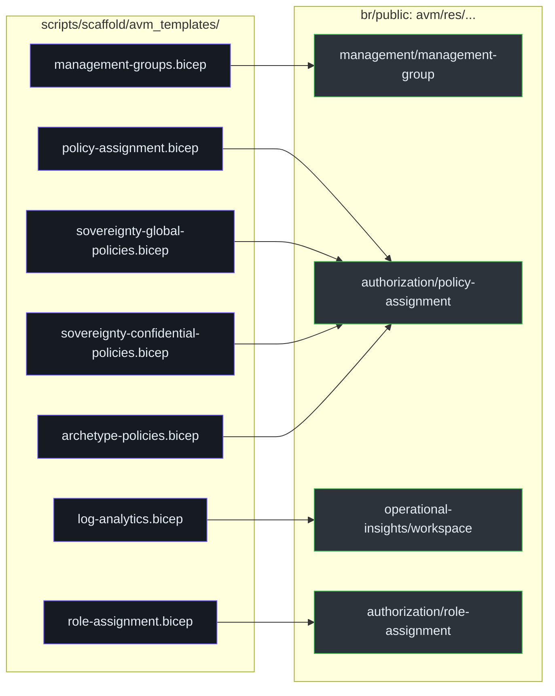
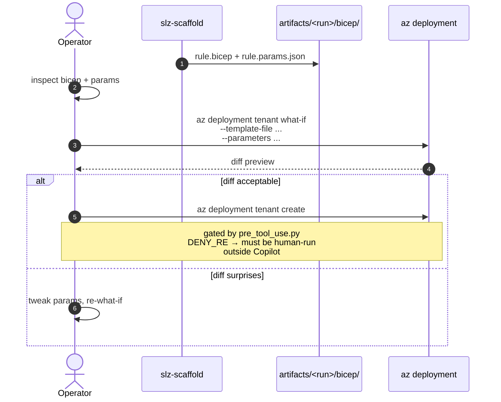

# AVM Templates

::: tip v0.5.1 — Phased rollout & scope-aware deployment
Policy-assigning templates now accept a `rolloutPhase` parameter (`audit` / `enforce`) and propagate `identityRequired` for DINE/Modify/Append remediation. The `management-groups` template's `targetScope` changed from `'tenant'` to `'managementGroup'`. The deployment-scope decision per template is now centralised in `TEMPLATE_SCOPES`. See **[Phased Rollout & Scope-Aware Deployment](../phased-rollout.md)** for details.
:::

## At a glance

| Template | Scope | Baseline policy / resource | Purpose |
|---|---|---|---|
| `management-groups` | tenant root | — | Create/align MG hierarchy |
| `policy-assignment` | MG | various | Generic single-policy assignment |
| `sovereignty-global-policies` | tenant root | `c1cbff38-87c0-4b9f-9f70-035c7a3b5523` | Pinned SLZ Global set |
| `sovereignty-confidential-policies` | Confidential MG | `03de05a4-c324-4ccd-882f-a814ea8ab9ea` | Pinned SLZ Confidential set |
| `archetype-policies` | any archetype MG | — (composed) | Bulk-assign archetype's policy bundle |
| `log-analytics` | subscription / RG | — | Log Analytics workspace (AVM `avm/res/operational-insights/workspace`) |
| `role-assignment` | MG / subscription | — | RBAC assignment |

All under [`scripts/scaffold/avm_templates/`](https://github.com/msucharda/slz-readiness/tree/main/scripts/scaffold/avm_templates). Allowlist at [`template_registry.py:48`](https://github.com/msucharda/slz-readiness/blob/main/scripts/slz_readiness/scaffold/template_registry.py#L48).

## Why only seven

Every template maps to a **generalisable** shape — a kind of thing SLZ requires, not a specific instance. The 14 rules map to these 7 templates via `RULE_TO_TEMPLATE`. Many archetypes share the `archetype-policies` template because the shape is identical; only the policy bundle changes.

Adding a template requires editing two Python files and adding a schema; adding a rule that reuses an existing template is a YAML-only change. This is deliberate economics — most growth should be rule-only.

## Template → AVM module matrix



<!-- Source: scripts/scaffold/avm_templates/*.bicep -->

Each local template is a thin wrapper that:

1. `targetScope` declaration (`managementGroup`, `subscription`, or `tenant`).
2. Input parameters (matching the schema).
3. One or more `module` references to upstream AVM modules.
4. Output block so downstream what-if diffs are readable.

This wrapping pattern is required because AVM modules don't always expose every SLZ-specific variant directly, and using a pinned AVM version lets us upgrade one dimension (policy content) independently of another (module version).

## Parameter schemas

Each `<name>.bicep` has a paired `<name>.schema.json` under [`scripts/scaffold/param_schemas/`](https://github.com/msucharda/slz-readiness/tree/main/scripts/scaffold/param_schemas). Example (`role-assignment`):

```json
{
  "$schema": "https://json-schema.org/draft/2020-12/schema",
  "title": "role-assignment params",
  "type": "object",
  "required": ["scope", "principalId", "roleDefinitionId"],
  "properties": {
    "scope": { "type": "string", "pattern": "^(/providers|/subscriptions)/" },
    "principalId": { "type": "string", "format": "uuid" },
    "roleDefinitionId": { "type": "string" }
  },
  "additionalProperties": false
}
```

`additionalProperties: false` is universal — catches param drift during refactors.

## What-if gate

Every emitted template pair is expected to be run through `az deployment <scope> what-if` before `create`. The plan phase's bullet text coaches this explicitly. CI has a `whatif` job that builds every template with `bicep build` to catch syntax errors, but won't hit Azure.



The `create` step is specifically **blocked** inside the Copilot CLI session (`DENY_RE` matches `deploy`). Operators run it in a separate terminal — the HITL gate.

## Sovereignty specifics

The two sovereignty templates pin `policySetDefinitionId` inside the template body, not the params. Rationale: the ID is a product-level contract of what "SLZ Global" means, not a per-deployment knob. Changing the ID is a baseline upgrade, not a customer customisation.

| Template | Pinned policySetDefinitionId |
|---|---|
| `sovereignty-global-policies` | `c1cbff38-87c0-4b9f-9f70-035c7a3b5523` |
| `sovereignty-confidential-policies` | `03de05a4-c324-4ccd-882f-a814ea8ab9ea` |

See [`sovereignty_controls.py`](https://github.com/msucharda/slz-readiness/blob/main/scripts/slz_readiness/discover/sovereignty_controls.py) for the matching discover side.

## Adding a template

1. Draft `scripts/scaffold/avm_templates/<name>.bicep`. Must reference an AVM `br/public` module unless genuinely impossible.
2. Draft `scripts/scaffold/param_schemas/<name>.schema.json` with `additionalProperties: false`.
3. Add `<name>` to `ALLOWED_TEMPLATES` in [`template_registry.py:48`](https://github.com/msucharda/slz-readiness/blob/main/scripts/slz_readiness/scaffold/template_registry.py#L48).
4. Wire one or more rules through `RULE_TO_TEMPLATE` at [`template_registry.py:21`](https://github.com/msucharda/slz-readiness/blob/main/scripts/slz_readiness/scaffold/template_registry.py#L21).
5. Extend `tests/unit/test_scaffold.py` with a fixture-backed emission test and a bicep-build test.
6. Update `docs/architecture.md` template list.

## Related reading

- [Engine & Registry](/deep-dive/scaffold/engine-and-registry) — how these are selected and populated.
- [Rules Catalog](/deep-dive/evaluate/rules-catalog) — rule-to-template mapping.
- [Testing](/deep-dive/testing) — the `whatif` CI job.
