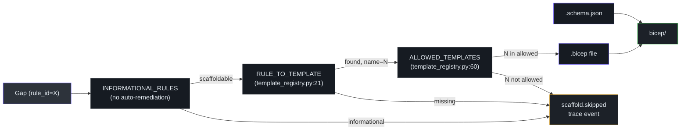

# Scaffold: Engine & Registry

::: tip v0.5.1 — New registry: `TEMPLATE_SCOPES`
Alongside `RULE_TO_TEMPLATE` and `ALLOWED_TEMPLATES`, v0.5.1 introduces `TEMPLATE_SCOPES` — a map from each template name to its ARM deployment scope (`managementGroup` / `tenant` / `resourceGroup`). This drives the scope-aware `az deployment` commands emitted into `how-to-deploy.md`. The engine also gained a `_downshift_deny_to_audit` helper and `rolloutPhase` plumbing for phased Audit→Enforce rollout. See **[Phased Rollout & Scope-Aware Deployment](../phased-rollout.md)**.
:::

## At a glance

| File | Role | Key symbols |
|---|---|---|
| [`scaffold/engine.py`](https://github.com/msucharda/slz-readiness/blob/main/scripts/slz_readiness/scaffold/engine.py) | Per-gap → Bicep emission | `scaffold_for_gaps` (L186), `_resolve_archetype_assignments` (L89), `_PER_SCOPE_TEMPLATES` (L48) |
| [`scaffold/template_registry.py`](https://github.com/msucharda/slz-readiness/blob/main/scripts/slz_readiness/scaffold/template_registry.py) | Closed-set template validator | `RULE_TO_TEMPLATE` (L21), `INFORMATIONAL_RULES` (L52), `ALLOWED_TEMPLATES` (L60) |
| [`scripts/scaffold/avm_templates/`](https://github.com/msucharda/slz-readiness/tree/main/scripts/scaffold/avm_templates) | 8 AVM-based Bicep templates | See [AVM Templates](/deep-dive/scaffold/avm-templates) |
| [`scripts/scaffold/param_schemas/`](https://github.com/msucharda/slz-readiness/tree/main/scripts/scaffold/param_schemas) | JSON Schemas | One per template |

## The closed-set principle

Scaffold **never** writes free-form Bicep. Every emission is:

1. Skip unknown or informational-only gaps that are not safe to auto-remediate.
2. Look up `rule_id` in `RULE_TO_TEMPLATE`.
3. Confirm the resulting template name is in `ALLOWED_TEMPLATES`.
4. Read the template file from `scripts/scaffold/avm_templates/<name>.bicep`.
5. Populate a parameters JSON from the gap's `observed` data and operator params.
6. Validate parameters against `scripts/scaffold/param_schemas/<name>.schema.json`.
7. Write both to `artifacts/<run>/bicep/<template>.bicep` and `artifacts/<run>/params/<template>.parameters.json`.

If step 1 or 2 fails, the rule is skipped with a `scaffold.skipped` trace event. Never silently, never with a fallback.

## The two-layer registry



Two layers because `RULE_TO_TEMPLATE` is a functional mapping (rule → name), while `ALLOWED_TEMPLATES` is a belt-and-braces set membership check. A typo in `RULE_TO_TEMPLATE` that produces an unknown template name is caught immediately by the allowlist.

## Per-scope deduplication

`_PER_SCOPE_TEMPLATES` at [`engine.py:48`](https://github.com/msucharda/slz-readiness/blob/main/scripts/slz_readiness/scaffold/engine.py#L48) names templates that apply at an Azure scope (MG, subscription) rather than per-rule. If two rules both emit `role-assignment` at the same MG, only one Bicep file is written — with parameters merged.

Without this, running against a tenant with many archetype gaps would produce overlapping deployment files, each partially overwriting the others at deployment time.

## Archetype resolution

[`_resolve_archetype_assignments` (engine.py:89)](https://github.com/msucharda/slz-readiness/blob/main/scripts/slz_readiness/scaffold/engine.py#L89) handles the archetype special case. An `archetype.alz_corp_policies_applied` gap knows:

- Which MG is the Corp archetype (from gap.resource_id).
- Which policies are expected (from the baseline).
- Which policies are missing (from gap.observed.missing_policy_ids).

It composes these into parameters for the `archetype-policies` template, which is a generic template taking `(mgId, policyAssignments[])` rather than a per-archetype bespoke file.

## `scaffold_for_gaps` walkthrough

From [`engine.py:186`](https://github.com/msucharda/slz-readiness/blob/main/scripts/slz_readiness/scaffold/engine.py#L186):

```python
def scaffold_for_gaps(gaps: list[Gap], out_dir: Path) -> list[BicepEmission]:
    emissions: list[BicepEmission] = []
    seen_per_scope: dict[tuple[str, str], BicepEmission] = {}

    for gap in gaps:
        if gap.status == "unknown":
            continue  # never emit from unknown observations

        name = RULE_TO_TEMPLATE.get(gap.rule_id)
        if name is None or name not in ALLOWED_TEMPLATES:
            continue  # trace event emitted

        params = _build_params(gap)

        if name in _PER_SCOPE_TEMPLATES:
            key = (name, params["scope"])
            if key in seen_per_scope:
                _merge(seen_per_scope[key], params)
                continue
            emission = _emit(name, params, out_dir)
            seen_per_scope[key] = emission
        else:
            emission = _emit(name, params, out_dir)

        emissions.append(emission)

    return emissions
```

## Skip conditions

| Condition | Emission |
|---|---|
| `gap.status == "unknown"` | Skipped — cannot emit from missing data |
| `rule_id not in RULE_TO_TEMPLATE` | Skipped — unsupported rule |
| Template name not in `ALLOWED_TEMPLATES` | Skipped — registry corruption |
| Parameter schema validation fails | **Raises** — this is a rule-data authoring bug |

The last is deliberately loud: if the shape of a matcher's `observed` changes and the param-builder gets out of sync, CI catches it on the golden tests.

## Output layout

```
artifacts/<run>/bicep/
├── management-groups.bicep
├── sovereignty-global-policies.bicep
├── archetype-policies-corp.bicep
├── archetype-policies-platform.bicep
└── ...
```

The `-<scope>` suffix appears on per-scope templates so the filename itself is unique when multiple target MGs contribute.

## Related reading

- [AVM Templates](/deep-dive/scaffold/avm-templates) — the 8 templates in detail.
- [Rules Catalog](/deep-dive/evaluate/rules-catalog) — the rule → template table.
- [Testing](/deep-dive/testing) — `tests/unit/test_scaffold.py` covers skip paths.
