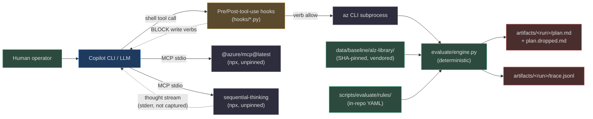
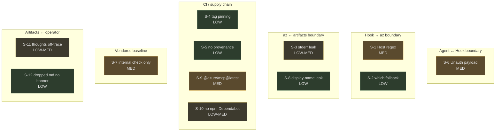
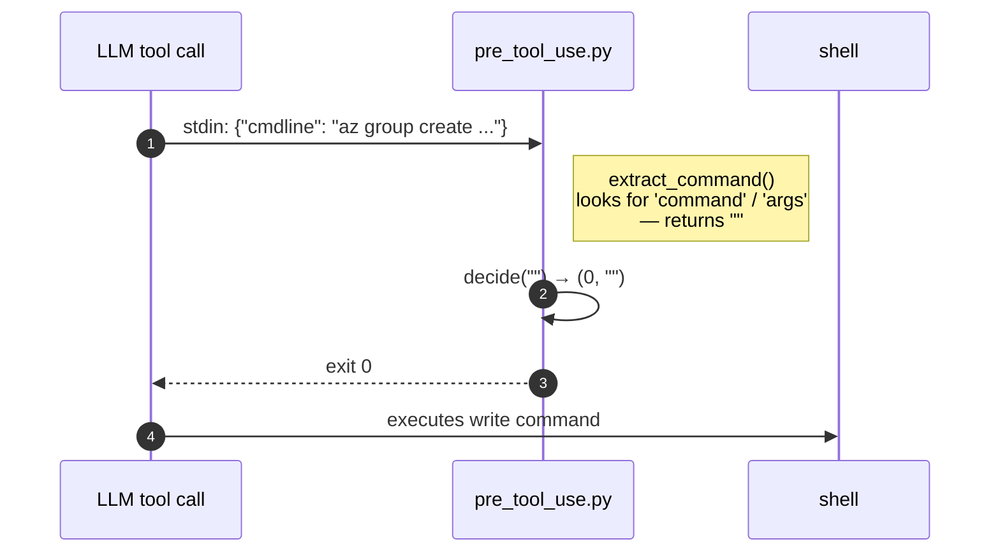
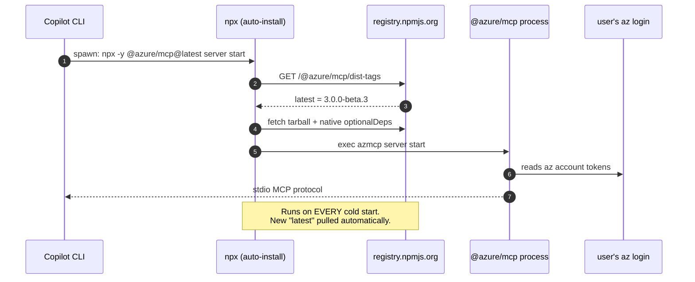
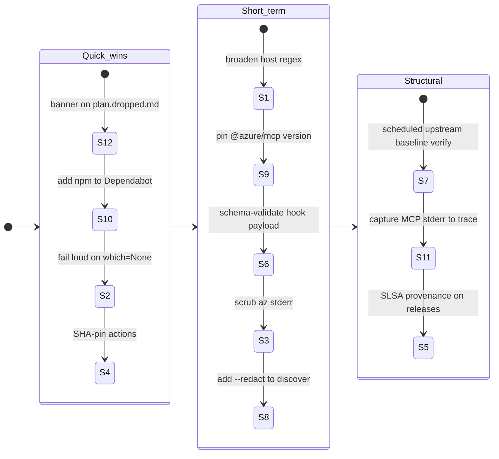

# Security Posture

This page consolidates the output of three iterative security research passes against
`slz-readiness`. It is organised around the twelve findings labelled **S-1 … S-12**,
each tied back to the exact file and line that produced it. The goal is operational:
a reviewer should be able to read one row of a finding table and know (a) where to
look, (b) how bad it is, and (c) what to change.

The project's **stated** security posture — read-only Azure, SHA-pinned baseline,
deterministic Evaluate, citation-guarded Plan, closed-set Scaffold — is genuinely
well-defended. The findings below are the gaps *around the edges* of that posture:
the hook contract, the transport guard's regex coverage, the supply chain of the
MCP helpers, and the surfaces where data leaves the machine.

::: tip Related reading
- [Hooks](./hooks.md) — where the pre/post-tool-use guards live
- [Architecture Overview](./architecture.md) — the closed-set discipline the findings test
- [Release Process](./release-process.md) — supply-chain context (pinning, Dependabot)
- [Phase 3 · Plan](./plan.md) — the citation guard that produces `plan.dropped.md`
:::

## The trust boundaries at a glance

The project straddles four trust boundaries. Every finding below lives on one of
them.



<!-- Sources: hooks/pre_tool_use.py:1-120; hooks/post_tool_use.py:1-89; .github/plugin/plugin.json:38-62; scripts/slz_readiness/evaluate/engine.py; scripts/slz_readiness/_trace.py -->

## Summary table — all 12 findings

| # | Boundary | Finding | Severity | Effort to fix |
|---|---|---|---|---|
| [S-1](#s-1-transport-guard-host-regex-gaps) | Hook → Azure | Transport-guard host regex misses Key Vault, storage, login, sovereign clouds | MED | Low |
| [S-2](#s-2-shutil-which-fallback) | Agent → Az | `shutil.which("az") or "az"` PATH-dependent fallback | LOW | Trivial |
| [S-3](#s-3-stderr-passthrough-in-findings) | Discover → artifacts | `error_finding` leaks raw `az` stderr (tenant topology) | LOW-MED | Low |
| [S-4](#s-4-actions-pinned-by-tag) | CI supply chain | GitHub Actions pinned by floating tag, not SHA | LOW | Low |
| [S-5](#s-5-no-release-provenance) | CI supply chain | No SLSA/sigstore provenance on release artifacts | LOW | Medium |
| [S-6](#s-6-unauthenticated-hook-payload) | Agent → Hook | Hook stdin unauthenticated; fail-open on malformed JSON | MED | Low |
| [S-7](#s-7-baseline-integrity-is-internal-only) | Vendor baseline | `baseline_integrity.py` only checks internal consistency; no upstream re-fetch in CI | MED | Low |
| [S-8](#s-8-display-names-and-ids-in-findings) | Discover → artifacts | subscription/logging discoverers emit display names + resource ids | LOW | Low |
| [S-9](#s-9-unpinned-npm-mcp-dependencies) | MCP supply chain | `@azure/mcp@latest` + sequential-thinking unpinned (only non-SHA-pinned deps in the project) | **MED** | Low |
| [S-10](#s-10-dependabot-missing-npm) | CI supply chain | Dependabot covers `pip` + `github-actions` but not `npm` | LOW-MED | Trivial |
| [S-11](#s-11-thoughts-not-in-trace) | MCP → operator | LLM thoughts go to MCP stderr only; `trace.jsonl` does not capture them | LOW-MED | Medium |
| [S-12](#s-12-plan-dropped-md-has-no-warning) | Plan → operator | `plan.dropped.md` is raw LLM hallucination with no warning banner | LOW | Trivial |

## Severity by boundary



<!-- Sources: consolidated from S-1..S-12 investigations; boundaries derived from hooks/pre_tool_use.py:60-117 and .github/plugin/plugin.json:38-62 -->

---

## S-1 · Transport-guard host regex gaps

The pre-tool-use hook runs a **transport-layer guard** before the verb-policy check,
so that `curl`, `Invoke-RestMethod`, and `az rest` can't bypass the verb gate.
That guard fires only when the URL matches an Azure-host regex. If the regex
doesn't cover a host, a write against that host slips through unreviewed.

<!-- Source: hooks/pre_tool_use.py:76-94 -->
```python
def _transport_block_reason(cmd: str) -> str | None:
    # az rest is always Azure-targeted; block on any write method.
    if _AZ_REST_RE.search(cmd) and _HTTP_WRITE_METHOD_RE.search(cmd):
        return ("pre-tool-use: BLOCKED az rest with write method ...")
    if _TRANSPORT_TOOLS_RE.search(cmd):
        targets_azure = bool(_AZURE_HOSTS_RE.search(cmd))
        has_write = bool(_HTTP_WRITE_METHOD_RE.search(cmd))
        if targets_azure and has_write:
            return ("pre-tool-use: BLOCKED raw HTTP write against Azure control plane ...")
    return None
```

| Host family | Covered by `_AZURE_HOSTS_RE`? | Risk |
|---|---|---|
| `management.azure.com` | ✅ | ARM writes blocked |
| `login.microsoftonline.com` | ❌ **(likely gap)** | Token endpoints for service-principal creation |
| `vault.azure.net` | ❌ | Key Vault secret/key/cert writes |
| `*.blob.core.windows.net` | ❌ | Storage data-plane PUT/DELETE |
| `*.usgovcloudapi.net` / `*.chinacloudapi.cn` | ❌ | Sovereign clouds (v1 targets Commercial, but a user could still issue such a call) |

**Recommendation (R1)**: broaden `_AZURE_HOSTS_RE` to cover at minimum
`*.azure.com`, `*.azure.net`, `*.microsoftonline.com`, `*.microsoft.com`, and the
sovereign suffixes — and add a golden test per family. See
[hooks/pre_tool_use.py:76-94](https://github.com/msucharda/slz-readiness/blob/main/hooks/pre_tool_use.py#L76-L94).

## S-2 · `shutil.which` fallback

When resolving the `az` binary, a fallback to the bare string `"az"` means the
command is launched via `PATH` lookup by the OS instead of by an absolute path.
If `PATH` contains a malicious directory earlier than the real `az`, a spoofed
binary wins. Severity is LOW because the attacker must already be local.

**Recommendation (R2)**: fail loud when `shutil.which` returns `None` instead of
falling back to `"az"`.

## S-3 · Stderr passthrough in findings

Discover-phase error records embed raw `az` stderr. That stderr often contains
tenant/resource-group names and principal GUIDs that the happy-path projection
otherwise strips. The `findings.json` file is then read by the LLM in Plan and
frequently attached to tickets by operators.

**Recommendation (R3)**: scrub stderr through a deny-list before writing to
`findings.json`; or record only the `az` exit code and a generic message.

## S-4 · Actions pinned by tag

All GitHub Actions in the three workflows are pinned by floating tag (`@v4`,
`@v3`, `@v5`) rather than immutable commit SHA. A tag retag is a known supply
chain vector.

**Recommendation (R4)**: SHA-pin all third-party actions and let Dependabot
bump them.

## S-5 · No release provenance

Release artifacts are produced by `.github/workflows/release.yml` but carry no
SLSA provenance, no sigstore signature, and no hash list. Downstream consumers
verifying a release have only the git tag to go on.

**Recommendation (R5)**: add `actions/attest-build-provenance` or the sigstore
action to the release workflow.

## S-6 · Unauthenticated hook payload

The pre-tool-use hook reads JSON from `stdin`, and `extract_command` inspects
only two keys. An unknown envelope shape fails open — the hook returns `0, ""`
and the command runs.

<!-- Source: hooks/pre_tool_use.py:69-73 -->
```python
def extract_command(payload: dict) -> str:
    cmd = payload.get("command")
    if not cmd and payload.get("args"):
        cmd = " ".join([payload.get("tool", ""), *payload["args"]])
    return (cmd or "").strip()
```

**Attack model**: a tool or sub-agent that wants to run a write `az` call only
has to place the command under a key other than `command` or `args` (or inside
a nested structure) — the guard sees an empty string and allows it.



<!-- Sources: hooks/pre_tool_use.py:69-73; hooks/pre_tool_use.py:97-117 -->

**Recommendation (R6)**: enforce a strict schema on the payload (pydantic /
jsonschema), and fail **closed** when the expected `command` field is absent.
Mirror the same change in `hooks/post_tool_use.py` (which today silently returns
`0` on a `JSONDecodeError` — see
[hooks/post_tool_use.py:74-77](https://github.com/msucharda/slz-readiness/blob/main/hooks/post_tool_use.py#L74-L77)).

## S-7 · Baseline integrity is internal-only

`baseline_integrity.py` verifies that every file under
`data/baseline/alz-library/` hashes to the value recorded in the adjacent
`_manifest.json`. But the manifest itself lives in the same directory — an
attacker with write access to the vendored tree can edit a file and rewrite
its manifest entry in one commit, and the check still passes locally.

The `vendor_baseline.py` CLI can re-fetch from upstream and rebuild the
manifest, but no CI job runs it on PRs. CI therefore only defends against
accidental drift, not tamper.

**Recommendation (R7)**: add a scheduled CI job that runs
`python -m slz_readiness.evaluate.vendor_baseline --verify-only --sha <pinned>`
against the upstream commit and fails on any diff.

## S-8 · Display names and resource ids in findings

`discover/subscription_inventory.py` and `discover/logging_monitoring.py` emit
subscription display names and fully-qualified resource ids by default. Those
two fields are the ones that most often count as "tenant topology" when shared.
This is independent of S-3 (which is an error-path leak).

**Recommendation (R8)**: add a `--redact` mode that replaces display names with
stable hashes and truncates resource ids to their type segment.

## S-9 · Un-pinned npm MCP dependencies

This is the **only** non-SHA-pinned dependency in the project — a striking
asymmetry with how the rest of the toolchain is locked down.

<!-- Source: .github/plugin/plugin.json:42-62 -->
```json
"mcpServers": {
  "azure": {
    "command": "npx",
    "args": ["-y", "@azure/mcp@latest", "server", "start"]
  },
  "sequential-thinking": {
    "command": "npx",
    "args": ["-y", "@modelcontextprotocol/server-sequential-thinking"],
    "env": { "DISABLE_THOUGHT_LOGGING": "false" }
  }
}
```

| Dependency | How pinned | Source |
|---|---|---|
| ALZ baseline files | SHA per file | [`_manifest.json`](https://github.com/msucharda/slz-readiness/blob/main/data/baseline/alz-library/_manifest.json) |
| AVM Bicep templates | Version pinned | [`VERSIONS.json`](https://github.com/msucharda/slz-readiness/blob/main/data/baseline/VERSIONS.json) |
| Rule YAMLs | In-repo, git tracked | [`scripts/evaluate/rules/`](https://github.com/msucharda/slz-readiness/tree/main/scripts/evaluate/rules) |
| GitHub Actions | Tag-pinned (soft) | `.github/workflows/*.yml` |
| **`@azure/mcp`** | **`@latest` (unpinned)** | [`plugin.json:47`](https://github.com/msucharda/slz-readiness/blob/main/.github/plugin/plugin.json#L47) |
| **`sequential-thinking`** | **No version specifier at all** | [`plugin.json:56`](https://github.com/msucharda/slz-readiness/blob/main/.github/plugin/plugin.json#L56) |

At time of research, `@azure/mcp@latest` resolves to `3.0.0-beta.3` — a BETA
release. `npx -y` re-fetches on every cold start and auto-accepts install. The
published `@azure/mcp` wrapper is tiny (~2 KB); the real code sits in five
platform-specific native packages (`@azure/mcp-linux-x64`, `@azure/mcp-win32-x64`,
etc.) via `optionalDependencies`, none of which are version-locked here either.



<!-- Sources: .github/plugin/plugin.json:42-62; apm.yml:31-47; npm registry @azure/mcp dist-tags -->

**Recommendation (R9)**: pin to an exact version (e.g.
`@azure/mcp@3.0.0-beta.3`), record it in `data/baseline/VERSIONS.json`, and do
the same for `@modelcontextprotocol/server-sequential-thinking`.

## S-10 · Dependabot missing `npm`

<!-- Source: .github/dependabot.yml -->
```yaml
version: 2
updates:
  - package-ecosystem: pip
    directory: /
    schedule: { interval: weekly }
  - package-ecosystem: github-actions
    directory: /
    schedule: { interval: weekly }
```

No `npm` ecosystem entry — so even if S-9 is fixed by pinning versions, nobody
gets a PR when a CVE is disclosed against `@azure/mcp` or the sequential-thinking
MCP.

**Recommendation (R10)**: add an `npm` entry covering wherever the MCP versions
are recorded (directory containing `apm.yml` / a future `package.json`).

## S-11 · Thoughts live in stderr, not in the trace

The `sequential-thinking` MCP server's *only* effect of
`DISABLE_THOUGHT_LOGGING=false` is to emit each formatted thought to
`console.error` inside the MCP subprocess — upstream source
([`lib.ts:processThought`](https://raw.githubusercontent.com/modelcontextprotocol/servers/main/src/sequentialthinking/lib.ts)):

```ts
if (!this.disableThoughtLogging) {
  const formattedThought = this.formatThought(input);
  console.error(formattedThought);        // ← stderr of the MCP subprocess
}
```

The repo's `docs/anti-hallucination.md:24-25` pitches this as "auditable
reasoning" — but **nothing in `slz-readiness` captures that stream.** It does
not land in `artifacts/<run>/trace.jsonl`; it only shows up wherever Copilot CLI
routes MCP subprocess stderr (typically live terminal).

| Evidence type | Durable path | Controlled by us? |
|---|---|---|
| `az` commands + decisions | `artifacts/<run>/trace.jsonl` | ✅ |
| Final plan bullets | `artifacts/<run>/plan.md` | ✅ |
| **Stripped plan bullets** | **`artifacts/<run>/plan.dropped.md`** | ✅ (but see [S-12](#s-12-plan-dropped-md-has-no-warning)) |
| **LLM thoughts** | **MCP subprocess stderr only** | ❌ |

```mermaid
graph LR
  Model["LLM (Plan phase)"]:::llm
  MCP["sequential-thinking<br>MCP subprocess"]:::ext
  StdErr["MCP process stderr"]:::danger
  Copilot["Copilot CLI host"]:::ext
  Term["Terminal / host log"]:::out
  Trace["artifacts/&lt;run&gt;/trace.jsonl"]:::ours

  Model -->|sequentialthinking| MCP
  MCP -->|JSON response<br>(counts only)| Model
  MCP -->|console.error<br>FULL thought text| StdErr
  StdErr --> Copilot
  Copilot --> Term
  StdErr -.->|NOT CAPTURED| Trace

  classDef llm fill:#1e3a5f,stroke:#4a9eed,color:#e0e0e0
  classDef ext fill:#2d2d3d,stroke:#7a7a8a,color:#e0e0e0
  classDef danger fill:#4a2e2e,stroke:#d45b5b,color:#e0e0e0
  classDef out fill:#5a4a2e,stroke:#d4a84b,color:#e0e0e0
  classDef ours fill:#2d4a3e,stroke:#4aba8a,color:#e0e0e0
```

<!-- Sources: modelcontextprotocol/servers sequentialthinking/lib.ts:processThought (upstream); docs/anti-hallucination.md:24-25; scripts/slz_readiness/_trace.py -->

**Recommendation (R11)**: either (a) capture MCP stderr into
`artifacts/<run>/reasoning.log` (via a wrapper or host-side config), or
(b) amend `docs/anti-hallucination.md` to distinguish **live visibility** from
**durable audit trail**.

## S-12 · `plan.dropped.md` has no warning

<!-- Source: hooks/post_tool_use.py:60-64 -->
```python
drop_path = plan.with_suffix(".dropped.md")
with drop_path.open("w", encoding="utf-8") as fh:
    fh.write("# Bullets dropped by post-tool-use citation guard\n\n")
    for line, reason in dropped:
        fh.write(f"- ({reason}) {line.strip()}\n")
```

The file contains the full original bullet text of every bullet the citation
guard rejected — by construction, the LLM's *uncited* output. In-repo the
artifact is well contained:

| Exfil path | Present? | Enforced by |
|---|---|---|
| Git commit of `artifacts/` | ❌ | [`.gitignore:24-25`](https://github.com/msucharda/slz-readiness/blob/main/.gitignore#L24-L25) |
| CI workflow artifact upload | ❌ | `ci.yml` has no `upload-artifact` for `artifacts/` |
| Release zip | ❌ | `release.yml` rsync `--exclude='artifacts'` |
| PR-comment automation | ❌ | No such workflow |
| **Operator shares a run folder manually** | ⚠️ | Customer process |

The residual risk is operator behaviour — someone attaching a run folder to a
support ticket or PR. The file looks authoritative because it is a clean
Markdown list, but its contents are **the LLM's confessions folder**.

**Recommendation (R12)**: prefix the file with an explicit banner —

```markdown
> ⚠️ UNVERIFIED AI OUTPUT — the citation guard stripped these bullets because they
> could not be tied to a real rule. Do not act on them without independent
> verification, and do not share this file outside the audit team.
```

Optionally downgrade the format to a `plan.dropped` event stream in `trace.jsonl`
so the content stops inviting human reading.

---

## Open questions (not yet findings)

| Question | Why it matters |
|---|---|
| What do the `@azure/mcp-<platform>` native packages actually contain? | The wrapper is 2 KB; the real attack surface is in the five native binaries. |
| How does Copilot CLI route MCP subprocess stderr? | Decides whether S-11 thoughts are genuinely ephemeral or end up in a host log. |
| Does `apm pack --format plugin` resolve `npx @latest` strings at pack time? | If yes, a pack artifact can bundle a pinned version even when `plugin.json` says `@latest`. |
| Does the post-tool-use `JSONDecodeError` early-return silently allow a malformed payload to skip the citation guard? | Mirrors S-6 on the output side — worth a dedicated test. |

## Mitigation priority



<!-- Sources: severity/effort columns of the summary table above -->

## Related pages

| Page | Why |
|---|---|
| [Hooks](./hooks.md) | Mechanics behind S-1, S-6, S-12 |
| [Architecture Overview](./architecture.md) | Closed-set discipline the findings test |
| [Release Process](./release-process.md) | Supply-chain context for S-4, S-5, S-9, S-10 |
| [Baseline Vendoring](./evaluate/baseline-vendoring.md) | Internals behind S-7 |
| [Phase 3 · Plan](./plan.md) | Citation guard that produces the `plan.dropped.md` artifact discussed in S-12 |
| [Phase 1 · Discover — Discoverers](./discover/discoverers.md) | Data-shape context for S-3 and S-8 |
