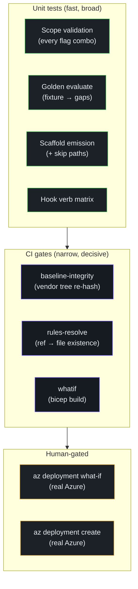

# Testing Strategy

## At a glance

| Layer | Fixture | Cite |
|---|---|---|
| Unit: discover scope | CLI parametrised | [`tests/unit/test_discover_scope.py`](https://github.com/msucharda/slz-readiness/blob/main/tests/unit/test_discover_scope.py) |
| Unit: evaluate golden | `findings.json` → `gaps.json` compare | [`tests/unit/test_evaluate_golden.py`](https://github.com/msucharda/slz-readiness/blob/main/tests/unit/test_evaluate_golden.py) |
| Unit: scaffold | Per-rule emission + skip paths | [`tests/unit/test_scaffold.py`](https://github.com/msucharda/slz-readiness/blob/main/tests/unit/test_scaffold.py) |
| Unit: hooks | Parametrised verb matrix | [`tests/test_hooks.py`](https://github.com/msucharda/slz-readiness/blob/main/tests/test_hooks.py) |
| CI: lint | ruff + mypy | [`ci.yml` lint job](https://github.com/msucharda/slz-readiness/blob/main/.github/workflows/ci.yml) |
| CI: test matrix | 3-OS (Linux/macOS/Windows) | `ci.yml` test job |
| CI: baseline integrity | Re-hash vendor tree | `ci.yml` baseline-integrity job |
| CI: rules-resolve | Every `baseline_ref` resolves | `ci.yml` rules-resolve job |
| CI: what-if | `bicep build` every template | `ci.yml` whatif job |

## The test pyramid (inverted)

<!-- Source: tests/, .github/workflows/ci.yml -->

The pyramid is deliberately heavy at the top (unit) and narrow near production (human). There are **no integration tests against live Azure** — they would require always-available test tenants, make CI expensive and flaky, and duplicate what manual `what-if` already covers.

## Golden evaluate

This is the test that pays the most rent. [`test_evaluate_golden.py`](https://github.com/msucharda/slz-readiness/blob/main/tests/unit/test_evaluate_golden.py):

1. Loads a committed `tests/fixtures/findings.json`.
2. Loads all 14 rules from `scripts/evaluate/rules/`.
3. Runs `engine.evaluate_all(findings, rules)`.
4. Compares the result byte-for-byte against `tests/fixtures/gaps.json`.

Any unintended change — a new rule that shifts sort order, a matcher tweak that changes observed payload shape, a baseline SHA bump — gets caught here.

## Scaffold skip-path coverage

[`test_scaffold.py`](https://github.com/msucharda/slz-readiness/blob/main/tests/unit/test_scaffold.py) tests the emission happy path but also every skip path:

- Gap with `status=unknown` → no emission.
- Rule id not in `RULE_TO_TEMPLATE` → no emission, trace event.
- Template name not in `ALLOWED_TEMPLATES` → no emission.
- Per-scope dedup: two gaps at same scope for `role-assignment` → one emission.
- Param schema validation failure → raises (is a bug, not a skip).

Missing these tests would allow silent regressions where scaffold "looks fine" but quietly drops emissions.

## Hook matrix

[`test_hooks.py`](https://github.com/msucharda/slz-readiness/blob/main/tests/test_hooks.py) parametrises `decide()` over a representative list of Azure and non-Azure commands. Coverage must include:

- Plain allow-verb + noun.
- DENY wins over ALLOW when both match.
- Non-Azure commands (ambient shell use).
- Edge cases: empty string, whitespace-only, mixed case.
- `az deployment … create` / `delete` — the critical safety boundary.

## CI matrix — three OSs

Why three?

- **Linux** — default CI host.
- **macOS** — most maintainer dev boxes.
- **Windows** — where `shutil.which("az")` PATHEXT quirks and tree-kill via `taskkill /T /F` bite. Cross-platform tests must exercise these paths or the `az_common.py` hardening rots.

The matrix adds ~3× test time but catches the Windows-only failures that would otherwise land in a bug report.

## `rules-resolve`

A small CI job that walks every rule's `baseline_ref` and confirms:

1. The file exists at `data/baseline/alz-library/<path>`.
2. The file's git-blob-sha matches `baseline_ref.sha` (recomputed live).

Failures mean a rule points at something not vendored — either a typo, or the rule was updated without a corresponding `vendor_baseline.py --sha` run.

Cite: [`rules_resolve.py`](https://github.com/msucharda/slz-readiness/blob/main/scripts/slz_readiness/evaluate/rules_resolve.py).

## `whatif`

For each `.bicep` under `scripts/scaffold/avm_templates/`, CI runs `bicep build`. This catches:

- Syntax errors.
- Reference to non-existent AVM module versions.
- Bicep linter warnings promoted to errors.

It **does not** run against live Azure — `what-if` at the Azure API level is a human step.

## Lint

ruff handles style + common errors; mypy handles types. Configuration in `pyproject.toml`. Both run in the `lint` job before `test` to fail fast on typos.

## What isn't tested

Knowing the gaps is as important as the coverage:

| Area | Why not tested automatically |
|---|---|
| Live Azure discovery | Tenants can't be checked into CI; covered by manual runs |
| LLM plan narration quality | Non-deterministic; covered by human review |
| Bicep deployment correctness | Covered by `az deployment what-if` (operator run) |
| `sequential-thinking` MCP behaviour | External dependency; we trust the upstream |
| Copilot CLI host behaviour | External dependency; we depend on its APM contract |

## Related reading

- [Rule Engine](/deep-dive/evaluate/rule-engine) — exercised by the golden test.
- [Hooks](/deep-dive/hooks) — the verb matrix tests.
- [Baseline Vendoring](/deep-dive/evaluate/baseline-vendoring) — integrity + rules-resolve.
