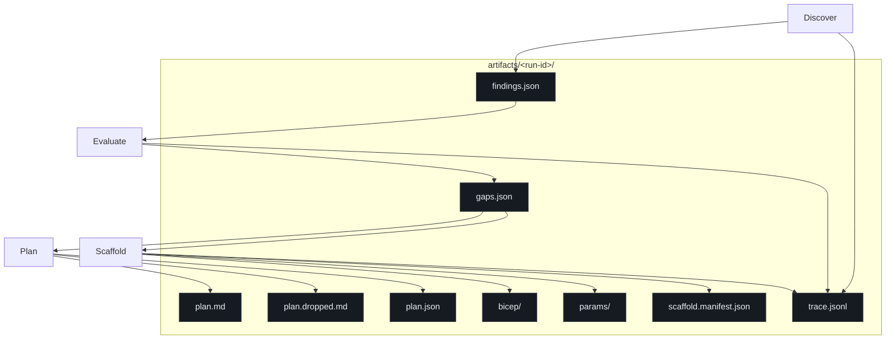

# Artifacts & Outputs

## At a glance

Every run writes to `artifacts/<run-id>/`. The `<run-id>` is a UTC timestamp (`YYYYMMDDTHHMMSSZ`) set by the first CLI in the chain. Subsequent CLIs reuse it when pointed at the same `--out` directory.

| File | Written by | Size (typical) | Purpose |
|---|---|---|---|
| `findings.json` | Discover | 100 KB – 5 MB | Raw Azure metadata per scope |
| `discover.summary.{json,md}` | Discover | 1 KB – 20 KB | Per-module status, error tallies, scope banner _(v0.5.0)_ |
| `gaps.json` | Evaluate | 2 KB – 50 KB | Deterministic diff vs baseline |
| `evaluate.summary.{json,md}` | Evaluate | 1 KB – 15 KB | Tally by severity/area/status, compliance ratio _(v0.5.0)_ |
| `plan.md` | Plan | 1 KB – 10 KB | LLM-narrated remediation (cited) |
| `plan.dropped.md` | Plan | 0 KB – few KB | Bullets stripped by citation guard |
| `plan.json` | Plan | 1 KB – 10 KB | Structured version of plan |
| `plan.summary.{json,md}` | `slz-plan-summary` | 1 KB – 10 KB | Deterministic readiness snapshot (zero LLM) _(v0.5.0)_ |
| `bicep/*.bicep` | Scaffold | 1 KB – 5 KB each | Deploy-ready AVM-backed Bicep |
| `params/*.parameters.json` | Scaffold | 0.5 KB – 3 KB each | Parameter file per template |
| `scaffold.manifest.json` | Scaffold | 1 KB – 5 KB | Per-gap trace of template emission |
| `scaffold.summary.{json,md}` | Scaffold | 1 KB – 10 KB | Emitted templates, warnings, deploy commands _(v0.5.0)_ |
| `how-to-deploy.md` | Scaffold | 3 KB – 15 KB | Operator runbook — Audit → Observe → Enforce waves, Bash + PowerShell, DINE role-assignment recipe _(v0.5.1)_ |
| `run.summary.md` | Scaffold (roll-up) | 5 KB – 50 KB | Concatenation of all four phase summaries _(v0.5.0)_ |
| `trace.jsonl` | All | 10 KB – 500 KB | NDJSON event stream — every `az` call, rule fire, template emit |

See [Phase Summaries](../deep-dive/phase-summaries.md) for the determinism contract behind the `.summary.*` files. See [Phased Rollout & Scope-Aware Deployment](../deep-dive/phased-rollout.md) for the v0.5.1 `how-to-deploy.md` runbook.

## File relationships



<!-- Source: scripts/slz_readiness/discover/cli.py, evaluate/cli.py, scaffold/engine.py, _trace.py -->

## `findings.json`

Shape (simplified):

```json
{
  "run_scope": {
    "tenant_id": "11111111-...",
    "mode": "filtered",
    "subscription_ids": ["sub-a", "sub-b"]
  },
  "findings": [
    {
      "kind": "mg_hierarchy",
      "scope": "tenant",
      "data": { "management_groups": [...] }
    },
    {
      "kind": "policy_assignment",
      "scope": "mg/root",
      "data": { "name": "...", "policyDefinitionId": "...", "enforcementMode": "Default" }
    },
    {
      "kind": "error_finding",
      "scope": "subscription/sub-c",
      "data": { "error_kind": "permission_denied", "detail": "..." }
    }
  ]
}
```

`run_scope` reflects exactly what the operator requested. It is persisted so downstream phases know what was actually audited. Test coverage: [`tests/unit/test_discover_scope.py:114-152`](https://github.com/msucharda/slz-readiness/blob/main/tests/unit/test_discover_scope.py#L114-L152).

**`error_finding` entries** are how Discover surfaces failures without crashing. [`az_common.py`](https://github.com/msucharda/slz-readiness/blob/main/scripts/slz_readiness/discover/az_common.py) classifies every `AzError` into `permission_denied | not_found | rate_limited | network`. Evaluate turns these into `status=unknown` gaps rather than false-positives or false-negatives.

Inspect with:

```bash
jq '.findings | group_by(.kind) | map({kind: .[0].kind, count: length})' \
    artifacts/<run>/findings.json
```

## `gaps.json`

Shape:

```json
{
  "generated_at": "2026-04-16T14:30:22Z",
  "baseline_pin": "559a4c86fd57eddd9ee5047fb01a455866bd1cf8",
  "gaps": [
    {
      "rule_id": "mg.slz.hierarchy_shape",
      "severity": "high",
      "resource_id": "tenant",
      "status": "missing",
      "baseline_ref": {
        "source": "https://github.com/Azure/Azure-Landing-Zones-Library",
        "path": "platform/slz/...",
        "sha": "559a4c86..."
      },
      "observed": { "missing": ["confidential_corp", "confidential_online"] }
    }
  ]
}
```

Fields defined in [`scripts/slz_readiness/evaluate/models.py`](https://github.com/msucharda/slz-readiness/blob/main/scripts/slz_readiness/evaluate/models.py).

| Field | Values |
|---|---|
| `status` | `missing` \| `misconfigured` \| `unknown` |
| `severity` | `critical` \| `high` \| `medium` \| `low` \| `unknown` |
| `resource_id` | `"tenant"` (for aggregate rules) or `"scope:mg/<id>"` / `"scope:subscription/<id>"` (per-resource) |

**Determinism invariant:** gaps are sorted by `(rule_id, resource_id)`. Tested by [`tests/unit/test_evaluate_golden.py`](https://github.com/msucharda/slz-readiness/blob/main/tests/unit/test_evaluate_golden.py).

Quick triage query:

```bash
jq '.gaps | group_by(.severity) | map({severity: .[0].severity, count: length})' \
    artifacts/<run>/gaps.json
```

## `plan.md`

Human-readable, structured by design area. Every bullet starts with `- [rule_id: X]` or is stripped.

Example slice:

```markdown
## Sovereignty

- [rule_id: sovereignty.confidential_corp_policies_applied] The Confidential Corp
  management group is missing the sovereignty policy set pinned at SHA
  `c1cbff38-87c0-4b9f-9f70-035c7a3b5523`. Apply via Scaffold-emitted
  `sovereignty-confidential-policies-confidential_corp.bicep`.
```

### `plan.dropped.md`

If the model produced bullets without the `(rule_id: X)` marker, [`hooks/post_tool_use.py:21`](https://github.com/msucharda/slz-readiness/blob/main/hooks/post_tool_use.py#L21) moves them here and out of `plan.md`. Treat as a debug artifact — don't cite it in audit evidence.

## `bicep/*.bicep` and `params/*.parameters.json`

One pair per `(template, scope)` combination. For templates in `_PER_SCOPE_TEMPLATES` ([`scaffold/engine.py:48`](https://github.com/msucharda/slz-readiness/blob/main/scripts/slz_readiness/scaffold/engine.py#L48)), the filename includes a scope suffix:

```
bicep/
  management-groups.bicep
  log-analytics.bicep
  sovereignty-confidential-policies-confidential_corp.bicep
  sovereignty-confidential-policies-confidential_online.bicep
  archetype-policies-corp.bicep
  archetype-policies-sandbox.bicep
params/
  management-groups.parameters.json
  ...
```

All templates come from [`scripts/scaffold/avm_templates/`](https://github.com/msucharda/slz-readiness/tree/main/scripts/scaffold/avm_templates). All parameter files pass JSON-Schema validation against [`scripts/scaffold/param_schemas/*.schema.json`](https://github.com/msucharda/slz-readiness/tree/main/scripts/scaffold/param_schemas) before being written.

## `scaffold.manifest.json`

Shape:

```json
{
  "run_id": "20260416T143022Z",
  "emitted": [
    {
      "rule_id": "mg.slz.hierarchy_shape",
      "template": "management-groups",
      "scope": null,
      "bicep": "bicep/management-groups.bicep",
      "params": "params/management-groups.parameters.json"
    },
    {
      "rule_id": "archetype.alz_corp_policies_applied",
      "template": "archetype-policies",
      "scope": "corp",
      "bicep": "bicep/archetype-policies-corp.bicep",
      "params": "params/archetype-policies-corp.parameters.json"
    }
  ],
  "skipped_unknown_gaps": 2,
  "warnings": []
}
```

This is the audit-evidence bridge between `gaps.json` and the deployed Bicep. Keep it with the deployment record.

## `trace.jsonl` — NDJSON event stream

One JSON object per line. Events from [`scripts/slz_readiness/_trace.py`](https://github.com/msucharda/slz-readiness/blob/main/scripts/slz_readiness/_trace.py):

| Event | When | Payload |
|---|---|---|
| `run.scope` | Discover start | tenant, mode, subscription_ids |
| `discoverer.begin` | Before each module | module name |
| `discoverer.end` | After each module | count of findings |
| `discoverer.error` | On module failure | AzError kind |
| `az.cmd` | Every `az` call | args, duration_ms, returncode |
| `rule.fire` | Evaluate, per rule | rule_id, aggregate, n_gaps |
| `template.emit` | Scaffold, per template | template, scope, bicep path |
| `scaffold.begin` / `scaffold.end` | Scaffold wrapping | gap count, emission count |

Useful queries:

```bash
# Every az call in the run, oldest first:
jq -c 'select(.event=="az.cmd") | {t:.ts, args:.args, ms:.duration_ms}' \
    artifacts/<run>/trace.jsonl

# Any error findings:
jq -c 'select(.event=="discoverer.error")' artifacts/<run>/trace.jsonl

# What did scaffold produce, in order:
jq -c 'select(.event=="template.emit") | {t:.ts, tpl:.template, scope:.scope}' \
    artifacts/<run>/trace.jsonl
```

## Retention & sensitivity

`findings.json` contains **control-plane metadata** — management group IDs, subscription IDs, policy names, role assignment targets. No secrets; but enough to describe tenant topology. Handle per your data-handling policy. Default `.gitignore` excludes `artifacts/`.

## Related reading

- [Rule Engine](/deep-dive/evaluate/rule-engine) — how `gaps.json` is constructed.
- [Scaffold Engine & Registry](/deep-dive/scaffold/engine-and-registry) — how files under `bicep/` and `params/` are produced.
- [Hooks](/deep-dive/hooks) — how the citation guard populates `plan.dropped.md`.
- [Testing Strategy](/deep-dive/testing) — golden fixtures that pin the shapes above.
