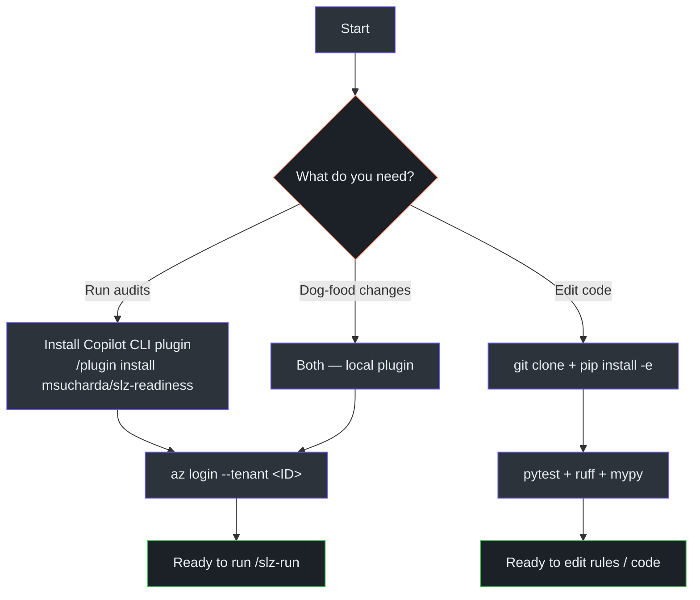

# Installation

## At a glance

| Install path | Use case | Time |
|---|---|---|
| **Copilot CLI plugin** | End users running audits | 2 minutes |
| **Dev install (`pip install -e`)** | Contributors editing rules / code | 5 minutes |
| **Both** | Dog-fooding your changes as a plugin | 6 minutes |

## Prerequisites

| Tool | Minimum | Check |
|---|---|---|
| Python | 3.11 | `python --version` — required by [`pyproject.toml:21`](https://github.com/msucharda/slz-readiness/blob/main/pyproject.toml#L21) |
| Azure CLI (`az`) | 2.60 | `az version` |
| GitHub Copilot CLI | current | `copilot --version` |
| git | 2.40 | `git --version` |
| Bicep | 0.30 (bundled with `az`) | `az bicep version` |

## Option A · Install the plugin (end user)

```powershell
copilot
/plugin install msucharda/slz-readiness
```

Copilot CLI reads [`.github/plugin/plugin.json`](https://github.com/msucharda/slz-readiness/blob/main/.github/plugin/plugin.json) — the packaged plugin manifest. This registers:

- 5 skills: `discover`, `reconcile`, `evaluate`, `plan`, `scaffold`
- 6 slash prompts: `/slz-discover`, `/slz-reconcile`, `/slz-evaluate`, `/slz-plan`, `/slz-scaffold`, `/slz-run`
- 2 MCP servers: `azure` (`@azure/mcp`), `sequential-thinking` (gated to plan + scaffold)
- 2 hooks: `hooks/pre_tool_use.py`, `hooks/post_tool_use.py`
- 1 agent definition: `slz-readiness` ([`.github/agents/slz-readiness.agent.md`](https://github.com/msucharda/slz-readiness/blob/main/.github/agents/slz-readiness.agent.md))
- 1 instructions file with the 8 non-negotiable rules ([`.github/instructions/slz-readiness.instructions.md`](https://github.com/msucharda/slz-readiness/blob/main/.github/instructions/slz-readiness.instructions.md))

Verify:

```
/plugin list
# Expect: slz-readiness (v0.14.8)
```

### Azure login

```powershell
az login --tenant <YOUR_TENANT_ID>
```

The Discover phase resolves your active tenant using the cached Azure CLI session. If the session is absent or the tenant mismatches, `/slz-discover` fails fast with an actionable error ([`discover/cli.py:88-154`](https://github.com/msucharda/slz-readiness/blob/main/scripts/slz_readiness/discover/cli.py#L88-L154)).

You do not need an Azure service principal. Discover uses whatever identity `az` is logged in as. Tenant Reader is sufficient.

## Option B · Dev install (contributors)

```bash
git clone https://github.com/msucharda/slz-readiness.git
cd slz-readiness

python -m venv .venv
source .venv/bin/activate              # Linux / macOS / WSL
# .venv\Scripts\Activate.ps1           # Windows PowerShell

pip install -e ".[dev]"
```

The `pyproject.toml` declares the phase console scripts ([`pyproject.toml:30-35`](https://github.com/msucharda/slz-readiness/blob/main/pyproject.toml#L30-L35)):

```toml
[project.scripts]
slz-discover = "slz_readiness.discover.cli:main"
slz-reconcile = "slz_readiness.reconcile.cli:main"
slz-evaluate = "slz_readiness.evaluate.cli:main"
slz-scaffold = "slz_readiness.scaffold.cli:main"
slz-plan-summary = "slz_readiness.plan.summary_cli:main"
```

Verify:

```bash
slz-discover --help
slz-reconcile --help
slz-evaluate --help
slz-scaffold --help
pytest -q
```

## Option C · Install the local plugin (dev round-trip)

From inside the cloned repo:

```bash
copilot
/plugin install .
```

This lets you run `/slz-discover` against your local edits. Combined with `pip install -e`, every code change is picked up immediately.

## Installation flow



<!-- Source: README.md:20-62, apm.yml, .github/plugin/plugin.json -->

## Troubleshooting

| Symptom | Likely cause | Fix |
|---|---|---|
| `/plugin install` says "not found" | Copilot CLI version too old | `copilot update` |
| `slz-discover --help` not found | Not in the venv, or `pip install -e` skipped | Re-activate venv and retry |
| `/slz-discover` fails "no active az session" | `az login` not run or expired | `az login --tenant <id>` |
| Tests fail with PATH / encoding errors on Windows | cmd.exe instead of PowerShell 7+ | Use `pwsh` or Windows Terminal |
| Hook blocks an `az` command | Verb not in allowlist | Check whether the command is genuinely read-only; if yes, open a PR adding to [`hooks/pre_tool_use.py:21`](https://github.com/msucharda/slz-readiness/blob/main/hooks/pre_tool_use.py#L21) |
| `baseline-integrity` CI fails | Local baseline edit | Never edit `data/baseline/` by hand; use `vendor_baseline.py` |

## Uninstall

```
/plugin uninstall slz-readiness
```

For a dev install, `pip uninstall slz-readiness` and `rm -rf .venv`.

## Related reading

- [Quick Start](/getting-started/quick-start) — first audit in 5 minutes.
- [Contributor Guide](/onboarding/contributor) — the full contributor workflow.
- [Plugin Mechanics](/deep-dive/plugin-mechanics) — how `apm.yml` and `plugin.json` work.
