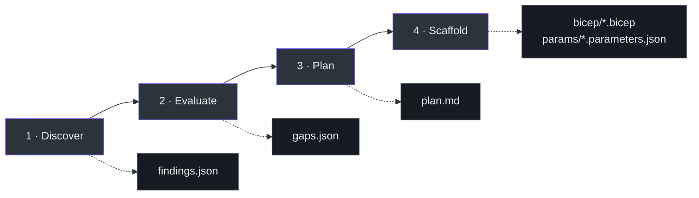
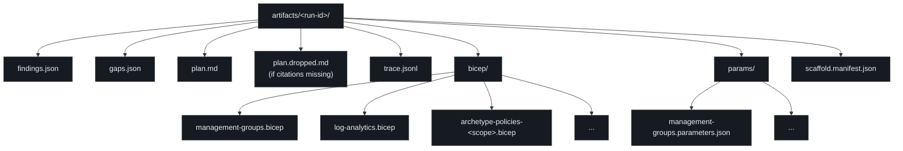

# Overview

## At a glance

| Property | Value |
|---|---|
| Project | `slz-readiness` |
| Version | v0.4.0 |
| Language | Python 3.11+ |
| Plugin host | GitHub Copilot CLI |
| Architecture | 4-phase pipeline (Discover → Evaluate → Plan → Scaffold) |
| Output | `findings.json`, `gaps.json`, `plan.md`, `bicep/*.bicep`, `trace.jsonl` |
| Safety | Shell-level verb allowlist (read-only); citation-guarded plan; template-only scaffold |
| License | MIT |
| Repository | [msucharda/slz-readiness](https://github.com/msucharda/slz-readiness) |

## What is slz-readiness?

`slz-readiness` is a Copilot CLI plugin that audits an Azure tenant against Microsoft's [Sovereign Landing Zone](https://aka.ms/slz) baseline and produces deploy-ready Bicep scaffolding for the gaps it finds.

Three things make it different from a typical AI cloud tool:

1. **Read-only by mechanical guarantee.** A [pre-tool-use hook](https://github.com/msucharda/slz-readiness/blob/main/hooks/pre_tool_use.py) blocks any `az` verb outside a hard-coded allowlist before the command reaches Azure.
2. **Deterministic gap analysis.** The Evaluate phase is pure Python — [`engine.py`](https://github.com/msucharda/slz-readiness/blob/main/scripts/slz_readiness/evaluate/engine.py) walks every rule YAML in [`scripts/evaluate/rules/`](https://github.com/msucharda/slz-readiness/tree/main/scripts/evaluate/rules), compares findings to a SHA-pinned baseline, and emits sorted output. Same inputs → identical `gaps.json`.
3. **Templates-only scaffolding.** Bicep output is never AI-generated. The [`scaffold/template_registry.py`](https://github.com/msucharda/slz-readiness/blob/main/scripts/slz_readiness/scaffold/template_registry.py) maps each rule id to one of seven allowed AVM templates under [`scripts/scaffold/avm_templates/`](https://github.com/msucharda/slz-readiness/tree/main/scripts/scaffold/avm_templates), with JSON-Schema-validated parameters.

## The 4 phases

<!-- Source: .github/agents/slz-readiness.agent.md -->

| Phase | Slash command | Inputs | Outputs | Uses LLM? |
|---|---|---|---|---|
| Discover | `/slz-discover` | `--tenant`, `--subscription` or `--all-subscriptions` | `findings.json`, `trace.jsonl` | No |
| Evaluate | `/slz-evaluate` | `--findings <path>` | `gaps.json` | **No** (pure Python) |
| Plan | `/slz-plan` | `--gaps <path>` | `plan.md`, `plan.json` | Yes (with citation guard) |
| Scaffold | `/slz-scaffold` | `--gaps <path>`, `--params <path>` | `bicep/*.bicep`, `params/*.parameters.json`, `scaffold.manifest.json` | No |
| Orchestrator | `/slz-run` | `--tenant`, scope flags | All of the above, sequenced | Plan only |

## Hard rules enforced by the tool

1. **Read-only Azure.** [`hooks/pre_tool_use.py:21`](https://github.com/msucharda/slz-readiness/blob/main/hooks/pre_tool_use.py#L21) regex allows only `list|show|get|query|search|describe|export|version|account`.
2. **Baseline as truth.** Every rule pins [`baseline_ref.sha`](https://github.com/msucharda/slz-readiness/blob/main/scripts/slz_readiness/evaluate/models.py); CI job `rules-resolve` verifies resolution.
3. **Determinism.** `gaps.json` is sorted by `(rule_id, resource_id)`; no LLM calls.
4. **Citations.** [`hooks/post_tool_use.py:21`](https://github.com/msucharda/slz-readiness/blob/main/hooks/post_tool_use.py#L21) strips plan bullets without `(rule_id: X)` to `plan.dropped.md`.
5. **Templates only.** [`scaffold/template_registry.py:48`](https://github.com/msucharda/slz-readiness/blob/main/scripts/slz_readiness/scaffold/template_registry.py#L48) `ALLOWED_TEMPLATES` is the closed set.
6. **HITL.** `az deployment` is the operator's click, never the agent's.
7. **Scope confirmation.** [`discover/cli.py:88-154`](https://github.com/msucharda/slz-readiness/blob/main/scripts/slz_readiness/discover/cli.py#L88-L154) requires explicit tenant + subscription scope.
8. **Trace everything.** NDJSON at `artifacts/<run>/trace.jsonl` — every `az.cmd`, `rule.fire`, `template.emit`.

## Where outputs land

<!-- Source: scripts/slz_readiness/discover/cli.py, evaluate/cli.py, scaffold/engine.py, _trace.py -->

The `<run-id>` is a UTC timestamp-based identifier (e.g. `20260416T143022Z`) set by the first CLI in the chain. Subsequent CLIs reuse it when pointed at the same `--out` directory.

## Design philosophy (30-second version)

- **Baseline is the ground truth.** Microsoft publishes the Azure Landing Zones library; we pin it at a git SHA and never look anywhere else for "what should be."
- **LLMs narrate, never decide.** Only the Plan phase touches an LLM — and its output is post-processed to strip any uncited bullet.
- **Safety is mechanical.** We do not trust the agent to remember to be read-only. A shell hook enforces it.

## What this guide covers

| Page | Teaches you |
|---|---|
| [Installation](/getting-started/installation) | Dev install (`pip install -e`) and plugin install (`/plugin install`) |
| [Quick Start](/getting-started/quick-start) | The five slash commands end-to-end |
| [Artifacts](/getting-started/artifacts) | What each output file looks like and how to read it |
| [Architecture](/deep-dive/architecture) | How the pieces fit |
| [Rules Catalogue](/deep-dive/evaluate/rules-catalog) | Every rule, its matcher, its baseline path |

## Related reading

- [Contributor Guide](/onboarding/contributor) — if you'll also be writing code.
- [Executive Guide](/onboarding/executive) — decision-maker view.
- [`README.md`](https://github.com/msucharda/slz-readiness/blob/main/README.md) — first-party top-level overview.
- [`docs/architecture.md`](https://github.com/msucharda/slz-readiness/blob/main/docs/architecture.md) — authoritative architecture note.
