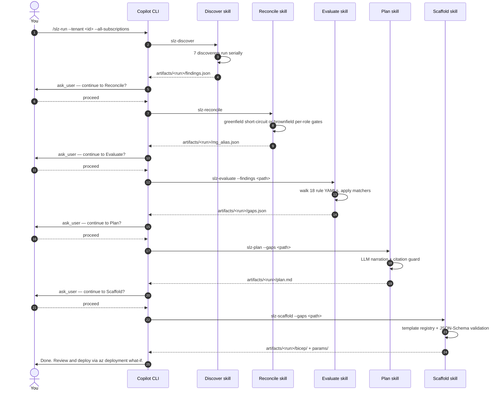

# Quick Start

## At a glance

From zero to review-ready Bicep artifacts.

| Step | Command |
|---|---|
| 1 | `az login --tenant <TENANT_ID>` |
| 2 | `/plugin install msucharda/slz-readiness` |
| 3 | `/slz-run --tenant <TENANT_ID> --all-subscriptions` |
| 4 | Review `plan.md` and `how-to-deploy.md` |
| 5 | Open PR with `bicep/`, `params/`, manifest, and runbooks as appropriate |

## Prerequisites

See [Installation](/getting-started/installation). Below assumes you have `az`, `copilot`, and (if contributing) the dev install done.

## Option 1 · End-to-end with `/slz-run`

```
copilot
/slz-run --tenant 11111111-2222-3333-4444-555555555555 --all-subscriptions
```

The orchestrator ([`.github/prompts/slz-run.prompt.md`](https://github.com/msucharda/slz-readiness/blob/main/.github/prompts/slz-run.prompt.md)) runs all five phases in sequence with a structured `ask_user` gate between each for human review.



<!-- Source: .github/prompts/slz-run.prompt.md, .github/skills/ -->

The current `/slz-run` prompt requires structured gates; it does not collapse phases or ask via plain text.

## Option 2 · Phase by phase

Useful when debugging, iterating on a rule, or running only part of the pipeline.

### Phase 1 · Discover

```
/slz-discover --tenant <ID> --all-subscriptions
```

or filtered:

```
/slz-discover --tenant <ID> --subscription sub-a --subscription sub-b
```

**Flag validation** ([`discover/cli.py:88-154`](https://github.com/msucharda/slz-readiness/blob/main/scripts/slz_readiness/discover/cli.py#L88-L154)):

- `--tenant` is required.
- Exactly one of `--subscription` (repeatable) or `--all-subscriptions`.
- Active `az` session's tenant must match `--tenant`.

Output: `artifacts/<run>/findings.json`, `artifacts/<run>/trace.jsonl`.

### Phase 2 · Reconcile

```
/slz-reconcile
```

Greenfield runs write an all-null `mg_alias.json`. Brownfield runs propose
canonical-role to customer-MG mappings and require an explicit `ask_user`
decision for each non-null mapping.

Output: `artifacts/<run>/mg_alias.json`, `artifacts/<run>/reconcile.summary.{json,md}`.

### Phase 3 · Evaluate

```
/slz-evaluate --findings artifacts/20260416T143022Z/findings.json
```

No LLM calls. Evaluates the current rule set deterministically.

Output: `artifacts/<run>/gaps.json`.

### Phase 4 · Plan

```
/slz-plan --gaps artifacts/20260416T143022Z/gaps.json
```

LLM narration via the sequential-thinking MCP server. Output is passed through [`hooks/post_tool_use.py`](https://github.com/msucharda/slz-readiness/blob/main/hooks/post_tool_use.py) which drops any bullet not cited as `(rule_id: X)`.

Output: `artifacts/<run>/plan.md`, `artifacts/<run>/plan.json`, optionally `artifacts/<run>/plan.dropped.md`.

### Phase 5 · Scaffold

```
/slz-scaffold --gaps artifacts/20260416T143022Z/gaps.json
```

Per-scope dedup ([`scaffold/engine.py:48`](https://github.com/msucharda/slz-readiness/blob/main/scripts/slz_readiness/scaffold/engine.py#L48)) means two archetype gaps at different MGs produce two Bicep files. Parameters are JSON-Schema-validated against [`scripts/scaffold/param_schemas/`](https://github.com/msucharda/slz-readiness/tree/main/scripts/scaffold/param_schemas) before files are written.

Output: `artifacts/<run>/bicep/*.bicep`, `artifacts/<run>/params/*.parameters.json`, `artifacts/<run>/scaffold.manifest.json`.

## Deploying the Bicep

This is the user's job, not the agent's. The agent's pre-tool-use hook actively blocks `az deployment ... create` and optional `deploy-all` / `grant-dine-roles` runbooks.

```bash
az deployment mg what-if \
    --management-group-id <root-mg-id> \
    --template-file artifacts/<run>/bicep/management-groups.bicep \
    --parameters artifacts/<run>/params/management-groups.parameters.json
```

Review the what-if output. If acceptable:

```bash
az deployment mg create \
    --management-group-id <root-mg-id> \
    --template-file artifacts/<run>/bicep/management-groups.bicep \
    --parameters artifacts/<run>/params/management-groups.parameters.json
```

## A typical first session

```mermaid
flowchart LR
    A["Install plugin<br>+ az login"]:::s
    B["/slz-run --tenant ... --all-subscriptions"]:::s
    C["Review findings.json<br>(jq | less)"]:::r
    D["Review gaps.json<br>(severity column)"]:::r
    E["Review plan.md<br>(prioritise by design_area)"]:::r
    F["Pick 1-2 gaps to fix first"]:::dec
    G["Create branch<br>commit artifacts/&lt;run&gt;/bicep/"]:::s
    H["Open PR<br>az deployment what-if on CI preview"]:::s
    I["Platform review + deploy"]:::s

    A --> B --> C --> D --> E --> F --> G --> H --> I

    classDef s fill:#2d333b,stroke:#6d5dfc,color:#e6edf3;
    classDef r fill:#161b22,stroke:#30363d,color:#e6edf3;
    classDef dec fill:#1c2128,stroke:#f78166,color:#e6edf3;
```



## Gotchas

| Issue | Fix |
|---|---|
| "tenant-active" error | Run `az login --tenant <id>` matching `--tenant` flag |
| `gaps.json` is empty | Tenant actually compliant ✅ or no findings reached rules — check `findings.json` |
| Every gap is `status: unknown` | Permission denied during Discover — use a broader role |
| `plan.md` is very short | Most of plan moved to `plan.dropped.md` — model forgot to cite with `(rule_id: X)` |
| Scaffold emits nothing | All gaps are `status=unknown`; Scaffold correctly skips them |
| Scaffold errors "template not in ALLOWED_TEMPLATES" | Rule → template mapping missing; see [Template Registry](/deep-dive/scaffold/engine-and-registry) |

## Related reading

- [Artifacts & Outputs](/getting-started/artifacts) — deep read of every output file.
- [Architecture](/deep-dive/architecture) — how the phases compose.
- [Orchestration](/deep-dive/orchestration) — how `/slz-run` sequences skills.
