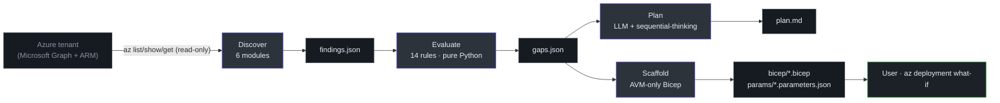

# slz-readiness

> A four-phase Sovereign Landing Zone readiness audit plugin for GitHub Copilot CLI. Read-only against Azure, deterministic in Evaluate, never applies changes.

Current version: **v0.4.0** · Source: [github.com/msucharda/slz-readiness](https://github.com/msucharda/slz-readiness)

## What this does

`slz-readiness` compares a live Azure tenant against the [Azure Landing Zones Library](https://github.com/Azure/Azure-Landing-Zones-Library) (SHA-pinned) and produces:

1. `findings.json` — raw evidence collected from Azure Resource Manager via `az` CLI (**read-only** verbs only)
2. `gaps.json` — deterministic diff from the pinned baseline (zero LLM; zero inference)
3. `plan.md` — human-readable remediation narrative (LLM narration, citation-guarded)
4. `bicep/*.bicep` + `params/*.parameters.json` — AVM-only Bicep scaffolds per gap, with a `scaffold.manifest.json`

All artifacts land under `artifacts/<run-id>/`. **No Azure writes ever happen.** Bicep `what-if` and `deploy` are the user's job.

## Quick Start

```powershell
# 1. Install the plugin into Copilot CLI (one-time):
copilot
/plugin install msucharda/slz-readiness

# 2. Log in to Azure and pick a tenant:
az login --tenant <TENANT_ID>

# 3. Run the full pipeline:
/slz-run --tenant <TENANT_ID> --all-subscriptions
```

Or call each phase independently:

| Phase | Slash command | Writes |
|------:|---------------|--------|
| 1 | `/slz-discover --tenant <id> --all-subscriptions` | `artifacts/<run>/findings.json` |
| 2 | `/slz-evaluate --findings <path>` | `artifacts/<run>/gaps.json` |
| 3 | `/slz-plan --gaps <path>` | `artifacts/<run>/plan.md` |
| 4 | `/slz-scaffold --gaps <path>` | `artifacts/<run>/bicep/*.bicep` |

## Architecture at a glance



<!-- Source: .github/agents/slz-readiness.agent.md, docs/architecture.md, scripts/slz_readiness/ -->

## Where to start

| Audience | Start here |
|---|---|
| **Contributing code** | [Contributor Guide](/onboarding/contributor) |
| **Reviewing architecture** | [Staff Engineer Guide](/onboarding/staff-engineer) |
| **Deciding whether to adopt** | [Executive Guide](/onboarding/executive) |
| **Understanding capabilities** | [Product Manager Guide](/onboarding/product-manager) |
| **Running the tool** | [Getting Started → Quick Start](/getting-started/quick-start) |
| **Debugging internals** | [Deep Dive → Architecture](/deep-dive/architecture) |

## Documentation map

| Section | Pages | Purpose |
|---|---|---|
| **Onboarding** | 4 | Audience-tailored first read |
| **Getting Started** | 4 | Install, run, interpret outputs |
| **Deep Dive** | 13 | Per-phase, per-component reference |

## Key files (code map)

| Path | What lives there | Notes |
|------|------------------|-------|
| [`apm.yml`](https://github.com/msucharda/slz-readiness/blob/main/apm.yml) | Plugin manifest (dev format) | Skills, prompts, hooks, MCP |
| [`.github/plugin/plugin.json`](https://github.com/msucharda/slz-readiness/blob/main/.github/plugin/plugin.json) | Packaged plugin manifest | Published form |
| [`.github/agents/slz-readiness.agent.md`](https://github.com/msucharda/slz-readiness/blob/main/.github/agents/slz-readiness.agent.md) | Agent definition | 4-phase contract |
| [`.github/instructions/slz-readiness.instructions.md`](https://github.com/msucharda/slz-readiness/blob/main/.github/instructions/slz-readiness.instructions.md) | Non-negotiable rules | Read-only, HITL, citations |
| [`hooks/`](https://github.com/msucharda/slz-readiness/tree/main/hooks) | Pre/post tool hooks | Verb allowlist, citation guard |
| [`scripts/slz_readiness/discover/`](https://github.com/msucharda/slz-readiness/tree/main/scripts/slz_readiness/discover) | 6 discoverers + `az` wrapper | Phase 1 |
| [`scripts/slz_readiness/evaluate/`](https://github.com/msucharda/slz-readiness/tree/main/scripts/slz_readiness/evaluate) | Deterministic rule engine | Phase 2 |
| [`scripts/slz_readiness/scaffold/`](https://github.com/msucharda/slz-readiness/tree/main/scripts/slz_readiness/scaffold) | Template-driven Bicep emitter | Phase 4 |
| [`scripts/evaluate/rules/`](https://github.com/msucharda/slz-readiness/tree/main/scripts/evaluate/rules) | 14 YAML rule definitions | Baseline-pinned |
| [`scripts/scaffold/avm_templates/`](https://github.com/msucharda/slz-readiness/tree/main/scripts/scaffold/avm_templates) | 7 AVM Bicep templates | The only allowed output shapes |
| [`data/baseline/VERSIONS.json`](https://github.com/msucharda/slz-readiness/blob/main/data/baseline/VERSIONS.json) | Pinned ALZ Library SHA | CI-enforced |

## Technology stack

- **Language**: Python 3.11+ ([`pyproject.toml:21`](https://github.com/msucharda/slz-readiness/blob/main/pyproject.toml#L21))
- **CLI framework**: [Click](https://click.palletsprojects.com/) 8+
- **Schema validation**: [jsonschema](https://python-jsonschema.readthedocs.io/) 4+ for AVM param files
- **Rule definitions**: PyYAML 6+
- **IaC output**: Bicep + [Azure Verified Modules](https://aka.ms/avm)
- **Host platform**: [GitHub Copilot CLI](https://docs.github.com/copilot) via APM plugin format
- **MCP servers**: `@azure/mcp`, `@modelcontextprotocol/server-sequential-thinking`
- **Test runner**: pytest (multi-OS matrix: Linux, macOS, Windows)

## Hard rules (non-negotiable)

> The agent cannot violate these — the `hooks/pre_tool_use.py` verb allowlist enforces #1 mechanically.

1. **Read-only against Azure.** Only `list|show|get|query|search` Azure CLI verbs.
2. **Baseline is truth.** Every rule pins a baseline file at a git SHA.
3. **Deterministic Evaluate.** Pure Python, sorted output, zero LLM calls.
4. **Citations or it didn't happen.** Plan bullets without `(rule_id: X)` are stripped.
5. **Templates only.** Scaffold must pick from [`ALLOWED_TEMPLATES`](https://github.com/msucharda/slz-readiness/blob/main/scripts/slz_readiness/scaffold/template_registry.py#L48).
6. **Human in the loop.** Every `az deployment` is the user's click, not the agent's.
7. **Scope confirmation.** Discover fails fast unless both `--tenant` and (`--subscription` | `--all-subscriptions`) are supplied.
8. **Trace everything.** NDJSON `artifacts/<run>/trace.jsonl` records every `az` invocation, rule fire, and template emit.

See [Architecture Overview](/deep-dive/architecture) for how each rule is implemented.
