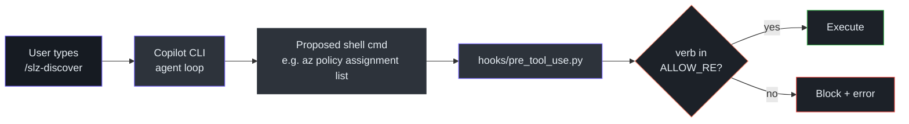
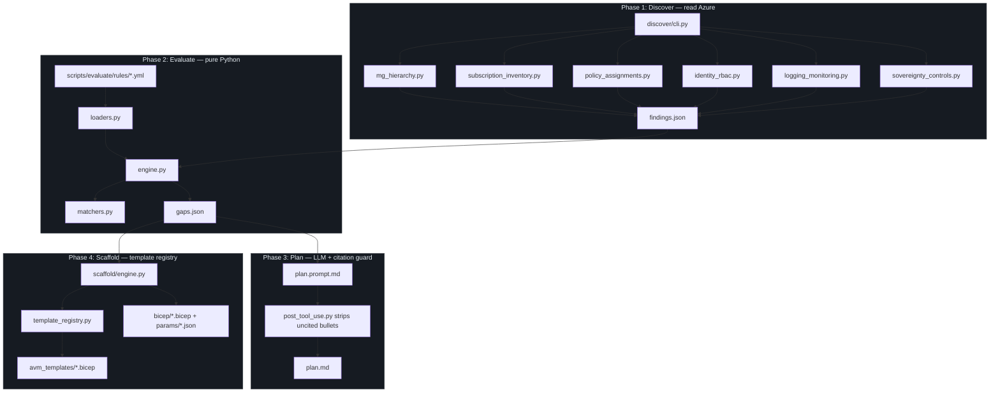
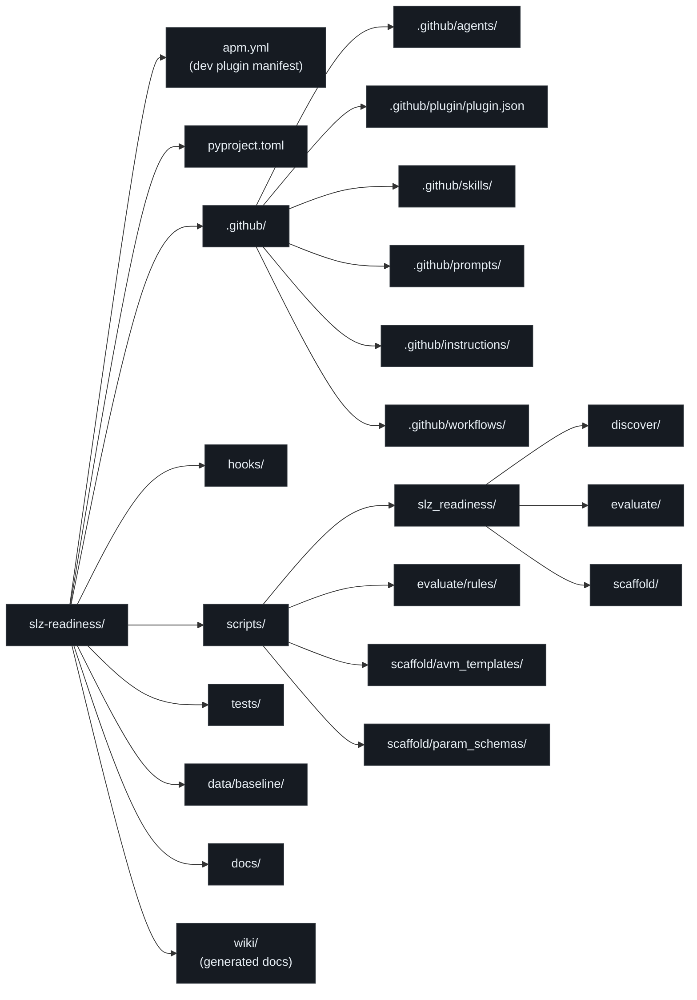
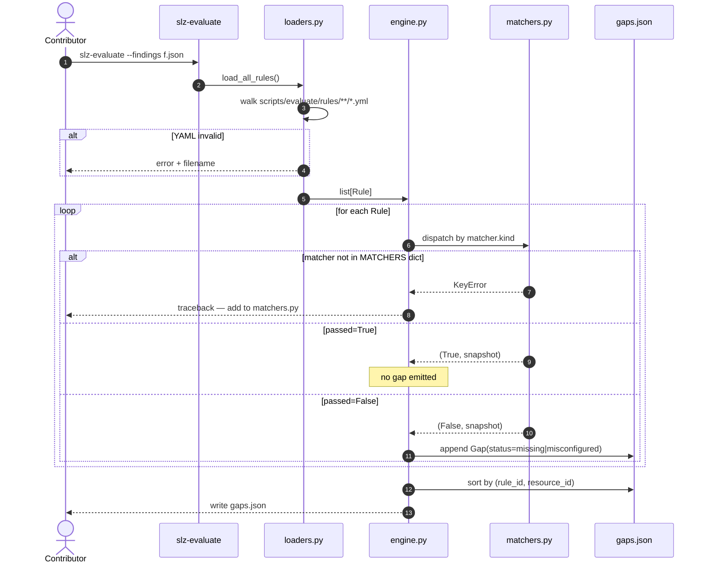

# Contributor Guide

> **Audience:** New contributor. Assumes you know Python and have basic familiarity with Azure CLI, but may be new to Copilot CLI plugins, Bicep, or Azure Landing Zones.
>
> **Goal:** From `git clone` to your first merged PR.

## Table of contents

1. [What you're contributing to](#what-you-re-contributing-to)
2. [Prerequisites & environment](#prerequisites-environment)
3. [First clone & install](#first-clone-install)
4. [The 5-minute mental model](#the-5-minute-mental-model)
5. [Codebase map](#codebase-map)
6. [Your first task walkthrough](#your-first-task-walkthrough)
7. [Running tests](#running-tests)
8. [Debugging guide](#debugging-guide)
9. [Contribution workflow](#contribution-workflow)
10. [Common pitfalls](#common-pitfalls)
11. [Glossary](#glossary)

## What you're contributing to

`slz-readiness` is a **Copilot CLI plugin** — it extends the `copilot` CLI with four slash commands (`/slz-discover`, `/slz-evaluate`, `/slz-plan`, `/slz-scaffold`) plus a top-level orchestrator (`/slz-run`). The plugin asks Azure *read-only* questions, compares the answers against a [SHA-pinned baseline](https://github.com/msucharda/slz-readiness/blob/main/data/baseline/VERSIONS.json), and emits Bicep scaffolds the user can deploy themselves.

The agent itself never writes to Azure. The mechanism that makes this safe is the [`hooks/pre_tool_use.py`](https://github.com/msucharda/slz-readiness/blob/main/hooks/pre_tool_use.py) pre-tool-use hook, which inspects every shell command before execution and denies any non-allowlisted verb:



<!-- Source: hooks/pre_tool_use.py:1-85 -->

## Prerequisites & environment

| Tool | Minimum | Used for | How to check |
|---|---|---|---|
| **Python** | 3.11 | Everything in `scripts/` | `python --version` |
| **pip** | 23.0 | Install with `-e` | `pip --version` |
| **git** | 2.40 | Clone, submodules, SHA checks | `git --version` |
| **Azure CLI (`az`)** | 2.60 | Discover phase | `az version` |
| **Bicep CLI** | 0.30 | Validate scaffold output (`az bicep build`) | `az bicep version` |
| **Node.js** | 20 LTS | VitePress dev server (wiki only) | `node --version` |
| **GitHub CLI (`gh`)** | 2.50 | PR workflow | `gh --version` |
| **Copilot CLI** | latest | Running the plugin end-to-end | `copilot --version` |

Optional but recommended:

| Tool | Why |
|---|---|
| **Just** or **make** | Run repeatable developer tasks |
| **pre-commit** | Ruff + mypy before each commit |
| **VS Code** + Python extension | Best inline mypy/ruff feedback |

### Platform notes

The project works on **Linux, macOS, and Windows**. CI runs pytest on all three ([`.github/workflows/ci.yml`](https://github.com/msucharda/slz-readiness/blob/main/.github/workflows/ci.yml)). The [`az_common.py`](https://github.com/msucharda/slz-readiness/blob/main/scripts/slz_readiness/discover/az_common.py) wrapper has explicit Windows code paths (uses `CREATE_NEW_PROCESS_GROUP` + `taskkill /T /F`) and POSIX code paths (`start_new_session=True` + `killpg`) so tree-kill works for `az` subprocess timeouts on both.

If you're on Windows, use PowerShell 7+ (not cmd.exe). If you're on WSL, run everything **inside WSL** — don't mix Windows `az` and WSL Python.

## First clone & install

```bash
git clone https://github.com/msucharda/slz-readiness.git
cd slz-readiness

# Create & activate a virtualenv (choose one):
python -m venv .venv
source .venv/bin/activate              # Linux / macOS / WSL
# .venv\Scripts\Activate.ps1           # Windows PowerShell

# Editable install with dev extras:
pip install -e ".[dev]"

# Verify CLIs resolved:
slz-discover --help
slz-evaluate --help
slz-scaffold --help
```

Entry points are declared in [`pyproject.toml:31-33`](https://github.com/msucharda/slz-readiness/blob/main/pyproject.toml#L31-L33):

```toml
[project.scripts]
slz-discover = "slz_readiness.discover.cli:main"
slz-evaluate = "slz_readiness.evaluate.cli:main"
slz-scaffold = "slz_readiness.scaffold.cli:main"
```

The package root is [`scripts/slz_readiness/`](https://github.com/msucharda/slz-readiness/tree/main/scripts/slz_readiness). `pyproject.toml` uses a `[tool.setuptools.packages.find]` root of `scripts/`.

### Log in to Azure (for live runs only)

You only need this for true end-to-end runs. Unit tests don't touch Azure.

```bash
az login --tenant <YOUR_TENANT_ID>
az account set --subscription <SUBSCRIPTION_ID>
```

Create a sandbox Azure tenant if you don't have one. **Don't run against a production tenant as your first test.** Even though the agent is read-only, latency and rate limits can surprise you.

### Install the plugin into Copilot CLI (optional for contributors)

```bash
copilot
/plugin install ./.github/plugin       # from the repo root
```

This loads the packaged plugin format at [`.github/plugin/plugin.json`](https://github.com/msucharda/slz-readiness/blob/main/.github/plugin/plugin.json). For development iteration you can edit [`apm.yml`](https://github.com/msucharda/slz-readiness/blob/main/apm.yml) directly — the two files must stay in sync, and `scripts/release.py` does that in lockstep.

## The 5-minute mental model

Four phases. Two of them are **deterministic** (Discover, Evaluate, Scaffold). One is **LLM-narrated** (Plan). You can test 75% of the code without ever touching an LLM.



<!-- Source: scripts/slz_readiness/ -->

**Read these in order if you only have 30 minutes:**

1. [`.github/instructions/slz-readiness.instructions.md`](https://github.com/msucharda/slz-readiness/blob/main/.github/instructions/slz-readiness.instructions.md) — 8 non-negotiable rules. Memorize these.
2. [`scripts/slz_readiness/evaluate/engine.py`](https://github.com/msucharda/slz-readiness/blob/main/scripts/slz_readiness/evaluate/engine.py) — the deterministic core.
3. [`scripts/evaluate/rules/policy/slz.sovereign_root_policies_applied.yml`](https://github.com/msucharda/slz-readiness/tree/main/scripts/evaluate/rules/policy) — a real rule.
4. [`tests/unit/test_evaluate_golden.py`](https://github.com/msucharda/slz-readiness/blob/main/tests/unit/test_evaluate_golden.py) — the golden-fixture tests that make determinism testable.

## Codebase map



<!-- Source: repository directory listing -->

### What to look at first

| Directory | Read when you want to… | Key files |
|---|---|---|
| `.github/agents/` | Understand the agent contract | `slz-readiness.agent.md` |
| `.github/instructions/` | Learn the 8 hard rules | `slz-readiness.instructions.md` |
| `.github/skills/discover/` | Add a new discoverer | `SKILL.md` |
| `.github/skills/evaluate/` | Add a new rule | `SKILL.md` |
| `hooks/` | Understand safety guards | `pre_tool_use.py`, `post_tool_use.py` |
| `scripts/slz_readiness/discover/` | Change how Azure is queried | `cli.py`, `az_common.py`, `*.py` (6 modules) |
| `scripts/slz_readiness/evaluate/` | Change the rule engine | `engine.py`, `matchers.py`, `loaders.py`, `models.py` |
| `scripts/slz_readiness/scaffold/` | Change Bicep emission | `engine.py`, `template_registry.py` |
| `scripts/evaluate/rules/` | Add/edit a rule (YAML only!) | `<design_area>/<rule_id>.yml` |
| `scripts/scaffold/avm_templates/` | Add a new Bicep template | `.bicep` + matching `*.schema.json` in `param_schemas/` |
| `tests/unit/` | Run golden tests | `test_evaluate_golden.py`, `test_scaffold.py`, `test_discover_scope.py` |
| `data/baseline/alz-library/` | Inspect the pinned ALZ library | vendored subtree |

## Your first task walkthrough

Let's say a maintainer assigns you **"add a new rule: archetype.alz_decommissioned_policies_applied"**. You already have most of the scaffolding — only 4 files change.

### Step 1 · Add the rule YAML

Create `scripts/evaluate/rules/archetype/alz_decommissioned_policies_applied.yml` mirroring a sibling:

```yaml
rule_id: archetype.alz_decommissioned_policies_applied
design_area: archetype
severity: medium
target:
  aggregate: null              # per-resource (scope)
  scope_pattern: "scope:mg/decommissioned"
matcher:
  kind: archetype_policies_applied
  params:
    archetype: decommissioned
baseline_ref:
  source: "https://github.com/Azure/Azure-Landing-Zones-Library"
  path: "platform/alz/archetype_definitions/decommissioned.alz_archetype_definition.json"
  # sha filled by resolve_sha() at load-time — leave blank; CI validates
remediation:
  template: archetype-policies
  summary: "Apply ALZ decommissioned archetype policy set"
```

Verify the file resolves:

```bash
python -m slz_readiness.evaluate.rules_resolve --fail-on-missing
```

This hits [`evaluate/rules_resolve.py`](https://github.com/msucharda/slz-readiness/blob/main/scripts/slz_readiness/evaluate/rules_resolve.py), which walks every rule YAML, calls `resolve_sha(baseline_ref)` from [`loaders.py:46`](https://github.com/msucharda/slz-readiness/blob/main/scripts/slz_readiness/evaluate/loaders.py#L46), and fails if any path can't be located in the pinned ALZ library.

### Step 2 · Verify the matcher already exists

`archetype_policies_applied` is already in [`matchers.py:98`](https://github.com/msucharda/slz-readiness/blob/main/scripts/slz_readiness/evaluate/matchers.py#L98). No matcher code change needed.

### Step 3 · Verify the template mapping

Open [`scaffold/template_registry.py:21`](https://github.com/msucharda/slz-readiness/blob/main/scripts/slz_readiness/scaffold/template_registry.py#L21) and confirm there's already a line:

```python
"archetype.alz_decommissioned_policies_applied": "archetype-policies",
```

If there isn't, add it. Also add to `ALLOWED_TEMPLATES` if you introduced a *new* template (you didn't — `archetype-policies.bicep` already exists).

### Step 4 · Add golden fixture coverage

Edit [`tests/unit/test_evaluate_golden.py`](https://github.com/msucharda/slz-readiness/blob/main/tests/unit/test_evaluate_golden.py) or the fixtures it loads, so a fake `decommissioned` MG with no policies produces a `status=missing` gap. Then:

```bash
pytest tests/unit/test_evaluate_golden.py -v
pytest tests/unit/test_scaffold.py::test_scaffold_dedup_is_per_scope -v
```

### Step 5 · Open the PR

```bash
git switch -c rule/alz-decommissioned
git add scripts/evaluate/rules/archetype/ tests/
git commit -m "Add rule: archetype.alz_decommissioned_policies_applied"
git push -u origin rule/alz-decommissioned
gh pr create --fill
```

CI runs ruff + mypy + pytest (3 OSes) + baseline-integrity + rules-resolve + whatif. All must be green.

### What you did NOT need to touch

- No `discover/` changes (we're reading existing policy-assignment findings).
- No new Bicep template.
- No hook changes.
- No plugin manifest changes.

This is the target experience: **95% of rule additions are YAML-only**. That's the point of the engine split.

## Running tests

```bash
# Full suite:
pytest

# Fast iteration on one module:
pytest tests/unit/test_evaluate_golden.py -v

# With coverage:
pytest --cov=slz_readiness --cov-report=term-missing

# Just the hooks:
pytest tests/test_hooks.py -v

# Golden fixture update (when you intentionally change gaps.json output):
pytest tests/unit/test_evaluate_golden.py --update-golden   # custom flag in our conftest
```

`pyproject.toml` pins the test config. `pytest` alone runs ~40+ tests end-to-end in under 10s on a modern laptop (no Azure traffic; everything is stubbed).

### Lint & type-check

```bash
ruff check scripts/ tests/ hooks/
ruff format --check scripts/ tests/ hooks/
mypy scripts/slz_readiness
```

CI enforces these — fix locally before pushing.

### Bicep `what-if`

CI's `whatif` job runs `az bicep build` against every file in `scripts/scaffold/avm_templates/`. Locally:

```bash
az bicep build --file scripts/scaffold/avm_templates/log-analytics.bicep
```

## Debugging guide

### "My rule isn't firing"



<!-- Source: scripts/slz_readiness/evaluate/engine.py, matchers.py, loaders.py -->

Checklist when a gap doesn't appear:

1. **YAML typo?** `python -m slz_readiness.evaluate.rules_resolve --fail-on-missing` will catch most of them.
2. **Findings don't include the scope?** Inspect `findings.json` directly — if the scope isn't there, the discoverer missed it.
3. **Matcher is wrong?** Temporarily add `print` in [`matchers.py`](https://github.com/msucharda/slz-readiness/blob/main/scripts/slz_readiness/evaluate/matchers.py) (or better, add a golden fixture test).
4. **Rule severity/aggregate wrong?** Check [`engine.py:51-140`](https://github.com/msucharda/slz-readiness/blob/main/scripts/slz_readiness/evaluate/engine.py#L51-L140) — aggregate=tenant goes down a different path than per-resource.

### "`slz-discover` hangs"

The `az_common.py` wrapper has a default 60s timeout per `az` call (`SLZ_AZ_TIMEOUT` env override). If an `az` subprocess is genuinely hung (happens under network issues), tree-kill fires. Look at `artifacts/<run>/trace.jsonl` for the last `az.cmd` event before the hang.

### "The hook is blocking my command"

Add your verb to [`ALLOW_RE`](https://github.com/msucharda/slz-readiness/blob/main/hooks/pre_tool_use.py#L21) only if it's genuinely **read-only**. If it's write, it's correctly being blocked — route it through `scaffold` + user action instead.

### Tracing

Every `az` invocation is written to `artifacts/<run>/trace.jsonl`:

```json
{"ts":"2026-04-16T12:34:56Z","event":"az.cmd","args":["policy","assignment","list","--scope","/providers/..."],"duration_ms":812,"returncode":0}
```

`_trace.py` uses a `ContextVar` so nested calls inherit the same run id.

## Contribution workflow

```mermaid
flowchart LR
    A["Issue or<br>self-assigned idea"]:::start
    B["git switch -c<br>type/topic-slug"]:::work
    C["Edit code<br>+ add test"]:::work
    D{"Local green?"}:::check
    E["Push branch<br>gh pr create --fill"]:::pr
    F["CI matrix"]:::ci
    G{"All jobs<br>green?"}:::check
    H["Reviewer approves"]:::review
    I["Squash-merge"]:::done
    J["release.py bumps 4 files<br>git tag vX.Y.Z"]:::release

    A --> B --> C --> D
    D -- no --> C
    D -- yes --> E --> F --> G
    G -- no --> C
    G -- yes --> H --> I
    I -. next release .-> J

    classDef start fill:#161b22,stroke:#6d5dfc,color:#e6edf3;
    classDef work fill:#2d333b,stroke:#6d5dfc,color:#e6edf3;
    classDef check fill:#1c2128,stroke:#f78166,color:#e6edf3;
    classDef pr fill:#2d333b,stroke:#3fb950,color:#e6edf3;
    classDef ci fill:#2d333b,stroke:#30363d,color:#e6edf3;
    classDef review fill:#2d333b,stroke:#6d5dfc,color:#e6edf3;
    classDef done fill:#1c2128,stroke:#3fb950,color:#e6edf3;
    classDef release fill:#1c2128,stroke:#f78166,color:#e6edf3;
```



### Branch naming

| Type | Example |
|---|---|
| Rule addition/edit | `rule/archetype-decommissioned` |
| Discoverer change | `discover/rbac-include-custom-roles` |
| Scaffold/template change | `scaffold/add-monitor-workspace-template` |
| Bug fix | `fix/tree-kill-windows-pwsh-quoting` |
| Docs/tooling | `docs/contributor-guide-update` |

### Commit message style

Short imperative subject, body optional. No issue prefix required.

```text
Add rule: archetype.alz_decommissioned_policies_applied

Matches against the ALZ library decommissioned archetype at
the pinned SHA, emitting per-MG gaps when any policy assignment
is missing from that scope.
```

### CI jobs (must all pass)

| Job | What it does | Defined in |
|---|---|---|
| `lint` | Ruff + mypy | [`ci.yml`](https://github.com/msucharda/slz-readiness/blob/main/.github/workflows/ci.yml) |
| `test` | pytest on Linux, macOS, Windows | same |
| `baseline-integrity` | Re-hashes every vendored ALZ blob vs `_manifest.json` | same |
| `rules-resolve` | Every rule's `baseline_ref.path` resolves in the pinned library | same |
| `whatif` | `az bicep build` over every template | same |

### Release

Maintainers run [`scripts/release.py`](https://github.com/msucharda/slz-readiness/blob/main/scripts/release.py) which bumps 4 files in lockstep:
- `apm.yml`
- `.github/plugin/plugin.json`
- `scripts/slz_readiness/__init__.py` (`__version__`)
- `data/baseline/VERSIONS.json` (pinned_at timestamp)

Then tags `vX.Y.Z` and pushes. The [`release.yml`](https://github.com/msucharda/slz-readiness/blob/main/.github/workflows/release.yml) workflow cross-checks all 4 versions against the tag and fails loudly if any is out of sync.

## Common pitfalls

| Pitfall | Symptom | Fix |
|---|---|---|
| Writing Bicep by hand | `scaffold` errors with "template not in ALLOWED_TEMPLATES" | Add a template file + its schema, then update the registry. Never free-form Bicep. |
| Calling a write-verb `az` command | Hook blocks with `denied: verb 'create' not allowed` | That's the hook doing its job. Route through scaffold → user deploys. |
| Forgetting `baseline_ref` in a rule | `rules-resolve` CI fails | Every rule needs `source`, `path`, `sha` (leave `sha` blank; `resolve_sha()` fills it). |
| Non-deterministic test | `test_evaluate_golden` passes locally, fails in CI | You iterated a `set` or `dict` without sorting. Engine output is always `sorted(..., key=lambda g: (g.rule_id, g.resource_id))`. |
| Adding a Plan-phase bullet without citation | Post-hook moves it to `plan.dropped.md` | Start every bullet with `- [rule_id: X]`. The regex is strict. |
| Shelling out from Python directly | Skips the hook | Use `run_az` from [`az_common.py`](https://github.com/msucharda/slz-readiness/blob/main/scripts/slz_readiness/discover/az_common.py). It's instrumented. |
| Committing a secret into `findings.json` | Bad day | Gitignore includes `artifacts/`. If it leaks, rotate immediately. |
| Editing `data/baseline/` by hand | `baseline-integrity` CI fails — SHA mismatch | Never edit vendored baseline. Use `vendor_baseline.py` to refresh, and update the pinned SHA in `VERSIONS.json`. |
| Running `az` against the wrong tenant | Discover fails or emits wrong data | Always run `az login --tenant <id>` first; Discover validates `--tenant` against the active session. |

## Glossary

| Term | Meaning |
|---|---|
| **ALZ** | [Azure Landing Zones](https://aka.ms/alz) — Microsoft's reference architecture for multi-subscription Azure. |
| **SLZ** | Sovereign Landing Zone — ALZ variant with sovereignty guardrails (Confidential Corp/Online, data residency). |
| **AVM** | [Azure Verified Modules](https://aka.ms/avm) — Microsoft-maintained Bicep/Terraform modules. |
| **MG** | Management Group — hierarchical container above subscriptions. |
| **Archetype** | ALZ shorthand for a landing zone template (corp, online, sandbox, decommissioned, etc.). |
| **Policy Set (Initiative)** | Grouping of Azure Policy definitions applied together. |
| **Assignment** | A policy set applied at a specific scope (tenant/MG/subscription). |
| **Rule** | A YAML definition in `scripts/evaluate/rules/` that compares findings against a baseline. |
| **Gap** | An entry in `gaps.json` — `{rule_id, severity, resource_id, status, baseline_ref, observed}`. |
| **Finding** | Raw datum in `findings.json` from a discoverer. |
| **Matcher** | A function in `matchers.py` — `(rule, findings) -> (passed: bool, snapshot)`. |
| **Scope confirmation** | Mandatory `--tenant` + (`--subscription` OR `--all-subscriptions`) on `/slz-discover`. |
| **HITL** | Human in the Loop — the rule that `az deployment` is a user action, never the agent's. |
| **APM** | Agentic Plugin Manifest — the `apm.yml` format Copilot CLI reads. |
| **MCP** | Model Context Protocol — how the agent talks to Azure and sequential-thinking servers. |

---

**Next:** [Staff Engineer Guide →](/onboarding/staff-engineer) for the "why" behind the design.
