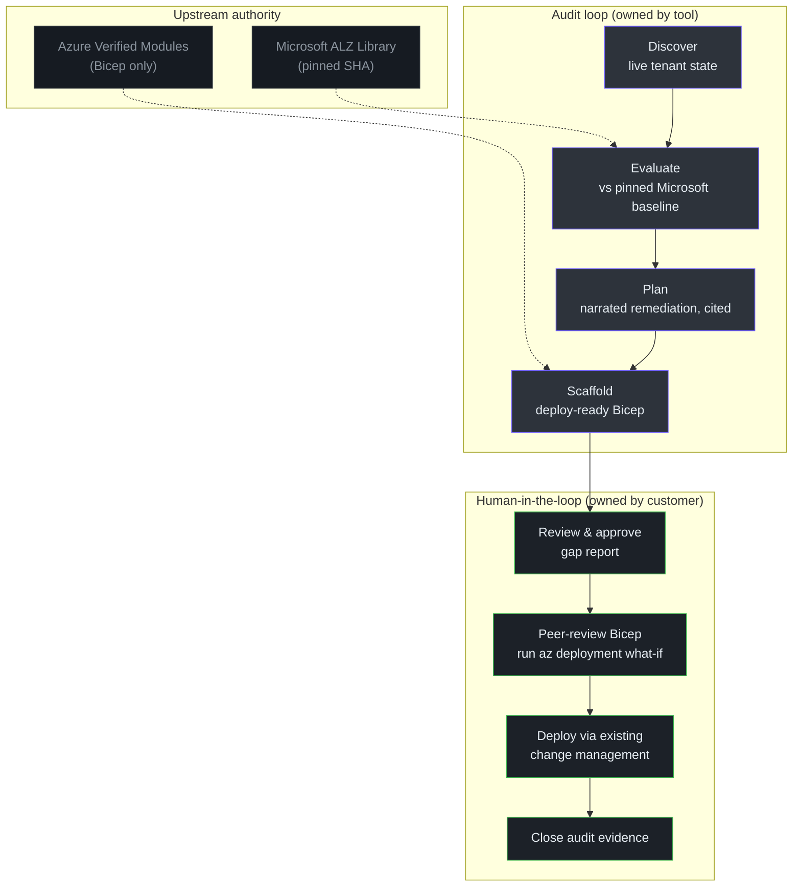
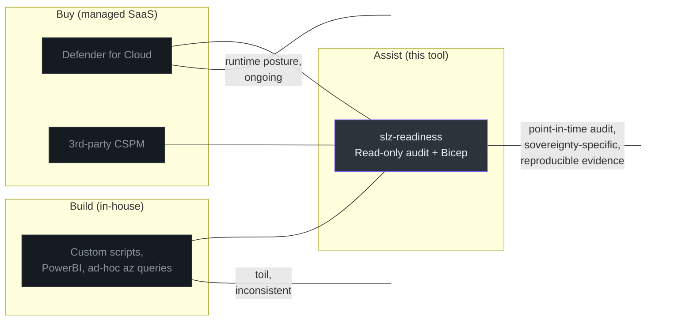

# Executive Guide

> **Audience:** VP / Director of Engineering, CTO, Head of Cloud. Service-level diagrams only. No code.
>
> **Goal:** Decide whether to adopt `slz-readiness`, commit resources, or greenlight a sovereignty programme around it.

## TL;DR

`slz-readiness` is a **compliance-grade audit tool** for Azure Sovereign Landing Zones. It answers one question in 10 minutes of elapsed time: *"Does this Azure tenant conform to the Sovereign Landing Zone baseline, and if not, where are the gaps and how do we remediate?"*

It is **deliberately narrow**:

- It **reads** Azure — it does not write, deploy, or remediate.
- It produces **evidence-grade artifacts** — every gap carries a cryptographic pin (git SHA) to the Microsoft-published baseline.
- It produces **Bicep templates** the team can deploy through existing governance, not surprise infrastructure.

The target outcome: an auditor, a platform team, and an AI agent can look at the same `gaps.json` and `plan.md` and reach the same conclusion.

## Capability map

<!-- Source: .github/agents/slz-readiness.agent.md, .github/instructions/slz-readiness.instructions.md -->

## What makes this different from "AI audits Azure"

Most AI-driven cloud tooling has a fundamental trust problem: the model both **decides what to look for** and **summarises what it found**. That's unauditable.

`slz-readiness` splits those responsibilities:

| Responsibility | Who does it | Evidence |
|---|---|---|
| Define what "compliant" means | Microsoft, as pinned YAML rules | Every rule points to a file at a git SHA |
| Query live Azure state | Deterministic Python | Read-only verbs only, hook-enforced |
| Compute gaps | Deterministic Python, zero AI | Same inputs → identical `gaps.json` every time |
| Narrate remediation | AI | Post-processed: every sentence must cite a rule ID, or it's stripped |
| Produce Bicep | Template library (no AI) | Only Azure Verified Modules; schema-validated params |
| Deploy | **The customer's team** | Agent cannot write to Azure; mechanical guarantee |

The customer never has to trust the AI for anything load-bearing. The AI is a narrator, not a decision-maker.

## Positioning

<!-- Source: Positioning analysis; README.md:1-92 -->

**`slz-readiness` is not a CSPM replacement.** It complements one:

- **Defender for Cloud / CSPM tools**: continuous posture, drift detection, alerting. `slz-readiness` runs episodically for a specific compliance framework (ALZ / Sovereign).
- **Custom scripts**: `slz-readiness` replaces the slow, inconsistent toil of "audit our landing zone before the compliance review."
- **Consulting engagement**: the tool is the deliverable. It's checked-in, version-pinned, and reproducible across tenants and time.

## Risk assessment

| Risk | Likelihood | Severity | Mitigation in tool |
|---|---|---|---|
| Agent silently writes to Azure | Very low | Very high | Shell-level verb allowlist (mechanical, not prompt-based) |
| Gaps are wrong because baseline drifted | Medium | Medium | Baseline pinned at git SHA; CI verifies blob hashes |
| Remediation plan hallucinates | Medium | High | Post-hook strips any bullet without a rule citation |
| Bicep template is not AVM-compliant | Low | High | Template library is closed set; JSON-Schema validation on params |
| Auditor cannot reproduce findings | Low | High | Every artifact carries the pinned SHA; same inputs → same outputs |
| Tool misses a sovereignty rule | Medium | Medium | Rule additions are YAML; quarterly refresh cadence recommended |
| Tenant rate-limits during large scan | Medium | Low | Surfaces as `unknown` gaps; operator narrows scope and retries |
| Supply chain: the ALZ library is compromised upstream | Very low | Very high | Blob manifest re-hashed in CI; pin moves require explicit PR |
| Plugin host (Copilot CLI) changes API | Medium | Low | APM format is Microsoft-owned; plugin.json is standardised |

## What's in scope today (v0.4.0)

- **14 rules** covering: management group hierarchy, identity platform, logging/monitoring, policy assignments (sovereign root), sovereignty-confidential (Corp + Online), 8 archetype rules (ALZ connectivity/corp/decommissioned/identity/landing-zones/platform/sandbox + SLZ public).
- **6 discoverer modules** covering: management groups, subscription inventory, policy assignments, identity RBAC, logging/monitoring (Log Analytics workspaces), sovereignty policy states.
- **7 AVM Bicep templates**: management-groups, policy-assignment, sovereignty-global-policies, sovereignty-confidential-policies, archetype-policies, log-analytics, role-assignment.
- **5 slash commands** in Copilot CLI: `/slz-discover`, `/slz-evaluate`, `/slz-plan`, `/slz-scaffold`, `/slz-run`.
- **Multi-OS support**: Linux, macOS, Windows (CI-tested on all three).

## Explicitly out of scope

- Continuous monitoring. The tool is episodic by design. Use Defender for Cloud for runtime posture.
- Remediation apply. The customer's team deploys. The tool never writes to Azure.
- Terraform output. Bicep only, AVM only. A Terraform pivot is possible (AVM publishes both) but not today.
- Non-Azure clouds. Sovereign concept is Azure-specific in this tool.
- Custom / bespoke sovereignty frameworks. The baseline is Microsoft's ALZ Sovereign — extensions require upstream contribution or a fork.

## Cost & scaling model

### Operational cost (per audit)

| Item | Typical | Notes |
|---|---|---|
| Azure API calls | 500–3000 read-only | Rate-limit friendly; no charges for `az list/show` |
| Elapsed time (single subscription) | 2–5 minutes | Dominated by Azure API latency |
| Elapsed time (50 subscriptions) | 10–20 minutes | Scales roughly linearly with subscription count |
| Engineer review time | 1–3 hours | Reading `gaps.json`, `plan.md`, sign-off for Bicep PR |
| LLM tokens (Plan phase) | 10k–40k input / 4k output | One call per run; negligible |

### Engineering cost (to adopt)

| Phase | Effort | Who |
|---|---|---|
| Install plugin + Azure login | 30 min | Any engineer with tenant reader access |
| First audit (pilot tenant) | 1 day | Platform engineer |
| Onboard the output into compliance workflow | 1–2 weeks | Governance/compliance + platform |
| Ongoing: refresh baseline pin per SLZ release | 1 day/quarter | Platform |
| Custom rule additions | 1 day per rule | Platform (YAML-only for 95% of cases) |

### Headcount implications

This tool **reduces** the engineers needed to produce a compliance-grade audit by approximately 1 FTE per 100 subscriptions — previously a consulting engagement or a quarterly-long internal project. It does **not** replace:

- The governance function (interpreting gaps, accepting risk).
- The platform function (reviewing + deploying the Bicep output).
- The security function (validating sovereignty decisions).

## Investment thesis

Where to spend, in priority order:

1. **Ops: pilot → production rollout.** Run against one representative sovereign tenant; produce a gap report; deploy one category of Bicep remediation end-to-end. Validates the entire round-trip.
2. **Coverage: extend rules.** Any gap in tenant coverage is a YAML rule away. Commission a quarterly sprint to align rules with the team's actual sovereignty framework (often a superset of Microsoft ALZ).
3. **Integration: wire `gaps.json` into the existing GRC tooling.** The artifact is JSON with SHA-pinned citations. It plugs into ServiceNow, Jira, OPA, or any evidence store.
4. **Automation: scheduled audits.** Wire a weekly Copilot CLI job against a read-only service principal. The tool is already idempotent and deterministic; scheduling is an external concern.
5. **Long-term: contribute rules upstream.** If your framework adds a sovereignty control Microsoft doesn't ship, your rule lives in your fork initially — upstream ALZ if generally applicable.

## Recommendations

| Recommendation | Confidence | Rationale |
|---|---|---|
| **Adopt for compliance-grade sovereign audits** | High | Evidence-grade output; SHA pinning; deterministic; hook-enforced safety |
| **Adopt to replace ad-hoc audit scripts** | High | Vastly more defensible; vastly less toil |
| **Do NOT adopt for continuous posture monitoring** | High | Wrong tool — use Defender for Cloud |
| **Do NOT adopt for non-ALZ frameworks without rule work** | Medium | YAML additions are cheap; matcher additions are Python |
| **Invest in governance-side playbook around `gaps.json`** | High | The output is only as useful as the workflow consuming it |

## Maturity assessment

At **v0.4.0**, the tool is:

- **Architecturally complete**: the 4-phase contract is frozen; the extension points are clear.
- **Mechanically safe**: hook-enforced read-only; hook-enforced citation integrity.
- **CI-gated**: lint, mypy, pytest (3 OSes), baseline integrity, rules-resolve, bicep build.
- **Coverage-growing**: 14 rules today; growth is purely YAML addition.

Missing from the v0.4.0 envelope (intentional):

- Authentication story beyond `az login`'s device-code flow (no CI service-principal template).
- Terraform emitter.
- Drift-since-last-audit comparison (two `gaps.json` files vs one).
- Cross-tenant fan-out.

These are reasonable v0.5–v1.0 candidates. None of them are blockers for a production pilot.

## Decision framework

Use the tool today if **all** of these apply:

- [ ] Your organisation runs Azure sovereign / regulated workloads.
- [ ] You need reproducible, cite-able compliance evidence.
- [ ] You have a platform team that can review and deploy Bicep.
- [ ] You are willing to pin to a Microsoft ALZ version and refresh quarterly.
- [ ] Your Copilot CLI policy permits local plugins.

If any of those are "no", the tool is still useful, but the ROI pattern shifts (possibly to an in-house fork or a CSPM vendor).

## Related reading

- [Product Manager Guide](/onboarding/product-manager) — capability view for non-engineering stakeholders.
- [Architecture Overview](/deep-dive/architecture) — how the guarantees are actually enforced.
- [Release Process](/deep-dive/release-process) — how quarterly baseline pin refreshes are executed.
- [`docs/anti-hallucination.md`](https://github.com/msucharda/slz-readiness/blob/main/docs/anti-hallucination.md) — safety contract as documented by the authors.

---

**Next:** [Product Manager Guide →](/onboarding/product-manager) for the capability-and-journey view.
