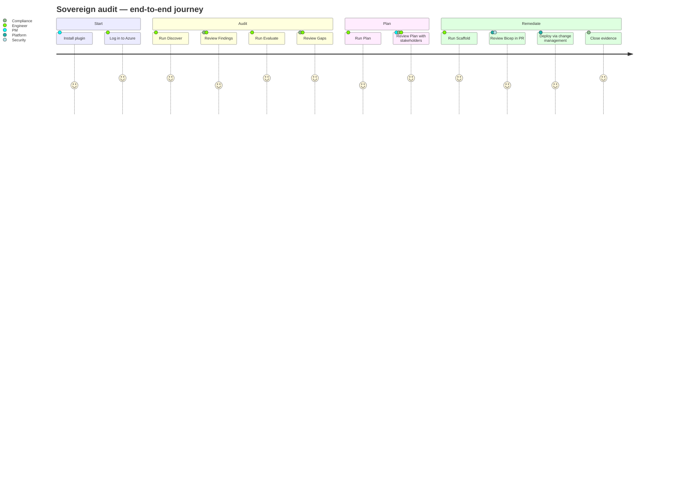
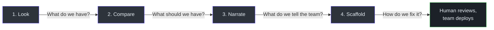
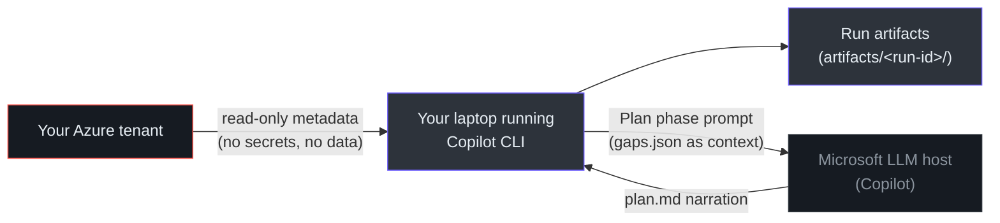

# Product Manager Guide

> **Audience:** Product managers, programme managers, compliance leads, governance professionals. No engineering jargon. No code.
>
> **Goal:** Understand what the tool does, who it helps, and how it fits into a compliance programme.

## What is `slz-readiness`?

It is an **audit assistant** that checks whether your Azure tenant matches Microsoft's Sovereign Landing Zone blueprint, and produces both a plain-English report and ready-to-deploy infrastructure templates.

Think of it as: **"A software-engineered auditor that reads your tenant, never writes to it, and hands the fix list to your platform team."**

## Who it's for

| Persona | What they get |
|---|---|
| **Compliance lead** | A signed, reproducible gap report — defensible in an audit |
| **Platform engineer** | Ready-to-deploy Bicep files for each gap, using Microsoft-verified modules |
| **CISO / security officer** | Certainty the audit agent cannot change anything in Azure |
| **Product manager** | A clear, staged workflow with obvious checkpoints |
| **Programme manager** | Quarterly cadence, version-stamped evidence, no manual toil |

## The user journey

<!-- Source: .github/prompts/slz-run.prompt.md, .github/skills/ -->

Each box is a conversation step in Copilot CLI. The humans in the loop are **you and your team**, not the tool.

## The four phases in plain English

1. **Look** — the tool asks Azure (read-only) what management groups, subscriptions, policy assignments, identity setup, logging, and sovereignty controls exist.
2. **Compare** — it contrasts what it saw against Microsoft's published baseline, pinned to a specific version.
3. **Narrate** — it summarises gaps in plain English, with a citation pointing to the exact baseline rule.
4. **Scaffold** — for each gap, it produces a Bicep infrastructure-as-code template your platform team can deploy.

The tool never touches Azure for writes. Ever. Your platform team clicks "deploy."

## Feature capability map

| Capability | Status | What it means |
|---|---|---|
| Management group hierarchy check | ✅ v0.4.0 | Confirms the ALZ management group tree shape exists |
| Subscription inventory | ✅ v0.4.0 | Lists every subscription under the tenant |
| Policy assignment check (root) | ✅ v0.4.0 | Confirms sovereign root policies are applied |
| Sovereignty-Confidential Corp | ✅ v0.4.0 | Specific policies for sovereignty-confidential workloads |
| Sovereignty-Confidential Online | ✅ v0.4.0 | Specific policies for online-facing sovereign workloads |
| Archetype policy checks (8) | ✅ v0.4.0 | ALZ connectivity, corp, decommissioned, identity, landing zones, platform, sandbox; plus SLZ public |
| Logging / Log Analytics check | ✅ v0.4.0 | Confirms the required workspace exists in management subscription |
| Identity platform MG check | ✅ v0.4.0 | Confirms the identity-platform management group exists |
| Evidence-grade citations | ✅ v0.4.0 | Every gap links to the exact baseline file at a pinned version |
| Bicep scaffolding | ✅ v0.4.0 | Azure Verified Modules only; schema-validated |
| Deterministic output | ✅ v0.4.0 | Same inputs = same results, reproducible across machines |
| Multi-OS | ✅ v0.4.0 | Linux, macOS, Windows |
| Terraform output | ❌ Not planned for v0.4 | Bicep-only today |
| Continuous monitoring | ❌ Out of scope | Use Defender for Cloud alongside |
| Drift comparison (audit-over-audit) | ⏳ Future | Compare last-run vs current run |
| Service-principal auth | ⏳ Future | Today uses interactive `az login` |
| Cross-tenant fan-out | ⏳ Future | One tenant per run today |

## Known limitations

| Limitation | Impact | Workaround |
|---|---|---|
| Large tenants can hit Azure rate limits | Some gaps marked "unknown" instead of pass/fail | Re-run with a narrower subscription filter |
| Plan narration uses an LLM | Minor wording differences between runs | Gaps themselves are deterministic — narration is flavour text |
| Baseline pinned to a specific date | Drift from newest Microsoft guidance | Refresh pin quarterly (engineering task) |
| Interactive Azure login required | Not yet CI-friendly | Planned; today use a human-operated tenant-reader account |
| Requires Copilot CLI installed | Adoption gate | Copilot CLI is a standard developer tool |

## Data & privacy overview

<!-- Source: .github/agents/slz-readiness.agent.md, apm.yml -->

**What leaves your network:**
- The Plan phase sends `gaps.json` to the Copilot LLM to generate remediation narration. `gaps.json` contains: management group IDs, subscription IDs, policy names, and "compliant / non-compliant" verdicts.
- **No secrets.** No storage account keys, no connection strings, no user data.
- **No resource-level content.** Only control-plane metadata (the same data a tenant reader can see).

**What stays on your machine:**
- `findings.json` (detailed Azure metadata from Discover)
- `bicep/*.bicep` (scaffolded templates)
- `trace.jsonl` (every `az` command executed)

If your governance does not permit any data leaving for LLM processing, you can still use phases 1 (Discover), 2 (Evaluate), and 4 (Scaffold) — only phase 3 (Plan) calls the LLM, and it's optional.

## Programme fit

| Programme type | Fit |
|---|---|
| **Annual sovereignty audit** | ✅ Core use case — reproducible evidence |
| **Quarterly compliance review** | ✅ Easy cadence — quarterly baseline refresh |
| **Migration/new-tenant onboarding** | ✅ Establishes baseline before workloads land |
| **M&A tenant integration** | ✅ Quickly assess an acquired tenant vs target |
| **Continuous posture monitoring** | ⚠️ Not the tool — pair with Defender for Cloud |
| **Non-Microsoft sovereignty frameworks** | ⚠️ Requires rule additions (YAML edits by platform) |

## Metrics you can track

Once the tool is in your programme, meaningful KPIs to report:

- **Gap count over time** (critical / high / medium / low) — measures posture improvement.
- **Mean time to remediate** per gap category — measures platform team velocity.
- **Audit preparation time** — should drop from weeks to hours.
- **Subscription coverage** — percentage of sovereign subscriptions audited in the last N days.
- **Baseline freshness** — days since last pin refresh vs upstream Microsoft release cadence.

## Frequently asked questions

**Q: Can the tool break production?**
A: No. The tool uses only read-only Azure verbs, enforced at the shell level by a pre-execution hook. Even if the AI were to attempt a write, the hook blocks it before it reaches Azure.

**Q: What if the AI hallucinates a gap?**
A: Gaps are not produced by AI. They are produced by deterministic Python code that compares Azure data against a pinned baseline file. The AI only narrates the Plan phase, and narration without a rule citation is automatically stripped.

**Q: What happens if the baseline gets tampered with?**
A: The baseline is vendored into the repository and every file's hash is recorded in a manifest. CI re-verifies every hash on every change. A tampered baseline fails CI loudly.

**Q: Can we run this in a regulated environment?**
A: Yes, with two caveats. The Discover, Evaluate, and Scaffold phases run entirely on your machine. The Plan phase sends `gaps.json` (control-plane metadata only, no secrets) to the Copilot LLM. If your regulation disallows this, skip Plan and use only the deterministic phases.

**Q: Is there a SaaS offering?**
A: No. It's a plugin that runs locally against a tenant the user is already logged into.

**Q: What if Microsoft changes the ALZ baseline?**
A: The baseline is pinned by git SHA. The tool will continue to produce consistent output until your platform team decides to move the pin forward. When they do, they run a release script that bumps a version and CI validates the new baseline's integrity.

**Q: What Azure permissions does it need?**
A: A standard Tenant Reader or equivalent for the Discover phase. The Scaffold phase writes only local files. Deployment of the generated Bicep is a separate, explicit user action using your team's existing deployment role.

**Q: How long does an audit take?**
A: 2–5 minutes for a small tenant, 10–20 minutes for a large tenant (50+ subscriptions). Human review adds 1–3 hours depending on gap count.

**Q: Can we customize the rules?**
A: Yes. Rules are YAML files. Your platform team can add, modify, or extend them. 95% of customisations are pure YAML edits — no Python changes required.

**Q: What happens to artifacts after a run?**
A: They land in `artifacts/<run-id>/` on the operator's machine. Treat them as sensitive (they contain tenant topology) and store per your data handling policy — typically in a compliance evidence store (SharePoint, S3, ServiceNow attachment, etc.).

**Q: Can I run it against multiple tenants?**
A: Yes, one tenant per run. Each run is independent and produces its own `artifacts/<run-id>/` directory.

## Suggested rollout plan

1. **Week 1–2: Pilot.** Platform team installs the plugin, runs against a non-production sovereign tenant. Reviews `gaps.json` and `plan.md`. Confirms the workflow makes sense.
2. **Week 3–4: Production tenant 1.** Run against one production sovereign tenant. Drive two or three gaps through to Bicep deployment end-to-end. Confirm the round-trip.
3. **Week 5–6: Evidence integration.** Agree where artifacts live (compliance store). Agree how `gaps.json` maps to tickets/audit findings.
4. **Week 7+: Scale out.** Add remaining sovereign tenants. Establish a quarterly baseline-refresh cadence.
5. **Ongoing: Custom rules.** When a sovereign control isn't covered, the platform team adds a YAML rule. Treat as standard backlog work.

## Glossary (plain English)

| Term | Meaning |
|---|---|
| **Sovereign Landing Zone** | Microsoft's reference setup for Azure tenants with sovereignty / data residency requirements. |
| **Baseline** | The Microsoft-published reference: management group shape, required policies, logging setup, etc. Pinned to a specific published version. |
| **Gap** | A mismatch between what the tenant has and what the baseline requires. Each has a severity. |
| **Bicep** | Microsoft's infrastructure-as-code language for Azure. The output format of the Scaffold phase. |
| **AVM (Azure Verified Modules)** | Microsoft-maintained, quality-assured Bicep/Terraform building blocks. The tool only emits these. |
| **Pinned SHA** | A cryptographic fingerprint of a specific baseline version. If Microsoft updates upstream, your pinned version doesn't change until you decide. |
| **Citation** | Every gap and every plan sentence references a specific rule. Without a citation, it's stripped. |
| **HITL (Human in the Loop)** | Every Azure write is a human decision, not an AI action. |

## Related reading

- [Executive Guide](/onboarding/executive) — decision framework and risk view.
- [Getting Started → Quick Start](/getting-started/quick-start) — the five commands in order.
- [Artifacts & Outputs](/getting-started/artifacts) — what files appear after a run and how to read them.

---

**Next:** [Getting Started → Overview →](/getting-started/overview) to run your first audit.
