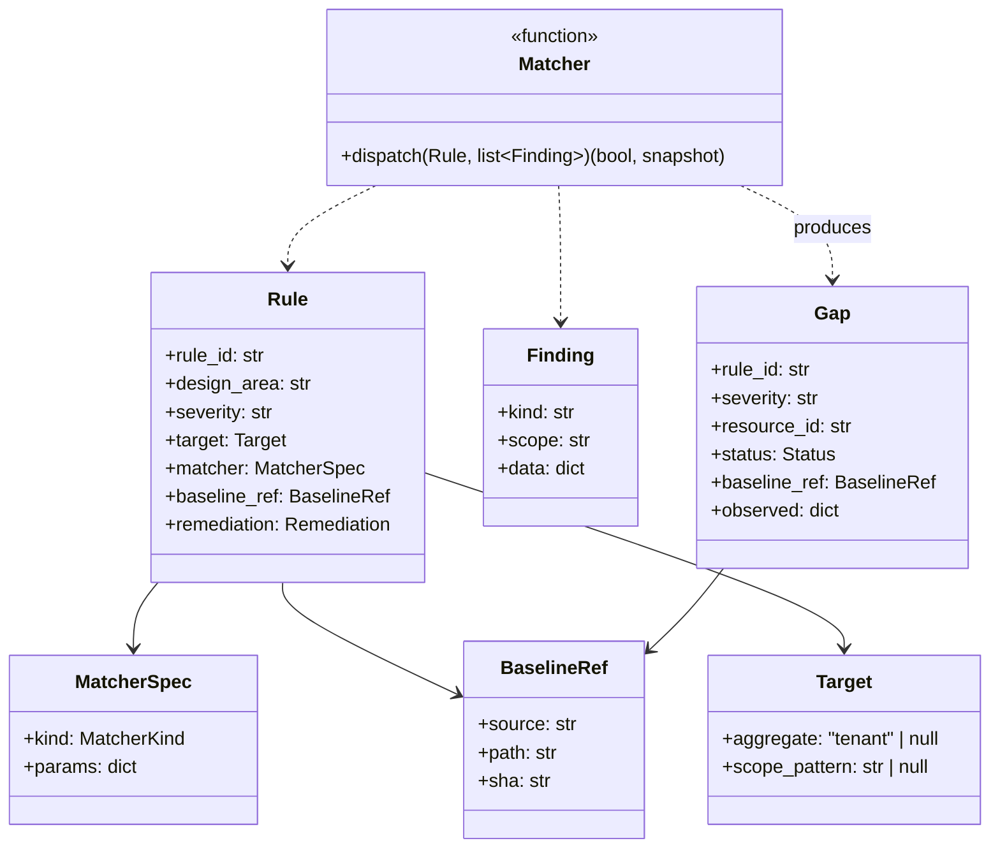
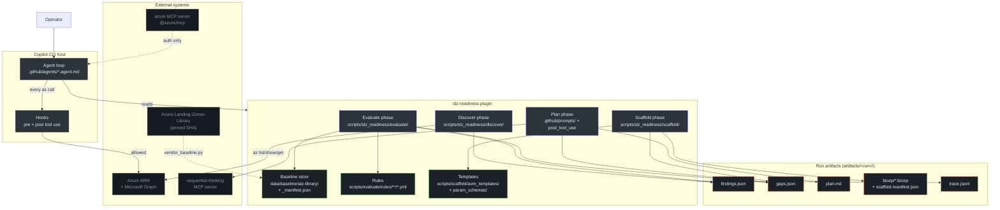
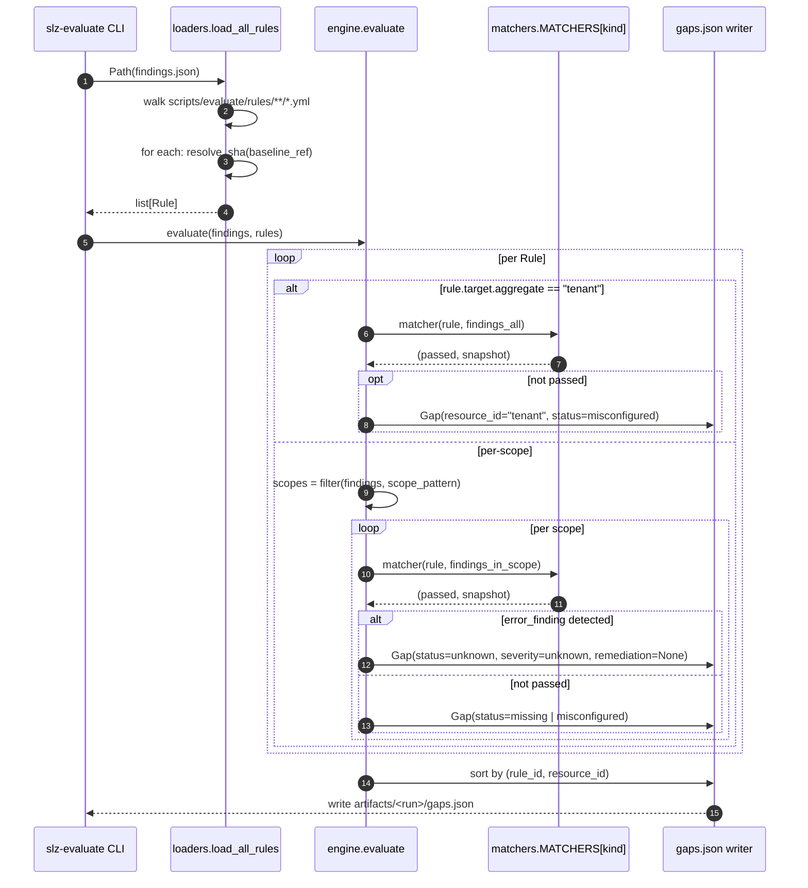
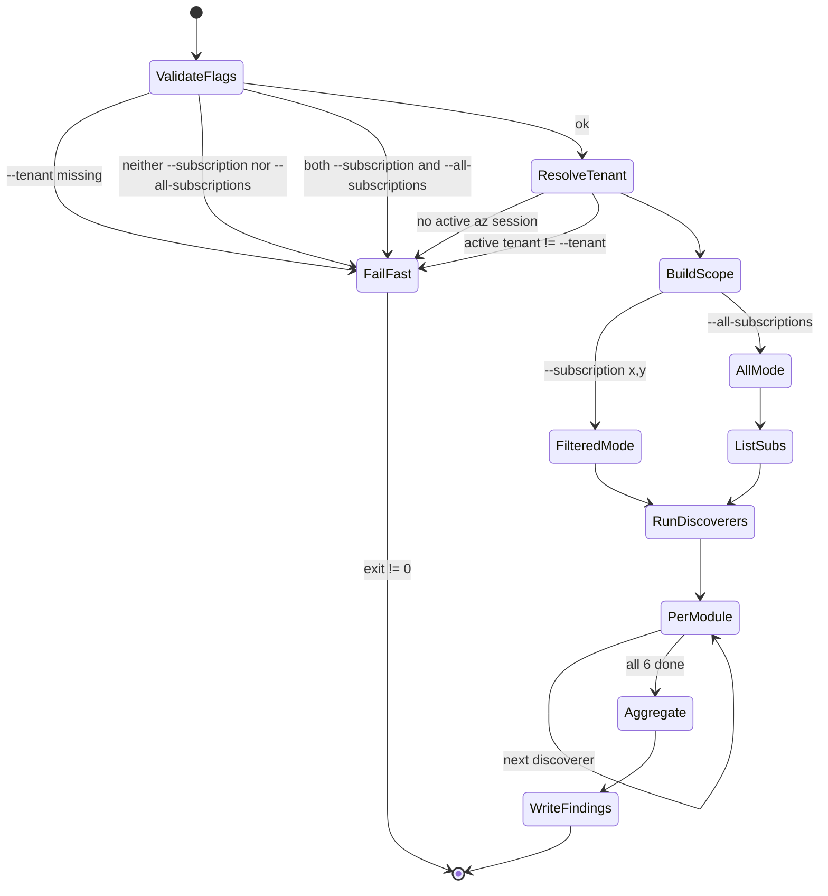
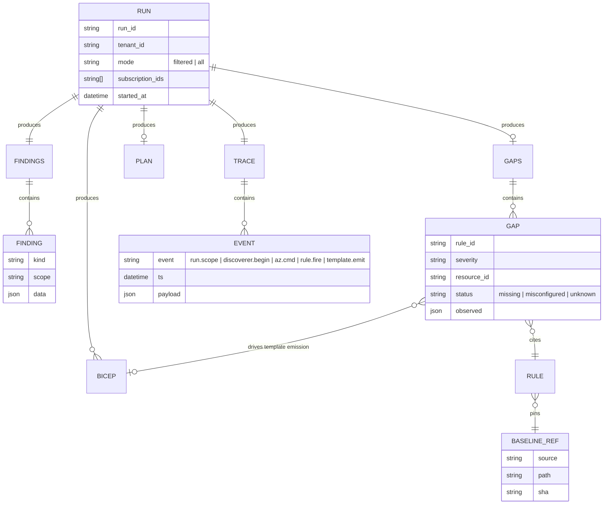
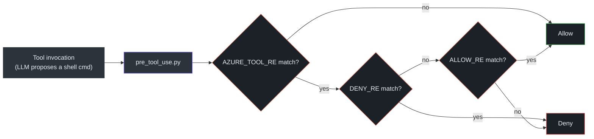
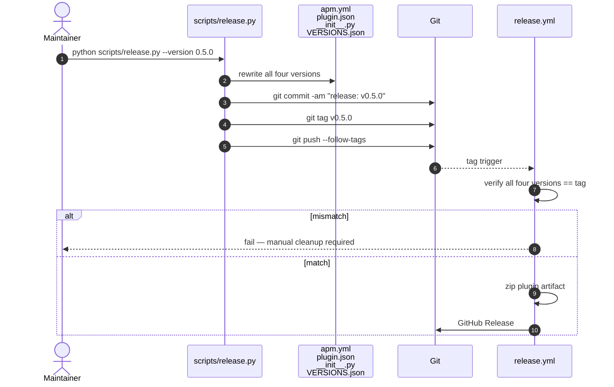

# Staff Engineer Guide

> **Audience:** Staff / principal engineers, tech leads, architects. Assumes fluency in Azure control plane, Python internals, CI/CD, and supply-chain concerns.
>
> **Goal:** Understand the *why* — the design decisions, tradeoffs, and failure modes. Be able to review a pipeline change and predict its blast radius.

## System philosophy

Three ideas shape every design decision in this repo:

1. **The baseline is the ground truth, not the agent.** The Azure Landing Zones Library at a **pinned git SHA** is the oracle. The agent is deterministic plumbing that compares live Azure state against that oracle.
2. **LLMs narrate, they don't decide.** Discover, Evaluate, and Scaffold have **zero LLM calls**. The Plan phase is the only LLM-touched artifact and is post-processed by a citation-guard hook that strips any bullet not anchored to a rule_id.
3. **Safety is mechanical, not procedural.** We don't rely on the LLM "remembering" to be read-only. A shell-level pre-tool hook rejects any `az` verb outside a hard-coded allowlist before the command is invoked.

These are not preferences — they are load-bearing. Relaxing any one of them turns a sovereignty audit into an unauditable AI artifact.

## Key abstractions



<!-- Source: scripts/slz_readiness/evaluate/models.py, scripts/slz_readiness/evaluate/loaders.py, scripts/slz_readiness/evaluate/matchers.py -->

The `Rule` dataclass lives in [`loaders.py:20`](https://github.com/msucharda/slz-readiness/blob/main/scripts/slz_readiness/evaluate/loaders.py#L20); the `Gap`, `Finding`, and `BaselineRef` dataclasses are in [`models.py`](https://github.com/msucharda/slz-readiness/blob/main/scripts/slz_readiness/evaluate/models.py). The five matchers are in a module-level [`MATCHERS` dict at `matchers.py:98`](https://github.com/msucharda/slz-readiness/blob/main/scripts/slz_readiness/evaluate/matchers.py#L98) — the kind string in YAML is the dispatch key.

## Architecture (C4 Level 2)



<!-- Source: apm.yml, .github/plugin/plugin.json, scripts/slz_readiness/, data/baseline/VERSIONS.json -->

## Decision log

| # | Decision | Alternative considered | Why chosen | Risk if reversed |
|---:|---|---|---|---|
| 1 | **Pure-Python deterministic Evaluate** | LLM-driven gap analysis | Reproducible; auditable; fast (< 100 ms for 14 rules); testable via golden fixtures | Auditors can't trust gap provenance |
| 2 | **Pin ALZ library by git SHA** | Track `main` branch | Upstream evolves weekly; drifting baseline = unstable gaps; SHA = reproducibility | Gap instability, CI flakes |
| 3 | **Vendor baseline into repo** ([`data/baseline/alz-library/`](https://github.com/msucharda/slz-readiness/tree/main/data/baseline/alz-library)) | Fetch at run time | Offline use; air-gapped tenants; CI integrity gate re-hashes blob-by-blob | Network dependency; supply-chain risk |
| 4 | **Pre-tool verb allowlist** ([`hooks/pre_tool_use.py:21`](https://github.com/msucharda/slz-readiness/blob/main/hooks/pre_tool_use.py#L21)) | Trust the prompt | Regex-enforced; no model can "forget"; only ~10 LoC | Agent could be prompted into writes |
| 5 | **Citation guard on Plan** ([`hooks/post_tool_use.py:21`](https://github.com/msucharda/slz-readiness/blob/main/hooks/post_tool_use.py#L21)) | Ask the LLM to cite | LLMs skip citations under load; regex strips unannotated bullets to `plan.dropped.md` | Plan output could contain hallucinations |
| 6 | **Template registry, not free-form Bicep** ([`template_registry.py:21`](https://github.com/msucharda/slz-readiness/blob/main/scripts/slz_readiness/scaffold/template_registry.py#L21)) | LLM-generated Bicep | AVM-only outputs; schema-validated params; zero LLM in Scaffold | Non-compliant IaC; no what-if guarantees |
| 7 | **Per-scope dedup in Scaffold** ([`engine.py:48`](https://github.com/msucharda/slz-readiness/blob/main/scripts/slz_readiness/scaffold/engine.py#L48)) | Dedup by (template) only | Two archetype gaps at different MGs must emit two Bicep files | Over-dedup would silently lose work |
| 8 | **HITL at deploy** | Auto-deploy on user consent | Sovereignty requires explicit sign-off per tenant; agent-deploy = unauditable | Compliance regression |
| 9 | **APM + `.github/plugin/plugin.json` duplication** | Single source | APM is dev format; plugin.json is release format; release.py keeps them synced | Version skew if one drifts |
| 10 | **ContextVar-based tracer** ([`_trace.py`](https://github.com/msucharda/slz-readiness/blob/main/scripts/slz_readiness/_trace.py)) | Logger adapters | No thread leak; lazy-initialized; writes NDJSON | Loss of audit trail |

## Control flow: single rule evaluation



<!-- Source: scripts/slz_readiness/evaluate/engine.py:51-140, loaders.py, matchers.py -->

The key invariants:

- **One pass per rule.** No chained rules, no derived evaluations. If rule B depends on rule A's output, that's a smell — it should be a single matcher that inspects both.
- **Sort is the last step.** `sorted(gaps, key=lambda g: (g.rule_id, g.resource_id))` is the determinism pin.
- **Unknown is a first-class state.** If Discover couldn't verify (permission denied, rate-limited, network), Evaluate emits `status=unknown, severity=unknown, remediation_template=None`. Scaffold explicitly skips unknown gaps — [`test_scaffold_skips_unknown_status_gaps`](https://github.com/msucharda/slz-readiness/blob/main/tests/unit/test_scaffold.py#L59) enforces this.

## Runtime state machine: Discover CLI



<!-- Source: scripts/slz_readiness/discover/cli.py:88-227 -->

Every failure path sets `exit != 0` and writes **nothing**. We never produce a partial `findings.json`. This is tested in [`test_discover_scope.py`](https://github.com/msucharda/slz-readiness/blob/main/tests/unit/test_discover_scope.py) — five scope-validation tests in lines 39-109.

## Entity-relationship: run artifacts



<!-- Source: scripts/slz_readiness/evaluate/models.py, scripts/slz_readiness/_trace.py, discover/cli.py -->

Every artifact is inspectable with `jq`. Every event in `trace.jsonl` can be grep'd by `event` type. No hidden state.

## Dependency rationale

| Package | Why this one | Rejected alternatives |
|---|---|---|
| [`click`](https://click.palletsprojects.com/) ≥ 8 | Param validation for scope flags — mutually exclusive groups, required options | `argparse` (verbose), `typer` (adds Pydantic, overkill) |
| [`pyyaml`](https://pyyaml.org/) ≥ 6 | Rules are YAML; native; ubiquitous | `ruamel.yaml` (we don't round-trip preserve) |
| [`jsonschema`](https://python-jsonschema.readthedocs.io/) ≥ 4 | AVM param validation before writing | `pydantic` (heavy, generates schemas differently from AVM) |
| [`rich`](https://rich.readthedocs.io/) | Discover progress UI — TTY detection, no garbling in CI logs | `tqdm` (no non-TTY fallback), stdout print (ugly) |

Not in deps:

- **`pydantic`** — overkill; we use plain `dataclass` + `jsonschema`. Avoids a 5MB transitive closure.
- **`httpx` / `requests`** — `az` CLI does all HTTP; no direct REST calls from Python.
- **`azure-identity`** — the agent never authenticates; `az` uses the user's session.
- **Any LLM SDK** — the plugin is host-native to Copilot CLI; the LLM lives in the host.

## Tradeoffs & failure modes

### Trade-off: Python CLI vs TypeScript

**Chosen:** Python.

| Dimension | Python (chosen) | TypeScript |
|---|---|---|
| Bicep/AVM ecosystem | weaker | stronger |
| Azure CLI idiomatic | strong (`az` is Python) | wrapper-ish |
| Schema-driven YAML → dataclass | very clean | acceptable |
| Hook scripts | `pre_tool_use.py` — 85 LoC, no build | would need bundling |
| Copilot CLI plugin ergonomics | **APM accepts any executable** | same |
| Mypy strictness | adequate | stronger |

Decisive factor: hooks are a single `.py` file with zero runtime deps that the Copilot CLI runtime shells out to. That's impossible to match in a TypeScript plugin without a build step.

### Failure mode: baseline drift

The ALZ library publishes roughly weekly. If `data/baseline/VERSIONS.json` isn't refreshed, gap accuracy decays. We mitigate three ways:

1. The pinned SHA is **recorded in every gap's `baseline_ref`** — auditors can compare `gaps.json` to the then-current ALZ state.
2. `rules-resolve` CI fails loudly if any rule's `baseline_ref.path` disappears from the pinned library.
3. `baseline-integrity` CI re-hashes every vendored blob against `_manifest.json` — tamper detection.

**What we don't have:** automated PR-bot that watches upstream. Intentional — the decision to move the pin is an SLZ-version boundary.

### Failure mode: `az` subprocess hang

Default 60s timeout per call ([`az_common.py`](https://github.com/msucharda/slz-readiness/blob/main/scripts/slz_readiness/discover/az_common.py), `SLZ_AZ_TIMEOUT` env override). We spawn in a new process group (`CREATE_NEW_PROCESS_GROUP` on Windows, `start_new_session=True` on POSIX) so tree-kill actually works — otherwise, hung child processes under PowerShell or login shells leak. On Windows, `taskkill /T /F /PID`; on POSIX, `killpg(pgid, SIGTERM)` then `SIGKILL` after grace.

Hanging still produces a findable trace entry; the failing discoverer emits an `error_finding` with `AzError.kind=network`, and Evaluate surfaces it as an `unknown` gap rather than silently succeeding.

### Failure mode: rate limiting

Azure throttles policy-state queries at ~800 RPM per subscription. With a large tenant (200+ subs, `--all-subscriptions`) plus 3-4 assignments per sub, `sovereignty_controls.discover` alone can issue ~800 requests. We don't retry in-CLI — rate-limited calls surface as `AzError.kind=rate_limited` → unknown gaps. **Design choice:** surface the problem, don't paper over it. Operators decide whether to narrow scope with `--subscription` or retry after the bucket refills.

### Failure mode: LLM drops citations

Under context pressure, the model can forget the `(rule_id: X)` convention. `post_tool_use.py` compiles a regex of **known** rule ids from the YAML set on disk and matches against each bullet. Uncited → moves to `plan.dropped.md`. The tests in [`test_hooks.py`](https://github.com/msucharda/slz-readiness/blob/main/tests/test_hooks.py) are parametrized over several flavors of "looks-like-a-citation-but-isn't" inputs.

## Anti-hallucination contract (summary of [docs/anti-hallucination.md](https://github.com/msucharda/slz-readiness/blob/main/docs/anti-hallucination.md))

| Risk | Mitigation | Enforced by |
|---|---|---|
| Agent writes to Azure | Verb allowlist | `hooks/pre_tool_use.py` |
| Rules invented on the fly | Rules are YAML files on disk; loader walks the tree | `loaders.load_all_rules` + `rules-resolve` CI |
| Gap produced without source | Every gap carries `baseline_ref.sha` | `engine.py` construction, tested by golden fixtures |
| Plan bullet without evidence | Citation regex | `hooks/post_tool_use.py` |
| Bicep template hallucinated | `ALLOWED_TEMPLATES` + JSON-Schema on params | `scaffold/template_registry.py`, `scaffold/engine.py` |
| Baseline tampered in vendoring | Manifest hash recomputed in CI | `baseline_integrity.py` |

## Performance characteristics

| Phase | Typical duration | Dominant cost | Parallelizable? |
|---|---|---|---|
| Discover (one sub) | ~30–60s | `az` sequential calls | Partially — discoverers run serially today, each may issue parallel sub-calls |
| Discover (`--all-subscriptions`, 50 subs) | ~5–15 min | RBAC + policy-state fan-out | Fan-out per sub is capped by rate limits |
| Evaluate | < 100 ms for 14 rules | YAML load + O(rules × findings) | Not worth it |
| Plan | 15–60s | LLM turn + sequential-thinking MCP | Not parallelizable — narration is inherently sequential |
| Scaffold | < 1s | JSON-Schema validation + file writes | Not worth it |

**The hot path is Discover.** Everything else is free. If you want to speed up the end-to-end, parallelize discoverers first. The current serial ordering is defensive: it makes trace events deterministic for debugging.

## Concurrency model

- **Discover:** one process, 6 discoverers sequentially. Each discoverer may spawn multiple `az` subprocesses in sequence (not in parallel — `az` has its own cache collision issues). ContextVar-based tracer inherits into every frame.
- **Evaluate:** single-threaded, single-pass, sorted output. No concurrency.
- **Plan:** single LLM turn, plus sequential-thinking MCP calls.
- **Scaffold:** single-threaded, file I/O bounded.

We intentionally do not use `asyncio` or threads. The simplicity pays for itself in tracing clarity and cross-platform behaviour.

## Configuration surface

| Source | Consumer | Purpose |
|---|---|---|
| `apm.yml` | Copilot CLI dev | Skills, prompts, hooks, MCP servers — development manifest |
| `.github/plugin/plugin.json` | Copilot CLI release | Same data, published form |
| `pyproject.toml` | pip / pytest / mypy / ruff | Package, deps, test & lint config |
| `data/baseline/VERSIONS.json` | Evaluate | Pinned ALZ Library SHA + timestamp |
| `scripts/evaluate/rules/**/*.yml` | Evaluate | Rule definitions |
| `scripts/scaffold/param_schemas/*.schema.json` | Scaffold | AVM param validation |
| `SLZ_AZ_TIMEOUT` (env) | Discover | Per-`az` timeout (default 60s) |

No YAML anchors, no Jinja, no templated config. Everything is literal — grep-able, reviewable, auditable.

## Go-style pseudocode: the engine

```go
// Pseudocode mirror of scripts/slz_readiness/evaluate/engine.py:51-140.

func Evaluate(findings []Finding, rules []Rule) []Gap {
    gaps := []Gap{}
    for _, r := range rules {
        if r.Target.Aggregate == "tenant" {
            passed, snap := dispatch(r.Matcher, findings)
            if !passed {
                gaps = append(gaps, Gap{
                    RuleID:     r.ID,
                    Severity:   r.Severity,
                    ResourceID: "tenant",
                    Status:     classify(snap),
                    Baseline:   r.BaselineRef,
                    Observed:   snap,
                })
            }
            continue
        }
        for _, scope := range selectScopes(findings, r.Target.ScopePattern) {
            inScope := filterByScope(findings, scope)
            if hasErrorFinding(inScope) {
                gaps = append(gaps, Gap{
                    RuleID: r.ID, Severity: "unknown",
                    ResourceID: scope, Status: "unknown",
                    Baseline: r.BaselineRef, Observed: errorSnapshot(inScope),
                })
                continue
            }
            passed, snap := dispatch(r.Matcher, inScope)
            if !passed {
                gaps = append(gaps, Gap{
                    RuleID: r.ID, Severity: r.Severity,
                    ResourceID: scope, Status: classify(snap),
                    Baseline: r.BaselineRef, Observed: snap,
                })
            }
        }
    }
    sort.Slice(gaps, func(i, j int) bool {
        if gaps[i].RuleID != gaps[j].RuleID {
            return gaps[i].RuleID < gaps[j].RuleID
        }
        return gaps[i].ResourceID < gaps[j].ResourceID
    })
    return gaps
}

func dispatch(m MatcherSpec, findings []Finding) (bool, any) {
    fn := MATCHERS[m.Kind] // map[string]MatcherFunc
    return fn(m.Params, findings)
}
```

Key things to notice in the real Python:

- `selectScopes` is driven by `scope_pattern` (prefix match, not regex) — avoid regex complexity.
- `classify(snap)` returns `"missing"` when the snapshot indicates emptiness, `"misconfigured"` when something present but wrong. The classification hint comes from the matcher's snapshot shape.
- The `sort` call is **outside** the per-rule loop. Do not be tempted to inline a heap.

## Hooks as shell-level guards



<!-- Source: hooks/pre_tool_use.py:1-85 -->

The allow regex (in [`pre_tool_use.py:21`](https://github.com/msucharda/slz-readiness/blob/main/hooks/pre_tool_use.py#L21)) covers `list|show|get|query|search|describe|export|version|account`. The deny regex covers `create|delete|set|update|apply|deploy|assign|invoke|new|put|patch`. `AZURE_TOOL_RE` gates the whole check to `az|azd|bicep` — non-Azure commands (ls, cat, etc.) aren't the hook's business.

If a PR relaxes any of these regexes, it's a **security-significant change** and should be reviewed as such. The hook is the mechanical guarantee behind the read-only promise.

## Release process



<!-- Source: scripts/release.py:1-125, .github/workflows/release.yml -->

The four-file lockstep is the only way to release — hand-editing one and forgetting the others will fail the `release.yml` version cross-check. See [Release Process](/deep-dive/release-process) for the exact fields bumped.

## Extension points

When considering a PR, ask: does it use the extension points, or does it bypass them?

| Extension point | Intended change | Anti-pattern |
|---|---|---|
| New rule YAML | 95% of policy/compliance asks | Writing custom matcher + new engine path |
| New matcher (`matchers.py` + entry in `MATCHERS` dict) | Genuinely new comparison shape | Inlining matcher logic in `engine.py` |
| New discoverer | Covering a new Azure surface | Inlining `az` calls in evaluate |
| New template + schema + registry entry | New Bicep output shape | Free-form Bicep in scaffold engine |
| New slash prompt (`.github/prompts/`) | New entry point with citation guard | LLM-orchestrated from existing prompt |
| New hook | New safety-critical guard | Business logic in hooks (they're security boundaries) |

## Review checklist for a pipeline change

Before approving a PR, confirm:

- [ ] Determinism preserved — any new dict/set iteration is explicitly sorted.
- [ ] If a new matcher was added, it's registered in `MATCHERS` dict and unit-tested.
- [ ] If a new rule was added, `rules-resolve` passes and its template mapping exists.
- [ ] If a new template was added, its schema is complete and `ALLOWED_TEMPLATES` updated.
- [ ] If a new `az` verb is invoked, `hooks/pre_tool_use.py` either already allows it or a reviewer has vetted the addition.
- [ ] Trace events fire for any new cross-phase artifact.
- [ ] Tests cover the happy path AND at least one error-finding path.
- [ ] No direct `subprocess.run(["az", ...])` — uses `run_az` from `az_common.py`.

## Related reading

- [Architecture Overview](/deep-dive/architecture) — the same material with more code citations.
- [Rule Engine](/deep-dive/evaluate/rule-engine) — engine internals.
- [Hooks](/deep-dive/hooks) — both hooks in detail with test coverage.
- [Baseline Vendoring](/deep-dive/evaluate/baseline-vendoring) — supply-chain posture.
- [`docs/anti-hallucination.md`](https://github.com/msucharda/slz-readiness/blob/main/docs/anti-hallucination.md) — first-party summary of the same contract.

---

**Next:** [Executive Guide →](/onboarding/executive) for the adoption / risk / investment view.
